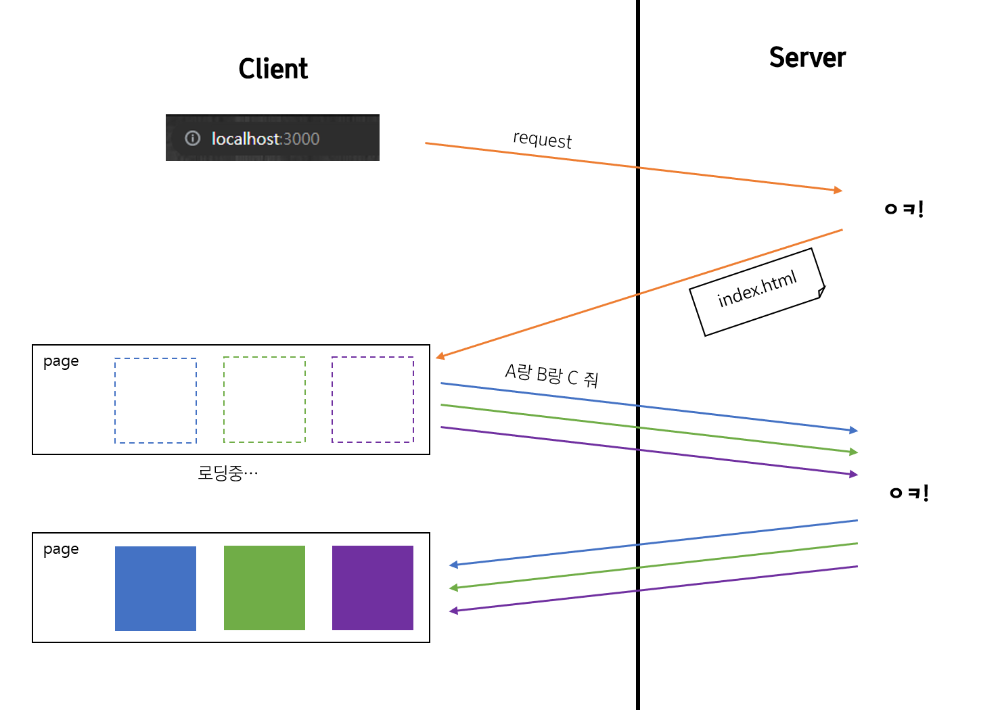
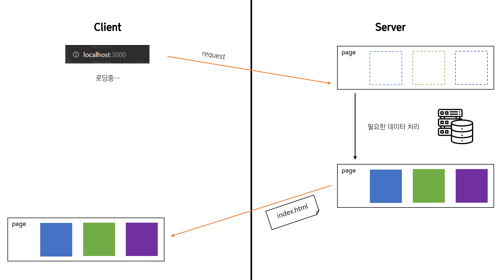
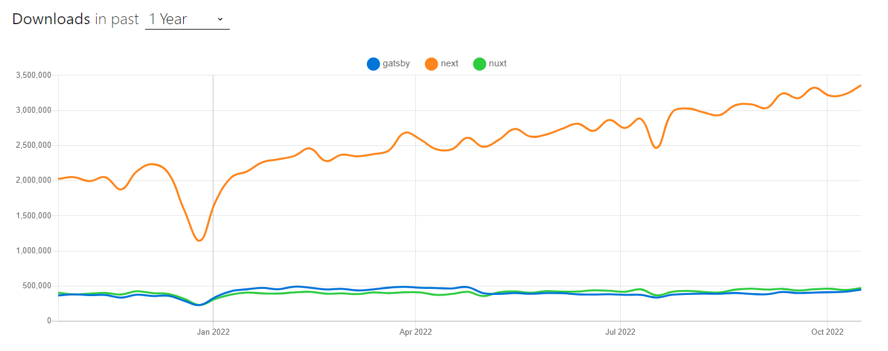

# Next.js: 더 빠른 페이지를 위해서

안녕하세요, SPARCS에서 개발자로 활동하고 있는 jaydub입니다!

최근 많은 기업과 서비스들이 Server Side Rendering을 도입하고 있습니다. SSR이란 무엇인지, 그리고 SSR을 위한 프레임워크 중 하나인 Next.js는 내부적으로 어떤 순서로 동작하는지 알아보도록 하겠습니다.

## SSR이란?

React의 등장 이후 클라이언트는 많은 일들을 처리하게 되었습니다. 기존에는 PHP 등을 사용해 서버에서 완성된 HTML 문서를 전달하고 있었습니다. React는 이와 달리 서버에서는 root element만이 포함된 HTML 문서를 전달하고 나머지 작업들은 JavaScript에서 처리하는 방식을 사용하게 됩니다. 바로 Client Side Rendering(CSR)이죠. 이 둘을 비교한 간단한 다이어그램을 그려보았습니다.

#### CSR

#### SSR

보시다시피 CSR은 클라이언트에서, SSR은 서버에서 더 많은 작업을 하고 있죠. 둘 중 어떤 것이 "정답이다"라는 것은 없습니다. 하지만 처리해야 하는 데이터의 양이 점점 증가하는 요즘, SSR이 사용자에게 더 빨리 의미있는 화면을 전달할 수 있다는 장점이 부각되고 있습니다.

SSR의 또다른 장점은 SEO(검색 엔진 최적화, Search Engine Optimization)에서 유리한 측면을 보여주는데요, 그 이유는 웹 크롤러의 특성에 있습니다. 대다수의 크롤러들은 JavaScript를 인식하지 못합니다. 단순히 HTML의 내용을 파싱하는데, CSR의 경우 화면에 표시될 데이터를 표시하는 많은 부분을 JavaScript에 의존하기 때문에 크롤러가 의미를 파악하기 힘들다는 말입니다. 예를 들어 내가 멋있는 맛집 사이트를 만들었는데 CSR로 구현되었다면 웹 크롤러는 식당에 대한 정보(JavaScript가 불러오고 있음)를 알 수 없습니다. 반대로 SSR로 구현되었다면 크롤러가 반환받은 페이지에 맛집에 관한 정보들이 담겨있겠죠. (이는 비즈니스 측면에서 매우 중요합니다)

이런 이유들로 많은 서비스들이 SSR 방식으로 구현되고 있습니다. SSR을 위한 프레임워크! 당연히 없을 리가 없겠죠? 수많은 SSR 프레임워크 중 1등은...

바로 Next.js입니다! Next.js는 내부적으로 어떻게 동작하길래 SSR이 가능한 것인지 알아보도록 하겠습니다.

## Next.js의 동작 순서

이하 글은 [Next.js의 공식 document](https://nextjs.org/learn/foundations/how-nextjs-works)를 번역, 참고한 글입니다.

### 1. 컴파일링

보통 컴파일링은 코드를 어셈블리 언어로 변환하는 과정을 의미하곤 하는데요, 여기에서 컴파일링은 이보다 넓은 의미를 가집니다. 공식 문서에서는 다음과 같이 설명하고 있네요.

> 컴파일은 한 언어로 된 코드를 다른 언어 또는 같은 언어의 다른 버전으로 출력하는 과정을 말합니다.

프론트엔드를 개발할 때는 사용되는 언어가 한정적이긴 하지만 JavaScript (jsx), TypeScript (tsx)와 같은 옵션들이 있죠. 컴파일링을 통해 저희가 어떠한 언어로 개발하더라도 컴파일 과정을 통해 "브라우저"가 이해할 수 있는 코드로 변환됩니다.

### 2. Minifying

저희가 작성한 코드에는 사실 불필요한 부분들이 있습니다. 주석도 실행에 있어서 불필요하고 줄바뀜이나 공백도 사실 필요 없습니다. 이러한 부분들은 페이지의 로딩 시간을 지연시킵니다. 파일의 크기가 증가하면서 네트워크에 오가는 패킷의 크기가 커지면 결국 클라이언트에 다다르는 데 더 많은 시간이 걸리는 것이죠. 피카츄 배구는 클릭과 동시에 실행되지만 배틀그라운드는 로딩에 꽤 오랜 시간이 걸리는 것을 생각해보세요.

그렇다고 모든 컴포넌트를 한 줄에 작성할 수는 없겠죠? 다행히도 Next.js에서는 minifying을 수행합니다. 위에서 말한 불필요한 charater들을 제거해줘 데이터를 효율적으로 서빙할 수 있게 해줍니다.

### 3. 번들링

프론트엔드를 개발하다보면 자주 마주치는 단어가 바로 "컴포넌트"이죠. 프론트엔드는 결국 이 컴포넌트를 어떻게 설계하고 사용할 것인가에 관한 부분이라 말할 수도 있겠습니다. 각 컴포넌트는 서로 다른 파일에서 정의되고 또다른 파일에서 불러와서 사용합니다. 서로 다른 파일에 있는 코드가 어떻게 한 화면에 보여질 수 있는 것일까요?

바로 이것을 가능하게 하는 것이 번들링입니다. Next.js는 서로의 종속성을 파악해 브라우저에 최적화된 번들로 병합(패키징)합니다. 여기에는 저희가 작성한 컴포넌트 뿐만 아니라 (npm, yarn 등을 이용해 추가한) 외부 패키지도 포함됩니다.

### 4. 코드 스플리팅

스플리팅(splitting)은 나눈다는 뜻이죠. 왜 방금 합쳐놓고 다시 나누냐는 의문을 가질 수도 있습니다.

사실 한 페이지를 보여주는 데 모든 컴포넌트가 필요한 것은 아닙니다. 예를 들어 로그인 버튼은 로그인 페이지에서만 사용되겠죠? 그 말은 검색 페이지에서는 로그인 버튼을 필요로 하지 않는다는 것입니다. 최적화가 가능해 보입니다.

Next.js에서는 특정 페이지를 실행하는 데 필요한 코드만 로드하도록 해 초기 로드 시간을 감소시켜줍니다. 특히 Next.js에서는 `pages/`라는 특수한 폴더가 존재하는데 각 페이지는 각각 번들로 분할됩니다. 또한 여러 페이지에 걸쳐 사용되는 컴포넌트의 경우 별도로 번들링합니다. 이 경우 다른 페이지로 이동하더라도 이미 가지고 있기 때문에 로드 시간을 줄일 수 있습니다.

---

지금까지의 과정은 Next.js의 빌드 단계였습니다. 이 과정을 통해 생성되는 파일들은

- 정적 HTML 파일
- 서버에서 렌더링하기 위한 JavaScript 코드
- 클라이언트에서 interaction을 하기 위한 JavaScript 코드
- CSS 파일

이 파일들은 서버에 배포하면 드디어 전세계 수많은 유저들이 저희 서비스를 이용할 수 있게 됩니다. 마지막으로 렌더링은 어떻게 이뤄지는지 살펴볼까요?

---

### 5. 렌더링

Next.js에서는 다음 세 가지 타입의 렌더링 방식을 지원합니다.

- CSR
- SSR
- Static Site Generation

이 중 CSR은 저희가 보통 생각하는 React의 렌더링 방식입니다. 이를 제외한 나머지 두 가지 방식에 대해 좀 더 자세히 알아볼게요.

- SSR

  SSR을 사용하면 페이지의 HTML이 "매 요청마다" 생성됩니다. 그리고 생성된 HTML 파일과 JSON 파일, 그리고 페이지의 인터랙션을 위한 JavaScript 파일이 클라이언트에게 전송됩니다.

- Static Site Generation

  이 렌더링 방식은 HTML 파일이 빌드시 단 "한 번"만 생성됩니다. 데이터의 변경이 없는 페이지에 적용할 수 있는 방식입니다.

# 마무리

지금까지 SSR의 기본적인 개념과 Next.js의 동작 순서에 대해 알아보았습니다. Next.js가 더 궁금해지셨다면 [공식 문서](https://nextjs.org/docs/getting-started)를 통해 깊이 알아보는 것도 좋을 것 같네요. 긴 글 읽어주셔서 감사합니다 :)
