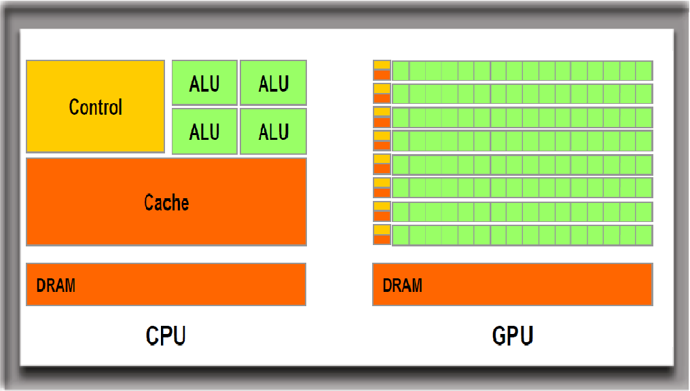

# GPU와 GPGPU 알아보기

안녕하세요! SPARCS에서 활동중인 scotch 입니다.

컴퓨터나 프로그래밍(특히 머신러닝)에 관심 가져보신 분들은 GPU라는 용어를 한 번쯤 들어보셨을 겁니다. 단순히 컴퓨터 부품 중 하나로 알고계신 분들도 있을거고, 머신러닝 등에 활용해신 분들도 있을 겁니다. 그리하여 이번 글에서는 GPU에 대해 자세히 알아보고자 합니다.

## 초창기의 그래픽카드

극초창기의 컴퓨터는 CPU(Central Processing Unit, 중앙처리장치)가 화면 출력까지 담당했습니다.
이후 해상도와 색상 수가 증가하며 화면 출력에 필요한 부하가 커졌고, 화면 출력을 담당하는 독립적인 장치인 그래픽카드가 탄생하였습니다. 다만 당시의 그래픽카드는 메모리의 저장된 화면 정보를 디스플레이로 옮기는 역할에 그쳤습니다.

그래픽카드의 역할이 커지기 시작한것은 3D 그래픽이 나온 이후입니다. 단순히 선과 면으로 이루어진 3차원 공간을 구현하는걸로 시작하여, 텍스쳐와 광원 등 현실과 가까운 그래픽을 구현하기 위해 화면 출력에 엄청난 연산량을 필요로 하게 됩니다. 이러한 연산은 단순한 벡터 계산 정도였지만 그 양이 엄청나 단순히 그래픽카드의 처리속도를 올리는 것만으로 처리하기는 힘들었습니다.

## GPU의 탄생

그리하여 그래픽카드 제조사들은 단순한 연산 유닛을 여러개 탑재해 병렬로 그래픽 연산을 처리하기 시작하였고, 기존의 그래픽카드와 차별화된 용어로 제시된것이 GPU입니다. 이는 Graphic Processing Unit의 약자로, 용어 그대로 컴퓨터 그래픽 처리에 특화된 장치입니다.

GPU는 CPU에 비해 훨씬 많은 수의 ALU(Arithmetic and Logical Unit, 산술 논리 장치)를 탑재하고 있어 그래픽 출력과 같은 대량의 병렬 계산에 특화되어 있습니다. 다만 CPU에 비해 ALU의 기능이 단순하고 처리 속도(Clock, 클럭)가 느리기 때문에 복잡한 직렬 계산에는 부적합하며, 단독으로 작업을 처리할 수 없습니다.

## GPGPU

GPU가 그래픽 처리에 사용되기 시작한 후, 몇몇 개발자들은 이를 그래픽처리뿐 아니라 범용적인 계산에도 사용할 수 있음을 알게 됩니다. 이후 그래픽카드 제조사도 이러한 범용 계산 기능을 공식적으로 지원하기 시작했으며 이를 GPGPU(General-Purpose computing on GPU)라고 칭하기 시작했습니다.

GPGPU를 활용하기 위해서는 이를 지원하는 GPU뿐 아니라 GPU의 명령어셋을 사용할 수 있게 해주는 소프트웨어 레이어가 필요한데, 대표적으로 NVIDIA의 CUDA와 범용으로 사용 가능한 OpenCL이 있습니다.

## GPGPU의 강력함

여러분들이 가장 흔하게 접해보셨을 GPGPU는 바로 머신러닝입니다. CPU보다 GPU가 머신러닝 학습 과정에서 훨씬 빨랐던 경험을 한 번씩 해보셨을텐데요. ML은 기본적으로 엄청난 양의 단순 연산(행렬곱)에 기반을 두고 있습니다. 즉, GPU가 병렬로 처리하기 아주 적합한 것입니다. 이외에도 렌더링, 영상 인코딩/디코딩, 유체 시뮬레이션, 암호화폐 채굴 등 다양한 분야에서 GPGPU가 활용되고 있습니다.

머신러닝을 포함한 다양한 범용 계산은 부동소수점을 활용합니다. 연산장치의 부동소수점 연산 성능을 FLOPS(FLoating point Operations Per Second)로 표현하는데요, 이 수치를 통해 GPU의 연산력이 얼마나 강력한지 알 수 있습니다.

최신 고성능 CPU인 5950X(80만원 내외)의 FP32(단정밀도 부동소수점) 연산 성능은 1.9 TFLOPS 정도인데에 반해, 최신 GPU인 RTX 3080(100만원 내외)의 FP32 성능은 30 TFLOPS에 가깝습니다. 항상 GPU의 성능을 100% 활용할 수 있는 것은 아니지만 이 수치를 통해 GPGPU가 얼마나 강력한 성능을 보여주는지 짐작할 수 있습니다.

## 마무리

상향평준화된 컴퓨터 시장에서 GPU는 급격한 성장을 하며 대량의 연산을 필요로 하는 과학, 공학 분야 전반의 발전에 큰 기여를 하고 있습니다. 최근 머신러닝의 급격한 부상도 GPU의 발전과 동반되었습니다. 그만큼 GPU의 중요성은 더욱 대두될 것이며, 본 글이 조금이나마 이해를 도왔으면 합니다. 감사합니다.
