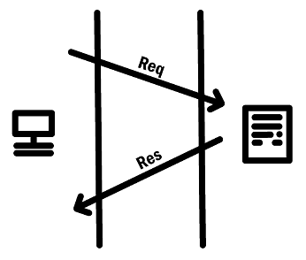
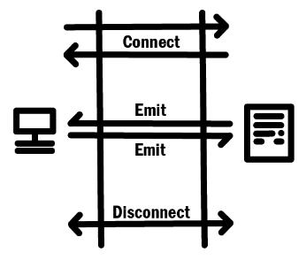

# 소켓 통신, Socket.IO

안녕하세요, SPARCS에서 개발자로 활동 중인 Miru 입니다.  
<br/>

## **웹에서 사용하는 통신**

개발자들이 웹 서비스를 개발하면서 필수적으로 갖추어야 할 기능은 종류에 따라 다르지만, 가장 기본적인 구성은 백 엔드와 프론트 엔드에서 시작됩니다. 백 엔드는 모든 클라이언트, 즉 사용자들의 컴퓨터에 전달 되어야 할 정보를 총괄하는 역할을 하며, 프론트 엔드의 코드는 각 클라이언트들에게 보여지는 서비스의 표면적인 구동을 담당한다는 사실은 흔하게 알려져 있을 것입니다.

하지만 이 과정에서 반드시 수반되어야만 하는 기능이 존재하는데, 당연하게도, 이 모든 것들은 백 엔드의 코드와 프론트 엔드의 코드가 소통하지 못하면 이루어내지 못하는 것입니다.

웹 서비스에서 사용되는 통신이 단순히 백 엔드와 프론트 엔드의 정보 송수신을 위한, 좁은 의미에서 탄생한 것은 아니지만, 오늘 날에는 그 기능의 상당 부분을 차지하게 되었습니다.  
<br/>

## **HTTP 통신**

이 글을 읽게 된 이상 HTTP라는 단어가 생소한 사람들이 많지는 않을 것이라고 생각을 합니다. HTTP 통신이란 브라우저와 웹 서버가 통신할 수 있도록 통신의 규칙과 절차를 규정한 통신 프로토콜이라고 생각할 수 있습니다. HTTP의 규칙을 따르겠다고 합의된 이상, 그에 따른 적절한 순서와 절차를 통해 원하는 파일과 데이터를 송수신 할 수 있도록 마련된 것입니다.

HTTP 통신은 기본적으로 요청과 응답으로(Request & Response) 이루어진다. 하나의 컴퓨터에서 다른 쪽으로 특정한 정보 혹은 파일을 요청하고, 그 신호를 인식한 상대 쪽 컴퓨터에서는 그에 대응하는 응답을 돌려주는 방식입니다.

이 방식은 많은 경우에 있어서 합리적인 통신 수단이지만, 그만큼 한계도 명확한 방식이 된다. 두 컴퓨터 간의 연결을 지속하는 방식 대신 단발적으로 요청이 수신 되었을 때만 연결을 허가하고, 응답까지 마무리된 후에는 연결을 해제하는 방식인 만큼, 소규모의 정보 전달이 다수 발생할 경우 계속해서 연결을 생성하고 해제하는 과정을 거쳐야 하기 때문에, 이는 굉장한 낭비를 하게 됩니다. 또한, 클라이언트의 요청 없이 서버 쪽에서 먼저 클라이언트의 문을 두드리는 것이 불가능해진다고 말할 수 있습니다. 한마디로, 일반적인 HTTP 통신 프로토콜을 따른다면, 모든 정보의 송수신의 시작은 클라이언트 쪽이 행동을 취함으로써 이루어질 수 밖에 없다는 것입니다.


<br/>
-HTTP의 작동 방식-
<br/>
<br/>

## **소켓 통신이란?**

이러한 HTTP의 단점을 보완하기 위해 소켓 통신이 사용됩니다. 소켓 통신은 이름만으로는 쉽게 그 기능이 연상되지는 않을 것이지만, 간단하게 클라이언트와 서버, 두 컴퓨터가 특정한 Port를 통해 실시간으로, 양방향 통신을 가능하게 만든 통신을 의미합니다.
정확히는 두 컴퓨터가 서로에게 단방향 통신을 주고 받음으로써 양방향 통신과 동일하게 구동하는 것이지만, 기능적으로 구 컴퓨터는 거의 동등한 위치에서 통신을 주고받게 되는 것입니다. 이는 클라이언트만이 통신을 시작할 수 있었던 HTTP 통신과는 큰 차이점을 보여줍니다.

소켓 통신은 HTTP 요청에서 연결을 Socket으로 업그레이드 하고자 한다는 요청을 주고 받음으로써 시작됩니다. 두 컴퓨터간의 상호 동의가 있다는 가정 하에 진행되는 연결로써, 소켓을 '여는' 작업과 그 열린 소켓에 '연결' 하는 작업을 동반하게 됩니다. 최초의 Handshake 방식의 요청과 응답이 한 차례 오가면, 자유로운 Websocket 통신이 열리게 되는 것입니다.


<br/>
-WebSocket의 작동 방식-
<br/>
<br/>

## **소켓 통신의 이점**

소켓 통신의 이점은 HTTP 통신 만으로는 불가능했던 것을 가능하게 만드는 것에 있습니다. HTTP로는 불가능했던 지속, 반복 적인 통신을 더 적은 리소스로 가능하게 만들며 무엇보다도 서버 쪽에서 클라이언트의 방향으로 먼저 정보를 전송하며 통신하는 것이 가능해집니다. 이는 흔하게 접할 수 있는 서비스인 채팅, 온라인 게임 등 클라이언트와 무관하게 발생하는 이벤트에 대한 정보를 정확한 시점에 클라이언트에게 전달하는 것이 가능하게 됩니다.
<br/>
<br/>

## **사용 방법**

웹 소켓이라는 개념은 엄밀한 의미에서 라이브러리가 아닙니다. HTTP와 같은 통신 프로토콜이기 때문에, 이를 구현하기 위해서는 Socket.io 라는 라이브러리를 사용할 것입니다.

프론트 엔드 Home_page.tsx

```javascript
import { io } from "socket.io-client";

useEffect(() => {
  const socket = io("http://localhost:8080", {
    transports: ["websocket"],
  });
  socket.emit("recieveMsg_Server", "Hello Server");

  socket.on("recieveMsg_Client", (i: string) => {
    console.log(i);
  });
}, []);
```

코드를 실행시킬 수 있는 방법을 마련한다면, 굳이 useEffect를 사용하지 않아도 됩니다.

백 엔드 index.js

```javascript
const express = require("express");
const http = require("http");

const app = express();
app.use(express.json());

const server = http.createServer(app);
const io = Socket(server);

io.on("connection", (socket) => {
  socket.on("recieveMsg_Server", (i: string) => {
    console.log(i);
  });
  socket.emit("recieveMsg_Client", "Hello Client");
});
```

<br/>
직관적으로 이해할 수 있다시피, 이 코드는 클라이언트/서버에서 각각 서버/클라이언트로 전달한 "Hello Server" 와 "Hello Client"라는 string을 콘솔 로그를 통해 출력합니다. 이 웹 소켓은 문자열 뿐만 아니라 함수가 사용할 수 있는 어떤 방식으로든 정보를 전달할 수 있을 것입니다.

하지만 Socket.io를 이용한 통신도 무적은 아닙니다. 웹소켓 통신은 한번 클라이언트와 서버가 연결된 이상 중단을 선언하기 전까지는 연결이 지속되기 때문에, 그만큼 정보 전달에 리소스를 많이 소모하게 됩니다. 의도적으로 조정하는 것이 가능하기는 하지만, 한번 전송하는 메세지의 한계가 1MB 인 것 또한 감안해야할 것입니다. 이에 관한 더 자세한 정보는 [Socket.io의 서버 옵션 문서](https://socket.io/docs/v4/server-options/)를 참고하면 도움이 될 것입니다.

본론으로 돌아와서, 보다시피, 프론트 엔드와 백 엔드는 동등한 방식으로 서로에게 통신을 하며, 전달 받은 정보를 가공하여 사용하는 것이 가능하게 됩니다. 웹 소켓 방식을 사용하면, 통신이 전달된 순간에 익명 함수가 실행되는 방식이므로, 개발자의 목적에 따라 다양한 활용이 가능해집니다.  
<br/>
<br/>

## **마무리하며**

이번 글에서는 WebSocket에 관한 설명과 그 사용 예시에 관하여 다루어보았습니다. 다양한 개발 경험을 가진 개발자라면 이 내용이 아주 쉽게 느껴질 수 있겠지만, 아직 경험을 쌓아가는 단계의 분들에게는 다양한 가능성을 가진, 굉장히 매력적인 기능으로 다가올 것이라고 생각합니다.

## 참고

[https://socket.io/docs/v3/client-initialization/](https://socket.io/docs/v3/client-initialization/)

[https://fred16157.github.io/node.js/nodejs-socketio-communication-basic/](https://fred16157.github.io/node.js/nodejs-socketio-communication-basic/)

[https://stackoverflow.com/questions/12977719/how-much-data-can-i-send-through-a-socket-emit](https://stackoverflow.com/questions/12977719/how-much-data-can-i-send-through-a-socket-emit)

[https://socket.io/docs/v4/server-options/](https://socket.io/docs/v4/server-options/)
