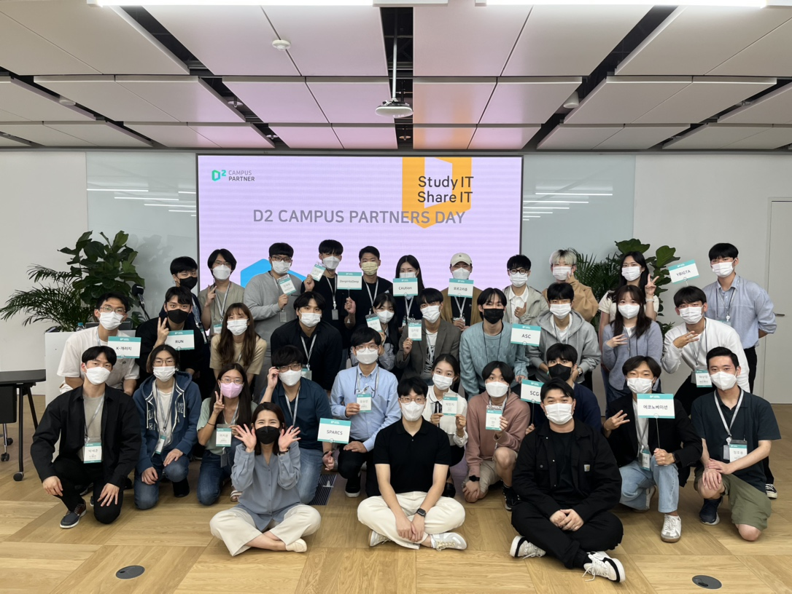

안녕하세요, SPARCS에서 22년도 부회장 및 개발자로 활동하고 있는 이지윤(dora)입니다.

올해 SPARCS가 **NAVER D2 CAMPUS PARTNER**로 선정되었는데요,  
지난 9월 23일 금요일에 첫번째 대면 프로그램인 **PARTNER'S DAY**에 참가한 후기를 간단하게나마 작성하고자 합니다.  

 # NAVER D2 CAMPUS PARTNER란?

> *For Developers, By Developers* 

**NAVER D2 CAMPUS PARTNER**는 살력 있는 학생 개발자들의 성장과 교류를 위해 NAVER에서 지원을 해주는 프로그램입니다.  

올해에는 SPARCS를 포함해 총 10개의 대학생 동아리가 PARTNER로 선정이 되었으며, 저희와 같은 웹/앱 개발 동아리뿐만 아니라 알고리즘, 인공지능, 빅데이터, 보안 등 다양한 분야에서 활동을 하는 동아리들이 함께 선정되었습니다. 각 PARTNER에 대한 정보는 [여기](https://github.com/D2CAMPUS-PARTNER/2022-Kick-off/issues)에서 확인할 수 있습니다.  

올해 9월부터 내년 8월까지 PARTNER로 활동하며 PARTNER'S DAY, TECH MEETUP 등 다양한 행사들에도 참여합니다. NAVER D2 CAMPUS PARTNER에 대한 더 자세한 내용은 [NAVER D2 홈페이지](https://d2.naver.com)를 참고해 주시기 바랍니다.  

# PARTNER'S DAY

PARTNER'S DAY는 8월 18일에 있던 Zoom Kickoff 이후 첫번째 만남이었습니다. 분당에 있는 **NAVER 1784**에서 진행되었으며, 새로운 사람들과 친해지고 쉽게 교류할 수 있도록 모두 섞어 앉았습니다. 각 동아리별로 소개하는 시간을 가졌는데, 오랫동안 운영되어 온 동아리들부터 생긴지 얼마 되지 않은 신생 동아리까지 구성이 다양했습니다. 동아리 운영이나 앞으로 나아가야 할 방향성에 대해서 서로 이야기를 나누고 조언을 해주기도 했습니다.

중간에는 NAVER에서 소프트웨어 엔지니어로 근무하고 계신 유호균 연사님의 강연이 있었습니다. Steve Jobs가 Stanford에서 했던 졸업식 축사인 [Connecting the Dots](https://youtu.be/saC_OH13fAQ)를 먼저 시청한 후, 자신의 인생에서는 어떤 dot들이 있었는지, 그리고 어떤 식으로 dot들이 연결되어 현재의 자신이 만들어질 수 있었는지에 대해 이야기해주셨습니다. 

> Your time is limited, so don't waste it living someone else's life
>
> &mdash; Steve Jobs

위 구절은 앞서 언급한 Steve Jobs의 졸업식 축사에서 나오는 말입니다. 아직 나중에 무엇을 하고 싶은지 확신이 없어 고민하고 있던 제게 저 구절은 매우 인상적이었습니다. 한정된 시간 속에서 우리는 다른 사람의 삶이 아닌, 내 삶을 살아야 합니다. 따라서 내 삶의 소중한 가치가 무엇인지 파악해야 하는데, 그러기 위해서는 **마음이 동하는 것**을 찾기 위해 **부단히** 노력해야 합니다. 따라서 우리는 이를 찾기 위해 다양한 경험을 해야하며, 현재가 미래와 연결되어 있다는 믿음과 확신을 가지고 성장해야 한다고 연사님께서 말씀해주셨습니다.

다른 동아리원들과 고민을 공유하고 선배 개발자님의 강연을 통해 정말 많이 얻어갈 수 있었습니다. 행사를 주최하고 참여할 기회를 주신 NAVER D2 담당자분들께 정말 감사하다고 전해드리고 싶습니다.

