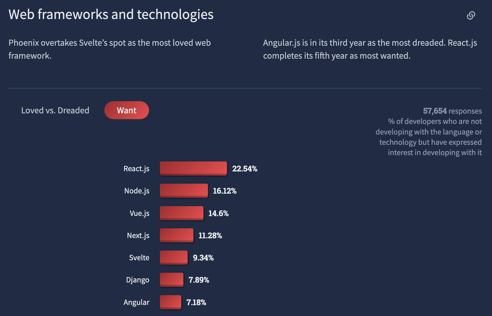
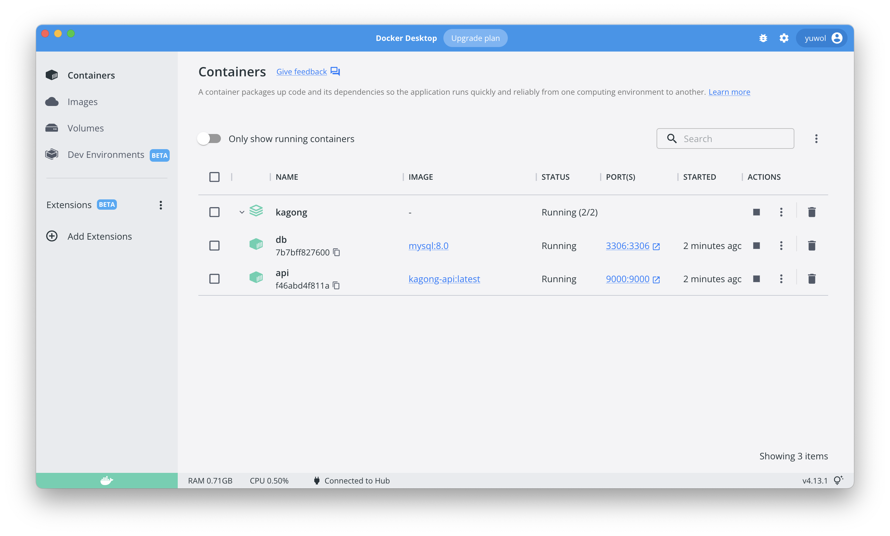
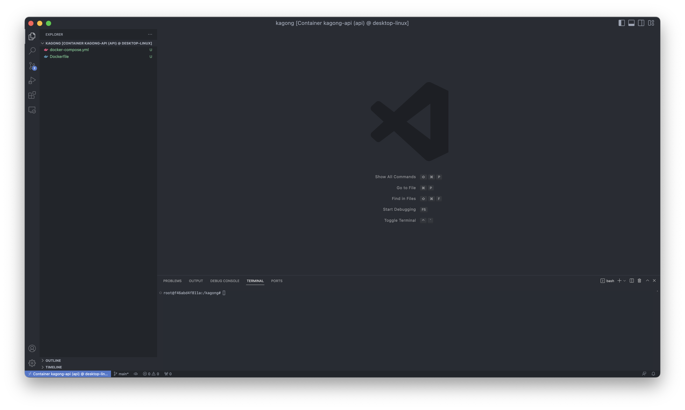
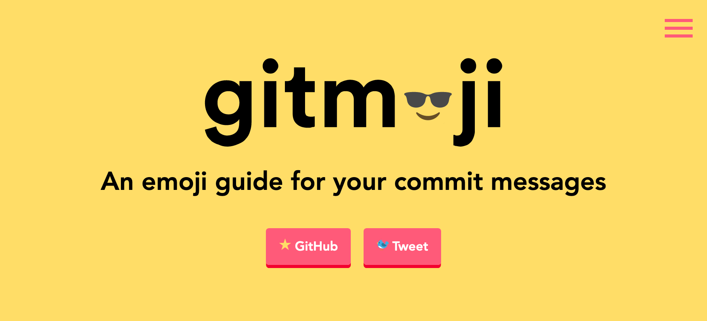

# Kagong Day 0 - 카이스트 공부 서비스, 카공

## 기획

카공을 간단히 소개하자면 카이스트 과목별 게시판이라고 할 수 있다. 최근 에브리타임에 _강의실_ 이라는 기능이 추가되었는데 이와 비슷하다고 볼 수
있겠다. 기능이 추가된 지 얼마 지나지 않아 해당 기능의 사용자는 적어 보인다. 현재 생각하고 있는 기능들로는 아래의 것들이 있다.

- 과목별 게시판
- 시험 정보 공유 (카이스트 전산학부의 경우 역대 시험지를 모두 공개하자는 류 교수님의 말씀이 있었다.)
- 포인트 제도
  - 질문에 대해 답변을 하면 포인트를 얻을 수 있다.
  - 숙명여자대학교에서는 커뮤니티 포인트로 족보를 거래한다.
  - 프로필 커스터마이징 기능 (이런 기능을 좋아하는 사용자들이 꽤 된다. 필자 또한 그중 한 명이다.)
- 다이렉트 메시지
- ~~카공은 사랑을 싣고…~~

## 개발 환경 세팅

필자는 2022년 가을 KAIST 공식 커뮤니티 서비스인 NewAra의 PM이다. Vue + django로 개발되고 있는 서비스로, 카공의
모티브가 되었다. 카공은 django를 이용해 개발할 계획이다 (사실 django를 연습할 프로젝트를 구상하다가 카공을 기획하게 되었다). 본
프로젝트를 통해 django를 더 잘 이해하고, 얻은 지식을 NewAra에 적용할 수 있기를 희망한다.

웹은 React 18을 이용해 개발할 계획이다. Vue를 사용하는 프로젝트의 매니저로서 부끄러운 사실이지만 필자는 Vue를 사용한 적이 없다.
React보다 러닝 커브(learning curve)가 낮다고 하지만 근 네 달 정도 React만 다루다 보니 아무래도 익숙한 기술을 사용하는
것이 낫지 않을까 생각했다.



### DockerFile

개발 환경 세팅은 언제나 힘들다. NewAra 백엔드의 경우 새로운 팀원이 들어오면 환경 세팅에 대부분의 시간을 할애한다. 이에 개발용 이미지를
만드는 것이 낫다고 생각하여 `Dockerfile`부터 생성한다.

개발을 진행할 디렉토리로 이동하고 `git init` 명령을 입력한다. 그 후 에디터를 연다. 필자는 VSCode를 사용한다.

```bash
$ mkdir kagong
$ cd kagong
$ git init
Initialized empty Git repository in /Users/yuwol/Dev/Projects/kagong/.git/
$ code .
```

우선은 백엔드용 `Dockerfile`만 작성하고 프론트는 필요할 때 만들어 사용하겠다. 내용은 python 3.10 이미지에 poetry를
설치하고 (패키지 관리자로 pip이 아니라 poetry를 이용할 계획이다) 디렉토리의 모든 파일을 복사하는 것이다.

배포용 이미지를 생성할 때는 `.dockerignore` 파일을 생성하여 불필요한 파일들을 배제하지만 본 이미지는 개발용이므로 해당 파일을
작성하지 않는다.

CI 용도로는 Poetry 버전을 명시하는 것이 좋으나 개발용 이미지이므로 늘 최신 버전을 다운받도록 한다. 이 부분은 추후 다시 작성하도록
하겠다. ([Poetry CI recommendations](https://python-poetry.org/docs/#ci-recommendations))

```dockerfile
# /Dockerfile

FROM python:3.10

RUN apt update && apt install -y curl

# Install Poetry
RUN curl -sSL https://install.python-poetry.org | python3 -
ENV PATH=/root/.local/bin:$PATH

WORKDIR /kagong

COPY . .

EXPOSE 9000
```

### Compose

이제 개발용 컨테이너를 띄울 `docker-compose.yml` 파일을 작성한다. DB로는 MySQL을 사용한다. 특별한 이유는 없다. 한
가지 주의해야 할 점은 `services: api`에서 `tty: true` 설정을 해야 한다는 것이다. 이를 설정하지 않으면 컨테이너가
시작되자마자 종료된다.

```yaml
# /docker-compose.yml

version: "3"

services:
  api:
    build: .
    container_name: api
    ports:
      - "9000:9000"
    tty: true
    depends_on:
      - db

  db:
    image: mysql:8.0
    container_name: db
    restart: always
    ports:
      - "3306:3306"
    environment:
      - MYSQL_ROOT_PASSWORD=passw0rd
      - MYSQL_DATABASE=kagong
    volumes:
      - dbdata:/var/lib/mysql

volumes:
  dbdata:
```

위 두 파일과 같은 경로에서 아래 명령을 입력하여 컨테이너를 띄운다.

```bash
docker compose up -d
```



### Dev Containers

VSCode를 사용함의 장점은 _Dev Containers_ 라는 익스텐션을 사용할 수 있다는 것이다. 본 익스텐션을 사용하면 선택한 컨테이너
환경에서 VSCode를 열 수 있다. 필자는 _Docker_ 익스텐션도 설치하였다.


사이드바에서 `kagong-api` 컨테이너를 우클릭한 후 "Attach Visual Studio Code"라는 옵션을 선택하면 컨테이너
환경에서 새 VSCode 창이 열린다.



## GitHub

### Gitmoji

여기까지 하고 커밋을 한 번 한다. 필자는 gitmoji를 이용한 커밋을 선호하는 편이다. 이모지를 사용해 커밋 메시지의 종류를 나타내는
방식으로, 50자로 제한되는 커밋 메시지 제목에 뜻을 함축적으로 적을 수 있어 좋다. (사견으로는 윈도우의 이모지가 더 귀엽고 예쁘다.)



Gitmoji에는 프로젝트의 시작을 뜻하는 tada(🎉) 이모지가 있다. 필자는 프로젝트 제목만 있는 README.md 파일을 만들어 "🎉
begin a project" 메시지로 커밋을 한 번 한 후 실질적인 커밋을 시작한다.

- 🎉 begin a project
- 🧑‍💻 add docker & compose files for development


## 맺는말

다음 글에서는 django 개발 환경을 세팅하고 정상 동작하는지 간단하게 확인할 계획이다. 마치 잘 아는 것처럼 적었지만 필자는 Docker와
그리 친하지 않다. 개발을 진행하며 많은 문제가 발생할 것이다. 카공 연재는 튜토리얼이라기보다 필자의 개발 일지에 가깝다. 얼마나 길어질지는
모르겠으나 꾸준히 작성할 예정이다.
