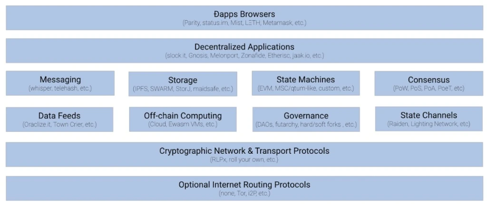

# WEB 3.0

1990년대 초반, 월드와이드웹이 개발되며 정보화 시대가 가속화 되었다. 이후 웹은 많은 기술들이 개발되고 사용자들이 늘어가며 빠른속도로 발전해왔다. 처음 웹이 상용화 되었을 때는 클라이언트(사용자)가 서버로부터 컨텐츠를 제공만 받던 형태였다. 이를 web1.0이라 한다. 이후 2004년 부터 인터넷 벤처들을 중심으로 웹 기술과 인터넷 산업 전반에 대한 새로운 시도들이 등장하며 web2.0이 시작되었다. wbe2.0의 가장 큰 변화는 AJAX의 등장으로 클라이언트와 서버가 상호작용하며 서버에 기록이 가능해졌다는 점이였다. 이를 통해 사람들간의 커뮤니테이션과 정보 전달 방식에 많은 변화가 생겼으며 서비스들이 생활에 가깝게 접근할 수 있게 되었다. 하지만 서버와 상호작용이 가능해지며 해커들이 악의적인 목적으로 사용자들의 개인 정보를 탈취하는 문제들이 발생하기 시작하였다. 또한, 이러한 개인정보의 보안은 서비스를 제공하는 기업을 믿고 의지하는 방법 뿐이였다. web3는 이러한 문제점들을 보완하고자 등장하였다.

## WEB3란?

web3는 분산 웹이라고도 불리며 간단히 요약하면 모든 정보들이 분산화된 차세대 네트워크 구조를 의미한다. web3는 중앙집권 적이던 과거의 플래폼에서 벗어나, 모든 유저가 플랫폼이 될 수 있는 인터넷이다. 이를 구현하는 가장 핵심적인 기술은 블록체인이다.

### web3의 기술스택

dApp(분산 앱)은 만들기 위해서는 컴퓨팅 자원, 파일 스토리지, 외부 데이터 등의 요소들을 필요로 한다. dApp의 개념이 2014년에 처음 등장했을 때 까지만해도 이를 구성하기에 많은 어려움들이 있었지만, 현재는 최소한의 자원으로도 dApp을 개발할 수 있도록 기술이 발전했다. web3를 구성하는 기술 스택은 다음 그림과 같다.

### web3의 장점

- 웹에 참여하고 있는 모든 클라이언트가 서비스를 사용할 권한을 가진다.
- 결제는 자체 토큰을 사용한다. ex. ether
- 탈중앙화되어 있어 검열이 불가능하다.
- 분산화되어있는 노드들로 구성되어 있어 특정 노드에 문제가 발생하더라도 서비스가 지속적으로 유지될 수 있다.(Single Point of Failure가 없다.)

## WEB3.js

이더리움(Ethereum)은 web3의 상용화를 위해 web3.js라는 JS API를 제공한다[(https://github.com/ethereum/web3.js/)](https://github.com/ethereum/web3.js/). web3.js는 이더리움 네크워크와 상호작용할 수 있는 다양한 기능들을 제공한다. 이를 이용해 다른 사용자에게 이더를 전송하거나 스마트 컨트랙트를 만들고 스마트 컨트랙트에서 데이터를 읽고 쓸 수 있다.

web3.js에는 다음과 같은 모듈들이 있다.

- web3-eth : 이더리움 블록체인과 스마트 컨트랙트 모듈이다.
- web3-utils : dApp 개발을 위한 헬퍼 함수를 모아둔 모듈이다.
- web3-bzz : 탈중앙화 파일 스토리지를 위한 스왐프로토콜 모듈이다.
- web3-shh : P2P 커뮤니테이션과 브로드캐스트를 위한 위스터 프로토콜 모듈이다.

## 마무리

클라이언트-서버로 구성된 웹에서 분산웹으로의 전환은 서서히 변화해 나갈 것이다. 이러한 변화는 중앙화된 형태에서 일부만 분산된 형태에서, 최종적으로 완전히 분산된 형태로 바뀌어 나갈것이다. 분산화된 웹에서는 네트워크에서 발생하는 오류들을 더욱 매끄럽게 처리할 수 있으며, 외부의 공격으로부터도 공격받는 구심점이 없기 때문에 보안성도 더욱 뛰어날 것이다. 현재까지는 속도적인 면에서 열위가 있지만 꾸준한 발전을 통해 초 연결 사회의 주요기술로 자리잡게 될것으로 보인다.

읽어주셔서 감사합니다
