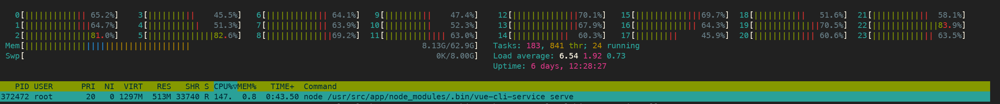
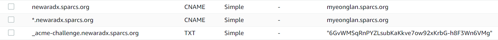
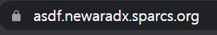

# newara-dx: 개발용 컨테이너 만들기

시작하기 앞서, 현재 블로그 주제는 이 주제가 아닌, Kubernetes에 관련된 주제였으나, 몇일 전에 의도치 않게 해당 주제로 많은 시간을 사용해 뉴아라 백엔드 개발용 컨테이너를 완성했기 때문에, 급하게 회고록 형태로 블로그 주제를 바꾸었습니다. 추후 연재? 될 Kubernetes 이야기도 기대해 주세요!

시험 몇일 전에 공부하기 싫어서 작성하는 글이어서, 퀄리티가 약간 떨어질수 있으나, 양해 부탁드립니다.

## 서론

 newara-dx 는 Newara Development Experience 의 약자이다. 노션의 뉴아라의 온보딩 페이지를 보면 알겠지만, 개발 환경 셋팅, 특히 백엔드는 매우 복잡하다. 따라서 이전부터 여유가 되는 SPARCS의 물리 서버를 활용해 개발 컨테이너를 만들자는 이야기가 나왔었다.

 최종 목표는 여러 유저들이 독립된 환경에서 빠르게 개발 환경을 갖출 수 있게 하는 것이었다. 완성된 결과는 ‣ 에서 확인할 수 있다.

 사실 몇주 전만 해도 개발용 컨테이너를 만들어야겠다는 생각은 전혀 없었었다. 비록 백엔드 온보딩 셋팅이 어렵다는 이야기는 계속해서 나왔었으나, 방학때나 나중에 여유있을때 천천히 만들 생각이었다. 그리고 우리의 NewAra PM님께서도 계속해서 개발용 이미지를 만들고 있다고 해서, 조금씩 도와줄 정도로만 생각했었고, 이렇게 많은 시간을 사용해서 학기 중에 완성하게 될 줄은 상상도 하지 못했다.

 컨테이너 제작 시기는 저번주 공동 코딩 시간이었다. 그때 뉴아라 부원분께서 M1 Mac을 쓰시는데, 자꾸 파이썬 환경이 문제를 일으켜 개발을 하지 못한다는 소식을 들었다. 몇주동안 해결을 하는데 어려움을 겪고 있다고 하셔서, PM님께 내가 빠르게 개발용 컨테이너 이미지를 만든다고 했다.

> 기영 : 또 파이썬이 안돼 인준아
인준 : dockerfile 만들고 컨테이너로 작업하자, 간단해 보이는데 예준이 형이랑 10분안에 해줄래?
>

 이때까지만 해도 나는 한시간, 오래 걸려도 공동 코딩 시간에 끝날 줄 알았다. 왜냐하면 기존에 프론트, 백엔드 CI 를 이전 PM님과 함께 구축을 하기도 했었고, 이번에는 production용이 아닌 develop용이어서 multi-stage build 등등 일부 요소들은 생각해도 안했기 때문에 빨리 끝날 것으로 예상했다.


 하지만 거의 5일 꼬박 걸려서 완성했는데, 그 시간동안 왜 이리 오래 걸렸는지, 그리고 어떻게 구현을 해 나갔는지 소개를 하려고 한다.

## `Dockerfile`과 `docker-compose.yml`, 그리고 `docker-entrypoint.sh`

처음에는 `Dockerfile`과 `docker-compose`는 CI용 Dockerfile과 dev 서버에 있는 docker-compose를 거의 그대로 사용해 보려고 했다. 하지만 문제는 production용과 달리 dx는 사용자가 수정한 내용을 저장할 수 있도록 `/root` 디렉토리와 볼륨 매핑을 해야만 한다. **그렇지만 볼륨 매핑을 하게 되면, 이미지 내 `/root` 디렉토리의 파일들은 전부 사라져 버리는 문제가 발생한다!**

따라서, 약간의 꼼수가 필요한데, 이미지 단에서 생성된 파일은 `/tmp` 폴더에 저장하고, 컨테이너가 실행 될 시 이 폴더로부터 복사해 원하는 디렉토리에 붙여넣는 것이다. 이를 위해서 Dockerfile의 entrypoint로 `/docker-entrypoint.sh` 를 실행하게 해, 해당 쉘 스크립트에서 `/tmp` 폴더에서 우리가 원하는 폴더로 복사토록 했다.

매핑된 볼륨이 비어있을 때만 초기화(initialize) 스크립트가 실행하게 해야 되므로, `if ! [ "$(ls -A /root/api/apps)" ]; then` 와 같은 조건문을 사용했다. 해당 디렉토리가 비어있는 경우, if 문 안을 실행한다.

여기서 잠깐, `Dockerfile` 에서 `RUN` 과 `ENTRYPOINT` 의 차이를 알아야한다. `CMD` 도 있으나, `ENTRYPOINT` 와 거의 유사하다.

- `RUN` : 이미지를 제작하는 과정에서 실행되는 명령어, `RUN apt-get update` 등 이미지를 구성하는데 필요한 환경 설정을 하는데 사용한다.
- `ENTRYPOINT` : **이미지가 실행되어 컨테이너로 되었을 때, 실행할 명령어.** 컨테이너에서 1번 프로세스로 실행된다. 만약 컨테이너를 올렸을 때 바로 React 앱을 띄워지게 하고 싶으면 `ENTRYPOINT ["npm", "run", "serve"]`  의 형태로 사용하면 된다. 그리고 개발용 컨테이너를 만들고 싶으면 `ENTRYPOINT ["sleep", "infinity"]` 를 하면 된다. 1번 프로세스가 죽지 않게 만들어야 하기 때문이다. bash를 띄워도 되지만, interactive + tty 옵션을 주어야 하는 번거로움이 있다.

`ENTRYPOINT` 로 실행해야할 명령어가 많으면, 따로 `[docker-entrypoint.sh](http://docker-entrypoint.sh)` 로 분리를 한 뒤, 이미지 빌드시 `COPY` 를 통해서 이 스크립트를 `/` 디렉토리로 복사한 뒤, `ENTRYPOINT ["bash", "-c", "/docker-entrypoint.sh"]` 로 실행하는 것이 좋다.

### Files

실행하는데 반드시 필요한 `.env` 파일을 포함해 아래와 같이 구성했다.

`api/`

- `Dockerfile`
- `.env`
- `[docker-entrypoint.sh](http://docker-entrypoint.sh)`

`web/`

- `Dockerfile`
- `.env`
- `[docker-entrypoint.sh](http://docker-entrypoint.sh)` : 최종적으로 `npm run serve` 실행 - 백엔드 개발자가 프론트 컨테이너를 건드리지 않아도 됨

`docker-compose.yml` : `api` `web` `mysql` `redis` `elasticsearch`

### NOTE

- `Dockerfile` 의 경우 명령어의 순서가 중요하다. CACHING되는 수준이 다르기 때문이다.
- CI용 이미지를 그대로 쓰니 몇몇 python 관련 문제가 나타났다. 어찌저찌해서 잘 해결했고, virtualenv를 쓰지 말자는 얘기도 나왔지만 그냥 poetry의 `virtualenv`의 `in-project` 옵션을 활성화하는 식으로 해결했다.
- entrypoint 혹은 사용자에 의해 변경되는 모든 것은 반드시 `/root` 볼륨 안에 있어야 한다. ****그렇지 않으려면 이미지를 만들때 반영이 되어야 한다. 그 이유는 컨테이너를 재부팅하면 변경사항이 모두 사라지기 때문이다. 그렇기 때문에 `virtualenv` 를 사용해 project 내에 `.venv` 를 만든 것이다.
- 프론트엔드가 받을 수 있는 백엔드 api는 `prod`와 `dev` 단 두개였는데, 이를 환경변수를 통해서도 받을 수 있도록 수정해 주었다.
- 로컬에서 작업했는데 이미지 빌드 후, 컨테이너가 초기화되는데까지 시간이 너무 오래 걸렸다. 따라서 명란 서버로 옮겼는데, 획기적으로 빌드 및 초기화 속도가 개선되었다! 명란 서버에서 빌드 시 아래 24코어를 전부 사용하고 있는 것을 보니 뿌듯했었다 😀



- `Dockerfile` 과 `[docker-entrypoint.sh](http://docker-entrypoint.sh)` 를 수정하는데 대부분의 시간을 할애했다. 처음 컨테이너를 실행할 때 조금이라도 원하는대로 되지 않으면 다시 컨테이너를 완전히 없앴다가 수정 한 후, 다시 실행해야 했기 때문이다. `poetry install` 은 명란 서버 덕분에 빠르게 되었지만 `make migrate` 하는데 시간이 많이 소요되었다. CPU도 1~2개의 코어만 사용하고, 아직도 그 이유를 모르겠다. 대신 컨테이너를 완전히 없앨 때는 `volumes` 디렉토리만 삭제하면 되서 빠르게 내릴 수 있었다.
- 어떤 것을 `Dockerfile` 에 둘 것인지, 어떤 것을 `[docker-entrypoint.sh](http://docker-entrypoint.sh)` 에 둘 것인지 잘 결정해야 한다.

처음에는 `git clone` 을 `Dockerfile` 에 두고, entrypoint 때 최신 develop 브랜치를 가져와 poetry install 하게 했다. 그랬더니 재부팅 한 후에는 예전 마스터 브랜치로 돌아가는 일이 발생했다. 아직도 정확한 원인은 파악하진 못했지만, `git clone` 도 entrypoint의 초기화 작업때 하도록 바꾸었더니 문제가 해결되었다. `.env` 도 `COPY` 를 통해 이미지내 포함되게 만들었지만, 불필요하게 이미지가 많이 늘어나고 `.env` 가 바뀔 때마다 이미지를 빌드하게 해야 되는 단점이 있었다. 따라서  `.env` 도 처음에 볼륨 매핑으로 연결하고, entrypoint에서 복사해서 사용하는 식으로 바꾸었다.

## https 달기: 서브 도메인 할당

장고의 Set-Cookie가 작동을 하지 않는다는 문제를 발견해, 강제로 Security를 끄는 식으로 어찌저찌 프론트, 백 모두 띄워 연결까지는 마무리했다. 아마 프론트, 백 포트가 다른 것이 문제인듯 했다. 문제는 다음에 발생했다.

바로 얼마 전에 뉴아라에 도입한 알림 기능이 켤 수 없게 비활성화 되어 있었다.

문제를 찾아보니, 다음과 같은 도큐에서 그 원인을 알 수 있었다.


[https://developer.mozilla.org/ko/docs/Web/API/Notifications_API/Using_the_Notifications_API](https://developer.mozilla.org/ko/docs/Web/API/Notifications_API/Using_the_Notifications_API)

망했다.. https를 달아야만 했다. 그러기 위해서는 nginx와 certbot이 필요하다. https를 다는 것은 어려운 일이 아니다. (휠 세미나만 잘 들었다면) 근데 문제는 단일 엔드포인트가 아닌 유저별 엔드포인트가 필요하다는 것이다. 유저 한명이 추가될 때마다 route53에서 도메인을 만드는 것은 번거롭고 깔끔하지 못하다. wildcard로 `*.newaradx.sparcs.org` 하나만 DNS에 등록하고, nginx 컨테이너를 띄워서 docker 수준에서 관리하는 것이 용이해 보였다. 관건은 위 도메인에 https를 붙일수 있는지였다.

다행히 이 목적에 정확히 적합한 방식이 있었다. letsencrypt에서 https 인증서를 발급받기 위해 두가지 방법이 있다.

1. `HTTP-01` - 유효한 서버인지 인증: 해당 도메인과 연결된 서버에 파일을 저장하고, 웹서버가 해당 파일을 잘 전달한다면 인증서를 발급해준다.
2. `DNS-01` - 유효한 도메인인지 인증: 특정 토큰을 던져 준뒤, `_acme-challenges.<domain>` 의 TXT 레코드로 해당 토큰을 잘 전달한다면 인증서를 발급해준다.

SPARCS의 모든 서버는 지금까지 `HTTP-01` 방식을 이용해 https를 달았었다. `certbot` 이 알아서 nginx 셋팅을 해 자동으로 갱신까지 해 주기도 하고, 하나의 서비스에 하나의 도메인만 필요했었기 때문이다. 하지만 wildcard 도메인으로는 `HTTP-01` 방식을 사용할 수 없다. 대신 `DNS-01` 방식으로 route53에서 TXT 레코드를 수정해주어야 한다. 이렇게 하면 `[triangle.newaradx.sparcs.org](http://triangle.newaradx.sparcs.org)` 로 들어가든, `[yuwol.newaradx.sparcs.org](http://yuwol.newaradx.sparcs.org)` 로 들어가든 모두 https 가 적용이 된다!

route53에 다음과 같이 레코드를 만든 뒤 (_acme-challenge의 TXT 레코드는 아래 명령어에서 리턴하는 값으로 나중에 바꿔야 한다.)



`sudo certbot certonly --manual --preferred-challenges dns -d "*.newaradx.sparcs.org" -d "[newaradx.sparcs.org](http://newaradx.sparcs.org/)"` 를 실행한다. 여기서 리턴하는 TXT레코드를 route53에 입력한다.

이후 서버 nginx 설정에 `ssl_certificate` 로 발급된 `fullchain` 과 `privkey` 를 연결하면 다음과 같이 https가 적용된 것을 확인할 수 있다.



하지만 certbot에서 3개월마다 자동으로 갱신까지 해 주진 못하므로, 수동으로 갱신을 해 주어야 하는 것으로 보인다. 아마 renew-hook을 위한 route53 api가 있을 것으로 추정되지만 여기까지는 알아보진 않았다.

nginx은 2번 거치게 된다. 하나는 서버의 nginx이고, 다른 하나는 docker 컨테이너로 띄워진 nginx이다. 역할은 다음과 같다.

- 서버 nginx: `*.newara.sparcs.org` 로 오는 모든 요청을 https 로 받는 역할을 하고, nginx 컨테이너로 reverse proxing 한다. 80번의 요청들은 전부 443번으로 리디렉트한다.
- 컨테이너 nginx: `*.newara.sparcs.org` 를 유저별로 구분한 뒤, `/api` 로 요청이 온 경우, 해당 유저의 백엔드 컨테이너로, `/` 로 요청이 온경우 해당 유저의 프론트 컨테이너로 reverse proxing 한다.

컨테이너 nginx를 위해 `conf.d` 내에 각 유저별로 하나의 `.conf` 파일이 필요하다. 이를 빠르게 생성할 수 있는 `[domain.sh](http://domain.sh)` 라는 쉘 스크립트를 만들었다. `server_name` 의 닉네임, `proxy_pass` 의 컨테이너 이름만 사용자별로 달라지면 되므로,  비교적 쉽게 스크립트를 만들었다.

### Files

실행하는데 반드시 필요한 `.env` 파일을 포함해 아래와 같이 구성했다.

`api/`

- `Dockerfile`
- `.env`
- `docker-entrypoint.sh`

`web/`

- `Dockerfile`
- `.env`
- `docker-entrypoint.sh`

`docker-compose.yml` : `nginx` `api` `web` `mysql` `redis` `elasticsearch`

`nginx`

- `nginx.conf` → 컨테이너 nginx 설정 중 하나, 존재하지 않은 유저에 대한 default domain case에 501 리턴
- `newaradx.sparcs.org.backup` → 서버 nginx 설정, `/etc/nginx/sites-enabled/newaradx.sparcs.org` 와 soft link 설정

`[domain.sh](http://domain.sh)` : 유저별 컨테이너 nginx conf 생성기

`[nginx-reload.sh](http://nginx-reload.sh)` : `docker exec nginx-dx nginx -s reload` 명령어, 말 그대로 컨테이너 nginx 재실행 목적

## 유저별 컨테이너 분리, ssh를 붙여 마무리

위의 파일 구조를 보면 알 수 있겠지만, 현재 `docker-compose.yml` 이 하나밖에 없고, 여기에 현재 6개의 서비스가 띄워져 있는 상태였다.

현재는 유저 한명만 있는 상황인데, 만약 유저를 추가하고 싶다면, `docker-compose.yml` 에 nginx을 제외한 5개의 서비스를 위한 설정 파일을 같은 파일에 복사 붙여넣기를 해야 한다. 깔끔하지 않을 뿐더러 서비스 이름이 겹치지 않도록 수정까지 해야 하므로 번거로워진다는 단점이 있다.

여기서 생각해 본 것은 과연 유저별로 이미지를 빌드를 해야 할 필요가 있을까였다. `docker-compose.yml` 에서 `build: .` 로 백엔드와 프론트 이미지를 빌드를 하고 있었는데, 빌드는 다른 곳에서 진행해 이미지는 미리 만들어 놓고, 유저별 컨테이너에서 `image: newaradx/web` 이런 식으로 같은 이미지를 공유하고, 볼륨 매핑으로 `.env` 만 다르게 가져가면 되지 않을까 라는 생각이 들었다.

그러면 자연스럽게 유저별로 `docker-compose.yml` 을 가져가고, `.env` 도 유저별로 다르므로, 이것들을 유저 디렉토리에 분리를 해야겠다는 생각이 들었다. `Dockerfile` 과 `[docker-entrypoint.sh](http://docker-entrypoint.sh)` 는 이미지 빌드때 사용되고, 같은 이미지를 공유하므로 `image` 디렉토리에 분리했다.

### Files

주황색 글씨는 사용자가 생길 때마다 생성되는 파일 및 디렉토리이다.

`docker-compose.yml` : `nginx`

`image`

- `api`
  - `Dockerfile`
  - `docker-entrypoint.sh`
- `web`
  - `Dockerfile`
  - `docker-entrypoint.sh`
- `[build.sh](http://build.sh)` : `docker build api --tag=newara-dx/api; docker build web --tag=newara-dx/web`

`sample` : `cp -r sample <user>` 로 유저별 디렉토리 (`<user>`) 복제해 사용

- `api`
  - `.env`
- `web`
  - `.env`
- `docker-compose.yml` : `api` `web` `mysql` `redis` `elasticsearch`
  - 볼륨 매핑으로 `<user>/volumes` 디렉토리 생성됨
- `[findmy.sh](http://findmy.sh)` : `docker compose exec api cat /root/.ssh/id_rsa; docker compose ps -a`
  - 후술할 ssh 키 파일 확인 및 사용중인 ssh, db 포트 확인 용

`nginx`

- `nginx.conf`
- `newaradx.sparcs.org.backup`

`[domain.sh](http://domain.sh)` : 유저별 docker nginx 설정 추가 스크립트 (`nginx/<user>.conf` 생성됨)

`[nginx-reload.sh](http://nginx-reload.sh)` : `docker exec nginx-dx nginx -s reload`

한가지 고려해 주어야 할 것은 `nginx` 컨테이너와 유저 컨테이너들 간에 같은 네트워크를 사용할 수 있도록 해주어야 한다는 점이다. 따라서 다음과 같이 네트워크를 연결했다. nginx와 유저 컨테이너들은 다른 docker-compose 파일에 위치하므로, `external: true` 를 붙여 외부 컨테이너간의 연결을 활성화해야 한다.

```yaml
# docker-compose.yml
nginx:
	...
	networks:
  - newara-network
networks:
  newara-network:
    name: newara-network

# sample/docker-compose.yml
5개의 컨테이너들:
	...
	networks:
  - newara-network 
networks:
  newara-network:
    name: newara-network
    external: true
```

놀라운 점은 특정 디렉토리 안의 `docker-compose.yml` 을 실행함으로써 유저 컨테이너들을 실행했을때, `sample-api-1` 이런 식으로 유저 및 컨테이너 별로  unique 한 도메인 이름을 생성해 준다는 것이다. 따라서 저 sample 디렉토리를 복사해 자신의 닉네임으로 바꾼 뒤 컨테이너를 실행하면 `nickname-api-1` 이런 식으로 도메인 이름을 만들어 준다. 한 파일에서 서비스 이름이 겹치면 안되지만, 다른 `docker-compose.yml` 에 위치한 서비스 이름이 겹치는 것은 괜찮다. 덕분에 `docker-compose.yml` 파일은 전혀 수정하지 않아 주어도 된다! (포트 매핑에서 포트가 겹치지 않는다면)

이를 이용해 docker nginx에서`[triangle.newaradx.sparcs.org](http://triangle.newaradx.sparcs.org)` 로 오는 요청은 `[http://triangle-web-1](http://triangle-web-1)` 로, `[triangle.newaradx.sparcs.org](http://triangle.newaradx.sparcs.org)[/api](https://triangle.n.....org/api)` 로 오는 요청은 `http://triangle-api-1` 로 reverse proxy 할 수 있도록 설정했다.

그리고 장고에서 db, redis, elasticsearch에 연결할 때도 `triangle-db-1` , `triangle-redis-1` `triangle-elasticsearch-1` 로 접속할 수 있도록 `.env` 안에 명시되어있는 host 경로를 바꾸어준다.

그러면 거의 모든 셋팅이 끝났다. 마지막으로 사용자가 ssh를 통해 컨테이너를 접속할 수 있게 해주어야 한다. `image/api/docker-entrypoint.sh` 에서 아래 코드를 추가한다. `Dockerfile` 에서 `openssh-server` 패키지를 먼저 설치해 준다.

```yaml
if ! [ "$(ls -A /root/api/apps)" ]; then
	...
	echo -e "\n"|ssh-keygen -t rsa -N ""
	touch /root/.ssh/authorized_keys
	cat /root/.ssh/id_rsa.pub >> /root/.ssh/authorized_keys
	...
fi;
...
service ssh start;
sleep infinity;
```

자동으로 키파일을 생성해 서버의 공개키를 등록하는 과정이다.

이제 마지막으로 해야 하는 것은 `docker compose exec api cat /root/.ssh/id_rsa;` 명령어를 통해 비밀 키를 확인하고, db 및 ssh 포트를 유저에게 전달해 ssh 셋팅을 하도록 하면 된다!!!

## newara-dx 를 통해 얼마나 삶이 편리해졌을까?

지금까지 어떻게 dx를 구축을 했는지 장황하게 설명했는데, 더 복잡한거 아니야? 라고 생각하는 사람도 있을 것이다. 하지만 이는 필자만 이 복잡한 거만 하면 되는 것이고, 유저를 추가할 PM, 이 컨테이너들을 사용한 유저들의 입장에서는 해야 할 일은 매우 적어졌다.

### PM이 해야 할 것

1. `sample` 디렉토리 `<닉네임>` 으로 복사
2. `<닉네임>/api/.env` `<닉네임>/web/.env` 에서 환경변수 수정

    api

    - 유저에게 전달받은 `SSO_CLIENT_ID` 및 `SSO_SECRET_KEY`
    - `NEWARA_DB_HOST=<닉네임>-db-1`
    - `NEWARA_REDIS_ADDRESS=<닉네임>-redis-1`
    - `NEWARA_ELASTICSEARCH_HOST=<닉네임>-elasticsearch-1`

    web

    - `VUE_APP_API_HOST='[https://<닉네임>.newaradx.sparcs.org](https://triangle.newaradx.sparcs.org/)'`

    (Optional) `<닉네임>/docker-compose.yml` 에서 포트 매핑에서 호스트 포트 번호 안겹치게 (랜덤하게 하는 경우 수정 필요 없음)

3. `docker compose up -d` 실행
    - 프론트는 `npm run serve` 까지 실행해 자동으로 띄워짐
    - 백엔드는 `poetry install` `make migrate` 까지 진행됨, 초기화가 끝나면 환경변수를 로드할 수 있는 `activate` 라는 파일 생성됨
    - 백엔드 다 띄워지면 다시 재부팅해야 함 (공유 파일 인식 목적)
4. `./domain.sh on <닉네임>` 실행
    - nginx 설정 파일 자동 생성
5. `<닉네임>/findmy.sh` 실행
    - <(1) 키파일 내용>과 <(2) ssh 포트번호>, <(3) db 포트번호> 확인 가능 → 유저에게 전달하기

### 유저가 해야 할 것

1. SSO Development Center에서 SSO Test service 추가 후 `SSO_CLIENT_ID` 및 `SSO_SECRET_KEY` 전달
    - alias: `new-ara-dx`
    - Main URL: `https://<닉네임>.newaradx.sparcs.org`
    - Login Callback URL: `https://<닉네임>.newaradx.sparcs.org/api/users/sso_login_callback`
2. PM님께 전달받은 <(1) 키파일 내용>과 <(2) ssh 포트번호>, <(3) db 포트번호>를 가지고 ssh와 vscode, datagrip 세팅을 진행
3. `make run` 실행 후, 초기 db 세팅
4. `https://<닉네임>.newaradx.sparcs.org` 에서 자유롭게 개발 가능!

**정말 간단해졌다!**

이제 m1 mac이라서 안되는 문제도 없고, 초기 환경설정에 몇주씩 걸릴 일도 없어졌다.

프론트엔드는 고려하지 않았지만, 백엔드보다 훨씬 간단할 것으로 예상한다.

이 글에서 코드는 최소한으로 하려고 했는데, 전체 코드는 [https://github.com/sparcs-kaist/new-ara-dx](https://github.com/sparcs-kaist/new-ara-dx) 에서 확인 가능하다.

dx 컨테이너를 통해 더이상 개발자들이 복잡한 환경 설정에 더이상 힘을 쏟지 않고, 개발에 좀 더 집중하길 희망한다. 그리고 SPARCS 내의 다른 프로젝트에서도 이런 dx 환경을 한번쯤 구축해 사용하면 좋을 듯 하고, 이 글이 구현에 큰 도움이 되길 바란다.
