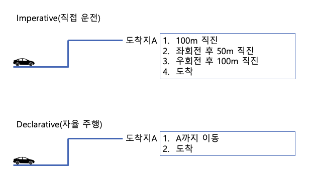

## Definition

> Infrastructure as Code (IaC) is the **managing and provisioning** of infrastructure **through code** instead of through manual processes.
- by ⛑️(Redhat)
> 
- 인프라를 관리하고 Provision 하는 과정을 수동(인간이 Step By Step으로 명령어를 날리는 것 등)이 아닌 코드를 통해서 수행하는 것
- Provision하려는(한) 인프라에 대해서 Spec을 담고있는 Configuration에 해당하는 파일이 생성되며, 이 파일이 코드로 작성된다.
    - 매번 같은(비슷한) 인프라를 구성하는데 있어서 빠뜨리는 것 없이 동일하게 Provision 가능하다.
    - 이러한 Config 파일들이 일종의 문서화의 역할을 한다.
    - Ad-hoc으로 불어나는 자잘한 변화들을 피할 수 있다.
- 코드로 작성되기 때문에, 수정사항에 대해서 VCS(Version Control System)을 사용하여 인프라 변화에 대하여 추적,관리, 운영할 수 있다.

## Types

- **Imperative**
    
    수행해야하는 명령들과, 명령들의 수행 순서를 정의하는 방식
    
- **Declarative**
    
    생성 결과물에 대한 상태를 정의하고, 이를 적용하면 IaC Tool이 자동으로 해당 결과물을 생성해주는 방식
    

## Tools

- **[Chef](https://www.redhat.com/en/topics/automation/what-is-infrastructure-as-code-iac#:~:text=few%20popular%20choices%3A-,Chef,-Puppet)**
- [**Ansible**](https://github.com/ansible/ansible)
- [**Puppet**](https://www.puppet.com/)
- [**Terraform**](https://www.terraform.io/)
    
*곧 Terraform에 대한 글이 이어집니다..*