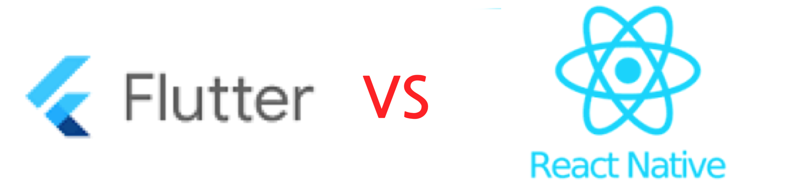
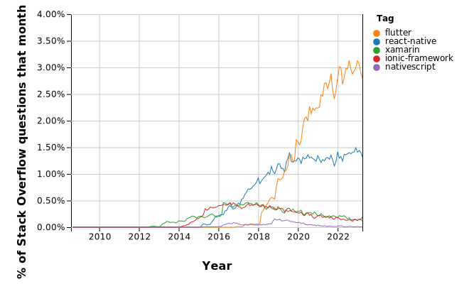

# Flutter vs React Native

## 서론
안녕하세요! NewAra 팀에서 앱 개발을 진행하고 있는 김현수입니다. 현재 Flutter로 iOS, Android 크로스 플랫폼 앱 개발을 진행하고 있습니다. Flutter로 앱 개발을 진행하는 김에 Flutter 와 React Native 두 앱 프레임워크를 비교하는 간단한 글을 써봤습니다.

## 본론
### 앱 프레임워크 종류

앱 프레임워크는 모바일 앱 개발을 위한 소프트웨어 개발 도구입니다. 
크로스 플랫폼 앱은 다양한 플랫폼에서 실행될 수 있는 앱입니다. 크로스 플랫폼 앱은 네이티브 앱과 유사한 성능을 제공하면서, 하나의 코드베이스로 다양한 플랫폼에서 앱을 개발할 수 있어 개발 비용을 절감할 수 있습니다. 크로스 플랫폼 앱은 다양한 플랫폼에서 실행될 수 있으므로, 앱을 다양한 사용자에게 제공할 수 있습니다.
하지만, 네이티브 앱보다는 성능이 아주~ 살짝~ 떨어질 수 있습니다.

밑에는 크로스 플랫폼 앱 프레임워크입니다.

- **Flutter**: 구글에서 개발한 모바일 앱 프레임워크로, 다양한 위젯과 레이아웃을 제공하여 UI 개발을 쉽게 할 수 있습니다. Dart 언어를 사용하며, 자체 렌더링 엔진을 가지고 있어 네이티브 앱과 비슷한 성능을 제공합니다.

- **React Native**: 페이스북에서 개발한 모바일 앱 프레임워크로, JavaScript 언어를 사용합니다. 네이티브 앱과 비슷한 UI를 제공할 수 있으며, 다양한 플랫폼을 지원합니다. 또한, 다른 JavaScript 기반의 프레임워크와 호환성이 높습니다.

- **Xamarin**: C# 언어를 사용하는 Microsoft의 모바일 앱 프레임워크로, 다양한 플랫폼을 지원합니다. Visual Studio를 사용하여 개발할 수 있으며, 네이티브 앱과 비슷한 성능을 제공합니다.

- **Ionic**: AngularJS 및 JavaScript를 사용하는 모바일 앱 프레임워크로, 다양한 플랫폼을 지원합니다. Cordova 플러그인을 사용하여 하이브리드 앱을 개발할 수 있으며, 개발 생산성이 높습니다.

- **PhoneGap**: Apache Cordova를 기반으로 한 모바일 앱 프레임워크로, HTML, CSS, JavaScript를 사용하여 하이브리드 앱을 개발할 수 있습니다. 다양한 플랫폼을 지원하며, Adobe에서 개발하고 있습니다.

- **Corona**: Lua 스크립트 언어를 사용하는 모바일 앱 프레임워크로, 게임 개발에 적합합니다. 다양한 플랫폼을 지원하며, 개발 생산성이 높습니다.

- **NativeScript**: Angular, Vue.js 등과 함께 사용할 수 있는 자바스크립트 프레임워크로, 네이티브 앱과 비슷한 성능을 제공합니다. 다양한 플랫폼을 지원하며, 개발 생산성이 높습니다.

이 중 가장 유명한 것은 Flutter와 React Native일 것입니다.

### 앱 프레임워크 이용 경향

### Flutter vs React Native 장단점 비교

Flutter와 React Native의 장단점을 비교해 보면 다음과 같습니다.

1. 성능

  **Flutter**는 자체 렌더링 엔진을 가지고 있기 때문에, 네이티브 앱과 비슷한 성능을 제공합니다.

  **React Native**는 네이티브 앱과 비교하면 성능이 다소 떨어질 수 있습니다.

2. 개발 생산성

  **Flutter**는 Hot Reload 기능을 제공하여 빠른 개발을 가능하게 하며, 다양한 위젯과 레이아웃을 제공하여 개발 생산성을 높일 수 있습니다.

  **React Native**는 Hot Reload 기능을 제공하여 빠른 개발이 가능하지만, Flutter만큼 다양한 위젯과 레이아웃을 제공하지는 않습니다.

3. 사용자 인터페이스(UI)

  **Flutter**는 다양한 위젯과 레이아웃을 제공하여 사용자 인터페이스(UI) 개발이 쉽습니다.

  **React Native**는 Flutter보다 다양한 위젯과 레이아웃을 제공하지는 않지만, 네이티브 앱과 비슷한 UI를 제공할 수 있습니다.

4. 커뮤니티

  **Flutter**는 구글에서 개발하고 있기 때문에, 안정성과 커뮤니티 지원이 잘 되어 있습니다.

  **React Native**는 페이스북에서 개발하고 있기 때문에, 안정성과 커뮤니티 지원이 잘 되어 있습니다.

5. 플랫폼 지원

  **Flutter**는 안드로이드, iOS, 웹, 데스크톱 등 다양한 플랫폼을 지원합니다.

  **React Native**는 안드로이드, iOS 등 다양한 플랫폼을 지원합니다.

6. 학습 곡선

  **Flutter**는 Dart 언어를 사용하기 때문에, 처음 사용하는 개발자들에게는 학습 곡선이 높을 수 있습니다.

  **React Native**는 JavaScript 언어를 사용하기 때문에, 다른 JavaScript 기반의 프레임워크와 비교하면 학습 곡선이 낮습니다.

### 어떤 경우에 어떤 프레임워크를 선택해야 할까?

Flutter와 React Native는 모두 크로스 플랫폼 앱 개발에 적합한 프레임워크입니다. 하지만, 개발자는 개발 목적과 앱 특성을 고려하여 선택해야 합니다.

- **성능이 중요한 앱: Flutter**

  Flutter는 자체 렌더링 엔진을 가지고 있기 때문에, 네이티브 앱과 비슷한 성능을 제공합니다. 또한, JIT(Just-in-Time) 컴파일러와 AOT(Ahead-of-Time) 컴파일러를 모두 지원하기 때문에, 빠른 개발과 성능 최적화를 모두 할 수 있습니다. 따라서, 성능이 중요한 앱(예: 게임, 미디어 앱)을 개발할 때는 Flutter를 선택하는 것이 좋습니다.

- **개발 생산성이 중요한 앱: React Native**

  React Native는 JavaScript 언어를 사용하기 때문에, 웹 개발 경험이 있는 개발자들이 빠르게 학습할 수 있습니다. 또한, 다양한 컴포넌트와 라이브러리를 제공하여 개발 생산성을 높일 수 있습니다. 따라서, 개발 생산성이 중요한 앱(예: SNS, 쇼핑몰 앱)을 개발할 때는 React Native를 선택하는 것이 좋습니다.

- **다양한 플랫폼 지원이 필요한 앱: Flutter**

  Flutter는 iOS, Android, Web, Windows, macOS 등 다양한 플랫폼을 지원합니다. 또한, 네이티브 앱과 같은 UI를 제공하기 때문에, 다양한 플랫폼에서 일관된 UI를 제공할 수 있습니다. 따라서, 다양한 플랫폼을 지원해야 하는 앱(예: 멀티 플랫폼 게임)을 개발할 때는 Flutter를 선택하는 것이 좋습니다.

- **이미 JavaScript를 사용하는 개발 환경: React Native**

  React Native는 JavaScript를 사용하기 때문에, 이미 JavaScript 기반의 프론트엔드 개발 환경을 갖춘 개발자들이 쉽게 학습할 수 있습니다. 또한, 다른 JavaScript 기반의 라이브러리와 호환성이 높기 때문에, React Native를 사용하는 것이 유리할 수 있습니다. 따라서, 이미 JavaScript를 사용하는 개발 환경에서 앱을 개발해야 하는 경우에는 React Native를 선택하는 것이 좋습니다.

- **다양한 UI 컴포넌트를 제공하는 앱: Flutter**

  Flutter는 다양한 위젯과 레이아웃을 제공하여, 자유롭게 UI를 구성할 수 있습니다. 또한, 커스텀 위젯을 만들어 사용할 수 있으며, 다양한 애니메이션을 쉽게 구현할 수 있습니다. 따라서, 다양한 UI를 제공하는 앱(예: 새로운 디자인 컨셉의 앱)을 개발할 때는 Flutter를 선택하는 것이 좋습니다.

## 결론

사실 둘의 성능은 좋기에 둘 간의 성능을 비교하는 것은 거의 무의미합니다. 따라서 본인이 익숙한 언어로 되어 있는 프레임워크를 선택하는 것이 좋습니다. 만약 개발자가 이미 JavaScript를 사용하는 개발 환경에서 앱을 개발하려는 경우, React Native를 선택하는 것이 좋습니다. 반면, Flutter는 성능이 중요한 앱을 개발하거나, Dart 언어를 사용할 수 있는 개발자라면 선택할 수 있습니다.

## 참고
[일본 1위 배달 앱, 바닥부터 다시 짠다 - Recode 프로젝트](https://engineering.linecorp.com/ko/blog/about-demaecan-recode-project)

[멀쩡한 앱을 Flutter 앱으로 다시 짠 이유 - 일본 1위 배달 앱, 두 번째 Recode](https://engineering.linecorp.com/ko/blog/demaecan-2nd-recode-kmm-to-flutter)

[모바일 개발 프레임워크 선택](https://learn.microsoft.com/ko-kr/azure/developer/mobile-apps/choose-mobile-framework)

[def]: trend.svg