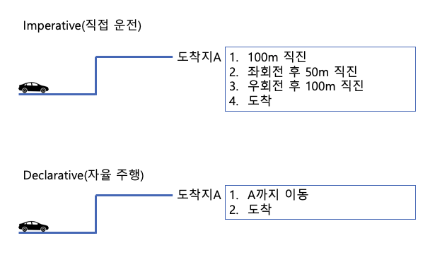

# IaC To Terraform
## Definition

> Infrastructure as Code (IaC) is the **managing and provisioning** of infrastructure **through code** instead of through manual processes.
- by ⛑️(Redhat)
> 
- 인프라를 관리하고 Provision 하는 과정을 수동(인간이 Step By Step으로 명령어를 날리는 것 등)이 아닌 코드를 통해서 수행하는 것
- Provision하려는(한) 인프라에 대해서 Spec을 담고있는 Configuration에 해당하는 파일이 생성되며, 이 파일이 코드로 작성된다.
    - 매번 같은(비슷한) 인프라를 구성하는데 있어서 빠뜨리는 것 없이 동일하게 Provision 가능하다.
    - 이러한 Config 파일들이 일종의 문서화의 역할을 한다.
    - Ad-hoc으로 불어나는 자잘한 변화들을 피할 수 있다.
- 코드로 작성되기 때문에, 수정사항에 대해서 VCS(Version Control System)을 사용하여 인프라 변화에 대하여 추적,관리, 운영할 수 있다.

## Types

- **Imperative**
    
    수행해야하는 명령들과, 명령들의 수행 순서를 정의하는 방식
    
- **Declarative**
    
    생성 결과물에 대한 상태를 정의하고, 이를 적용하면 IaC Tool이 자동으로 해당 결과물을 생성해주는 방식
    



## Tools

- **[Chef](https://www.redhat.com/en/topics/automation/what-is-infrastructure-as-code-iac#:~:text=few%20popular%20choices%3A-,Chef,-Puppet)**
- [**Ansible**](https://github.com/ansible/ansible)
- [**Puppet**](https://www.puppet.com/)
- [**Terraform**](https://www.terraform.io/)
    
# Terraform

## Features

- Cloud, On-prem resource 지원
- Human Readable한 HCL(Hashcorp Language)로 **Declarative**한 IaC를 제공
- Community Based 모듈(Provider) 지원으로 Low level의 하드웨어 리소스부터, High level의 DNS, SaaS 기능들까지 Code로 관리할 수 있게 제공 [[Terraform Registry](https://registry.terraform.io/)]

## Workflow Stages

- **Write**
    - Resource들을 .tf파일로 정의하는 단계(ex: AWS VPC with SG, ELB)
- **Plan**
    - Terraform이 tfstate(현재 인프라의 상태를 담고있는 파일)과 정의된 Resource를 비교하여 Desired State of Infra를 달성하기 위해서 어떠한 수정을 거칠 것인지 설명해주는 Execution Plan을 반환
- **Apply**
    - 사용자의 Confirm후에 Terraform이 Plan단계에 명시된 Operation을 알아서 각 Resource에 필요한 작업들을 맞는 순서로 수행함


## HCL(Terraform Language)

- Terraform의 Resource들을 선언하기 위해서 사용되는 언어

```ruby
resource "aws_vpc" "main" {
  cidr_block = var.base_cidr_block
}

# Way to Write a Block
<BLOCK TYPE> "<BLOCK LABEL>" "<BLOCK LABEL>" {
  # Block body
  <IDENTIFIER> = <EXPRESSION> # Argument
}
```

- Block은 type을 꼭 가지고 있고 Label은 없거나 여러개를 가질 수 있음
- Block Body에는 Argument나 Nested Block이 있음
- Argument는 Name(Key)에 해당하는 Value를 할당
- Expression은 값 자체나 다른 값에 대한 참조가 될 수 있음

## Caveats For Team Using Terraform

- Terraform을 통해서 생성, 수정, 삭제된 인프라의 정보들은 tfstate 의 포맷의 파일로 테라폼 레포지토리 Root에 기록
    - 팀단위로 테라폼을 운영할 경우에는 이 상태파일이 팀내에서 공유될 수 있도록, 상태파일 공유를 위한 스토리지 운영이 필수적으로 필요하다. (AWS를 사용하는 팀의경우 AWS S3활용이 범용적)
    - 또한, 여러명이 동시에 Terraform을 통해서 Apply하여 인프라에 수정상황이 발생할 경우에 예기치않은 많은 문제들이 발생할 수 있다.
        - 이를 막기 위해서, Race Condition을 방지하기 위한 잠금 장치가 필요하다. (AWS를 사용하는 팀의 경우 주로, DynamoDB를 통해서 terraform_lock을 구현한다.
            - 참고
                
                ```jsx
                resource "aws_dynamodb_table" "terraform_locks" {
                  name         = "terraform-up-and-running-locks"
                  billing_mode = "PAY_PER_REQUEST"
                  hash_key     = "LockID"
                
                  attribute {
                    name = "LockID"
                    type = "S"
                  }
                }
                ```
                
    - 마지막으로, 환경별(Production, Staging, Develop 등) 상태파일의 격리가 필요하다.
        - Human Error의 전형이 이 환경구분을 실수하여 개발환경에 필요한 리소스 변경을 Production에 한다던지 하면서 발생하기 쉽다.

## Simple Example

```ruby
terraform {
  required_providers {
    aws = {
      source  = "hashicorp/aws"
      version = "~> 1.0.4"
    }
  }
}

variable "aws_region" {}

variable "base_cidr_block" {
  description = "A /16 CIDR range definition, such as 10.1.0.0/16, that the VPC will use"
  default = "10.1.0.0/16"
}

variable "availability_zones" {
  description = "A list of availability zones in which to create subnets"
  type = list(string)
}

provider "aws" {
  region = var.aws_region
}

resource "aws_vpc" "main" {
  # Referencing the base_cidr_block variable allows the network address
  # to be changed without modifying the configuration.
  cidr_block = var.base_cidr_block
}

resource "aws_subnet" "az" {
  # Create one subnet for each given availability zone.
  count = length(var.availability_zones)

  # For each subnet, use one of the specified availability zones.
  availability_zone = var.availability_zones[count.index]

  # By referencing the aws_vpc.main object, Terraform knows that the subnet
  # must be created only after the VPC is created.
  vpc_id = aws_vpc.main.id

  # Built-in functions and operators can be used for simple transformations of
  # values, such as computing a subnet address. Here we create a /20 prefix for
  # each subnet, using consecutive addresses for each availability zone,
  # such as 10.1.16.0/20 .
  cidr_block = cidrsubnet(aws_vpc.main.cidr_block, 4, count.index+1)
}
```
