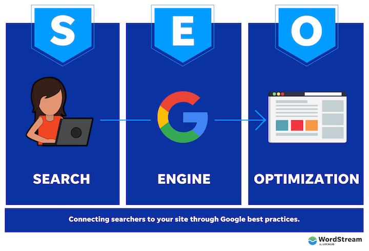

# SEO

SPARCS에서 NewAra front 개발자로 활동중인 고예준(arcticfox)입니다.  최근 NewAra 서비스 글 공유에 관해서 찾아보던 도중 메타 태그에 관해서 많은 것들을 읽어 보았습니다. 그런데 대부분의 글에서 빠지지 않던 키워드가 있었습니다. 바로 ‘SEO’입니다. 그래서 이번 글에서는 SEO가 무엇인지 다루어 보려고 합니다.

## SEO란?

SEO(Search Engine Optimization, 검색 엔진 최적화)란 우리가 만든 웹 사이트가 검색 결과에 더 잘 보이도록 사이트를 최적화 하는 과정을 말한다. 검색 엔진은 기본적으로 웹을 크롤링하며 페이지에 있는 링크들을 따라가고, 찾은 컨텐츠들의 색인을 생성한다. 우리가 검색 엔진에 키워드를 검색했을 때 보이는것은 이 때 저장된 컨텐츠의 색인이다. 검색 엔진의 크롤러는 일정한 규칙을 따라서 링크를 이동하기에, SEO를 진행하며 해당 규칙을 밀접하게 만들면 웹 사이트의 검색 결과가 보다 높은 곳에 노출되도록 만들 수 있다. 일부 검색 엔진들은 SEO 가이드 라인을 제공하긴 하지만 우리가 흔히 사용하는 대형 검색 엔진들의 경우 결과 랭킹은 대부분 영업 비밀에 해당한다. 따라서 SEO는 검색 엔진에 대한 경험적 지식과 논문과 특허 등에서 가져온 이론적 지식이 필요하다.

## SEO는 왜 필요할까?

우리는 궁금한것을 찾아보거나 무언가를 구매하고 싶을 때 가장 먼저 하는것은 구글과 네이버와 같은 검색엔진에 검색을 해보는것이다. 그리고 일반적으로 우리는 검색 결과의 상단에 있는 사이트나 이미지를 클릭해 본다. SEO를 한다는 것은 사용자가 검색 엔진에 특정 키워드를 검색 했을 때 우리의 사이트를 검색 결과에 상단에 보여줄 수 있도록 하는 작업이다. 이를 통해 웹사이트의 사용자의 유입을 늘릴 수 있다. 또한, SEO를 이용해 사용자들이 어떤 키워드를 중심으로 우리의 웹사이트를 방문하고 있는지 파악할 수 있다.  

## SEO의 분류

SEO는 최적화를 하는 방법에 따라 크게 2가지로 구분된다.

- On-Page SEO
    - On-Page SEO는 웹 사이트 내부에서 검색엔진의 최적화를 위해 진행되는 일련의 작업을 의미한다.
    - ex: H태그, 메타태그, 이미지 최적화, 콘텐츠 최적화, 글다의 수 , 내부링크
- Off-Page SEO
    - Off-Page SEO는 웹 사이트의 외부에서 검색 엔진 최적화를 위해 진행하는 일련의 작업을 의미한다.
    - ex: 관련성, 신뢰성, 권한, 사이트로 향하는 백링크

## SEO의 방향성

seo의 방향성은 크게 세가지 방향으로 나눌 수 있다

- 기술적
    - 콘텐츠 마크업 작성시 semantic html을 사용하면 색인하길 원했던 컨텐츠를 지정할 수 있다.
- 콘텐츠 작성
    - 방문자 층에세 적합한 언어로 콘텐츠를 작성한다. 텍스트 뿐만 아니라 이미지도 사용하여 크롤러의 주체가 이해할 수 있도록 콘텐츠를 작성한다.
    - 많은 사람들이 검색 해볼만한 키워드를 찾아내어 컨텐츠 작성 시 적절히 삽입한다.
- 인기도
    - 접속자가 많은 사이트에 사이트를 링크 시티면 더 많은 트랙픽을 발생시켜 노출되는 순위를 높일 수 있다.

## 구글 검색 엔진 최적화

대한민국에서 가장 많이 사용되고 있는 검색 엔진 3가지는 ‘Naver’, ‘Google’, ‘Daum’ 이다. 유저 점유율만으로 본다면 ‘Naver’가 ‘Google’, ’Daum’ 보다 높지만 이용자의 성향에 따라 ‘Google’이 더 높은 경우도 존재한다. 이 글에서는 구글의 검색 엔진 최적화에 대해서 조금 더 알아보고자 한다. 

### 구글 검색 엔진 최적화는 왜 필요한가?

키워드에 따라 차이가 있지만 동일한 키워드를 네이버, 다음, 구글 3곳 포털에 넣어보면 네이버와 다음은 구글에 비해 광고성 메시지와 검색 엔진 내 플랫폼 게시글들을 보다 많이 노출시킨다. 따라서 정말 원하는 정보를 찾고 이를 구분하는데 시간이 오래 걸린다. 물론 구글도 광고성 메시지가 존재하긴하지만 정보를 찾는데 신경 쓰일 만큼은 아니고 해당 티워드와 연관성이 높은 ‘웹사이트’를 주로 노출시키게 된다. 따라서 구글을 사용하는 사용자의 빈도수는 점점 증가하게 된다. 쇼핑의 영역에서는 구글보다 네이버와 다음이 더 좋은 정보를 제공할 수 있다. 하지만 구글은 지식, 컨텐츠 적인 측면에서는 네이버나 다음보다 확실히 유리하다. 따라서 콘텐츠를 기반으로 하는 웹사이트라면 이런 영역에서 점유율을 높이기 위해 구글 검색 엔진 최적화가 필요하다.

그렇다면 구글이라는 검색 엔진에 맞춰 최적화를 진행하면 얻을 수 있는 효과, 혜택은 무엇일까? 바로 구글에 키워드를 검색 했을 때 우리의 웹사이트의 결과를 유저들이 일반적으로 가장 많이 보는 상단에 노출시켜 주는 것이다. 이러한 혜택이 우리가 원하는 키워드에 전부 적용이 된다면, 광고 보다 더욱 큰 효과를 가져올 수 있다.

### 어떻게 최적화 할것인가

앞서 말한것처럼 대부분의 검색 엔진들은 ‘우리 검색 엔진의 로직은 이렇게 되어있어요’라고 공개하지 않는다. 구글 또한 검색 엔진 로직을 공개하지 않았다. 하지만 구글에서는 ‘이렇게 하면 우리 검색엔진에서 최적화가 될 수 있습니다’ 라는 가이드를 제공해준다. 구글의 검색 엔진 최적화 문서를 살펴보면 ‘사이트 표기, 콘텐츠 구조, 메타 태그, 사이트 계층 구조, 이미지 최적화, 모바일 친화성’등 이러한 것들은 기본적으로 꼭 해야 된다 등의 내용들을 알려준다.

[SEO 기본 가이드: 기본사항 | Google 검색 센터  |  문서  |  Google Developers](https://developers.google.com/search/docs/fundamentals/seo-starter-guide?hl=ko)

기본 가이드를 살펴보면 크게 두가지 영역으로 나누어져 있다. 기술 영역과 콘텐츠 영역이다. 이를 모두 충족해야 하는것은 아니다. 우리가 만든 사이트가 어떤 컨텐츠를 제공하고 어떤 목적을 가지고 있는지에 따라 어디에 비중을 더 두는 것이 유리할 지  생각해보고 조정하는 과정이 필요하다.

## 마무리

이번 글을 통해서 SEO란 무엇이고 왜 필여한지 , 어떻게 하는것인지 알아볼 수 있어다. 현재 NewAra의 경우 NewAra 내부에 작성한 컨텐츠들은 카이스트 내부인들만이 접근 권한을 가지고 있어 외부에 공개하지 않고 있기에 SEO를 적용할 필요성은 없다. 나중에 기회가 된다면 SEO를 적용시킨 커뮤니티 또한 제작해보고 싶다.

긴 글 읽어주셔서 감사합니다!