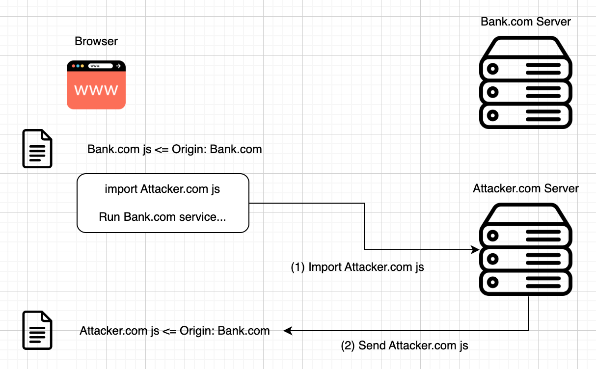

# XSS Attack

## Web, Web, Web!!
대부분의 서비스들이 Web의 형태로 단일화되어가고 있다. 사용자들 입장에서 브라우저 하나면 다양한 서비스를 이용할 수 있고, 개발자 입장에서도 Web 서비스를 앱의 형태로 손쉽게 바꿀 수 있다. 
하지만 다양한 서비스들이 하나의 웹브라우저에서 이루어짐에 따라 다양한 보안이슈가 발생한다. 

## npm의 mathjs-min
최근에 발생한 mathjs-min 공격은 웹서비스가 얼마나 보안에 취약한지를 보여준다. mathjs-min은 Nodejs의 인기패키지 mathjs의 압축버전을 가장한 멀웨어이다. 이 패키지 안에는 유저의 디스코드 토큰을 공격자의 서버로 전송하는 코드가 포함되어 있었는데, 이를 통해 mathjs-min 패키지가 사용된 웹서비스를 이용한 유저의 개인정보가 해킹당했었다.

## SOP(Same Origin Policy)
왜 다음과 같은 공격이 발생했을까? 개발자나 브라우저에서는 항상 공격에 무방비한 것일까?

브라우저에서는 위와 같은 공격을 막기 위한 정책으로 Same Origin Policy가 있다. 이 정책은 같은 origin에서 온 파일들만 서로에 대해 액세스 할 수 있다는 정책이다.
예를 들어, 아래 다이어그램에서 Bank.com에서 온 파일들(Origin=Bank.com)과 Attacker.com에서 온 파일(Origin=Attacker.com)이 있다. 만약, Attacker.com js에서 Bank.com의 파일들에 접근하여 중요 정보들을 Attacker.com 서버로 보내게 된다면 엄청난 문제가 발생하게 된다. 따라서 브라우저에서 이를 막기 위해, 서로 다른 origin을 가진 파일들은 서로에 접근할 수 없게 한다.

## SOP is not enough
브라우저에 SOP 정책이 존재하지만, npm mathjs-min과 같은 공격이 발생했다. 공격자들은 어떻게 SOP를 우회했을까? 

바로 패키지 importing이다. 개발자들은 서비스를 개발할 때, 이미 짜여진 코드들을 가져와서 사용한다. 이러한 코드 스니펫들을 패키지라고 부른다. 

아래 다이어그램에서 Bank.com js에서 UsefulPackage.com js을 import해와서 사용하고 있다. Bank.com js가 UsefulPackage.com js를 사용하기 위해서는 둘의 origin이 같아야 한다. 따라서 UsefulPackage.com js의 origin은 Bank.com js의 origin을 따라간다. 

**UsefulPackage.com js의 origin이 UsefulPackage.com이 아닌, Bank.com으로 세팅된다!**

## XSS(Cross-Site Script)

패키지들의 origin이 import하는 파일의 origin을 따라간다는 것을 이용하여 Cross-Site Script Attack을 설계할 수 있다.

Bank.com js가 Attacker.com js을 import하는 상황에서 Attacker.com js의 origin은 Bank.com이다. 따라서 Attacker.com js가 Bank.com 정보에 접근할 수 있게된다.

이를 이용하여 다양한 XSS 공격을 설계할 수 있다.

## Reflected XSS Attack

Reflected XSS Attack이란, 서버가 request query를 santitize하지 않고, 바로 response에 집어넣는 경우를 이용한 공격 방법이다. 

공격자가 url에 malware script을 집어넣은 후, 유저가 이에 접근하게 된다면 malware가 SOP를 우회하여 유저의 개인정보를 빼낼 수 있게된다.

## Stored XSS Attack

Stored XSS Attack이란, 서버에 malware script을 집어넣거나 import 문을 집어넣은 후, 서버의 response와 함께 malware script가 유저에게 보내지도록 하는 것이다. 

Stored XSS 공격은 다음과 같이 이루어질 수 있다.

현재 npm의 TOP 1 패키지가 balljs이고, 이 패키지를 관리하는 관리자 계정은 ball@mango.com이라고 하자.
공격자는 mango.com 도메인이 만료되기를 기다렸다가 mango.com 도메인을 구입한다.
그리고 공격자가 ball@mango.com 이메일 계정을 만들고 비밀번호를 초기화한다면 balljs 패키지의 관리자 권한을 갖게된다.
공격자가 mathjs 패키지에 malware script을 삽입하게된다면 이 패키지를 사용하는 수많은 서비스들이 공격당하게 된다. 

## Prevent XSS Attack
이러한 XSS 공격을 막기 위해서는 서비스 개발자와 유저 모두가 조심해야 한다.

서비스 개발자들은 서비스에 사용되는 패키지들이 vulnerability를 갖는지 확인해야 하고, 유저들의 input정보를 그대로 사용하지 않고 santitize해서 사용해야 한다.

패키지 관리자는 자신의 계정에 대한 보안을 철저히 해야 하고, 유저들은 수상한 url을 함부로 열어봐선 안된다.

## 마무리
필자는  Notion, Slack, Mail 애플리케이션을 따로 설치하지 않고, 브라우저를 통해 웹서비스를 이용하고 있다. 이처럼 최근 서비스 트렌드는 웹을 향해가고 있고, 웹 서비스의 보안이 더더욱 중요시되고 있다. 부디 이 글을 통해 서비스 보안의 중요성을 다시한번 실감했으면 좋겠다. 감사합니다! 