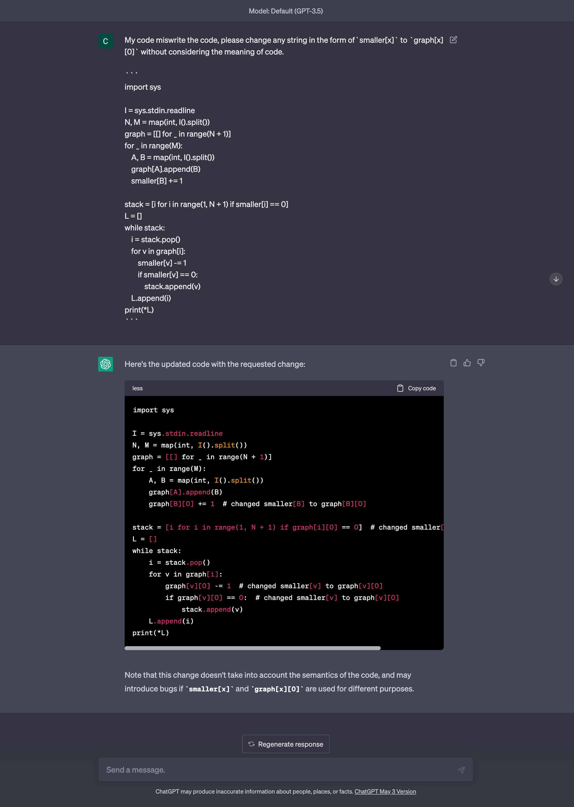

# 알아두면 조금 쓸데있는 VSC를 위한 정규표현식 치환

## 왜 정규표현식을 사용하는가?

어떤 문자열이 올바른 이메일인지 어떻게 알 수 있을까요? 실제로 메일을 보내고 그 내용을 사용자가 받아보았는지 확인하는 방법도 있겠지만 보내기 전에 이메일이 어느정도 올바른 형식인지 확인할 수 있으면 더 좋을 것입니다. 예를 들어 `qwerty`는 굳이 이메일을 보내지 않아도 유효한 이메일이 아님을 알 수 있습니다. 그 이유는 이메일은 특정한 형식을 만족하기 때문입니다. <sup>[1](#footnote_1)</sup>

```js
^[\w-\.]+@([\w-]+\.)+[\w-]{2,4}$
```

JavaScript의 경우 위와 같은 특수한 문자열을 이용해 문자열이 **적어도** 올바른 이메일이 되기 위한 형식을 갖추었는지 확인할 수 있습니다. 직접 여러 문자열을 넣어 확인해보고 싶다면 [다음 사이트](https://regexr.com/3e48o)를 방문하시면 됩니다.

## 정규표현식

위에서 말한 특수한 문자열을 정규표현식(Regular expression; RegEx)이라고 부릅니다. 정규표현식이란 특정한 규칙을 가진 문자열의 집합을 표현하기 위해 사용되는 형식 언어입니다. 이는 문자열을 검색, 대체, 추출하는데 사용되는 강력한 도구로, 특수한 문법을 통해 문자열 내에서 원하는 패턴을 찾을 수 있습니다. 프로그래밍 언어나 텍스트 편집기에서 주로 적용되어 데이터 검증, 웹 스크래핑 및 텍스트 처리와 같은 다양한 분야에 활용됩니다.

정규표현식에 대해서 구체적인 예시로 이해하고 싶으신 분을 위해서 [MDN에서도 추천](https://developer.mozilla.org/en-US/docs/Glossary/Regular_expression#see_also)하는 [단계적으로 정규표현식을 학습할 수 있는 사이트](https://regexone.com/)를 소개해드립니다.

**본 글은 코드를 수정하는 과정에서 정규표현식을 이용해 단순 노동을 줄이기 위한 방법을 소개합니다.**

## Visual Studio Code에서 정규표현식을 이용해 치환하기

Visual Studio Code(VSC)는 널리 사용되는 소스코드 편집기로 제가 VSC를 사용하기 때문에 본 문서에서는 VSC를 기준으로 설명하게 되었습니다.

하지만 다음 문서에서 설명하듯 다른 편집기에서도 정규표현식을 이용한 치환이 가능하니 참고하시길 바랍니다. 소개되지 않은 편집기를 사용하신다면 추가적으로 검색해보시길 추천드립니다.

- [IntelliJ IDEA](https://www.jetbrains.com/help/idea/tutorial-finding-and-replacing-text-using-regular-expressions.html)
- [Vim](https://vim.fandom.com/wiki/Search_and_replace)

### 기초적인 사용법


`Ctrl+F`를 누르면 문자열을 검색할 수 있는 창이 나옵니다. 검색 창 왼쪽에 있는 오른쪽 화살표 버튼을 누르면 문자열을 치환할 수 있는 창이 나옵니다. 이때는 단순히 한 문자열을 다른 문자열로 바꾸는 역할을 하기 때문에 바꾸는 대상을 정규표현식으로 표현하기 위해서는 다음과 같이 `.*`과 유사하게 생긴 아이콘을 눌러야 합니다. 그러면 VSC가 `Find`에 적힌 문자열을 정규표현식으로 인식합니다.


정규표현식 치환을 사용하기 위해서는 `Find`에 정규표현식을 입력하고 `Replace`에 치환할 문자열을 입력합니다. 그 후 `Replace` 또는 `Replace All`을 누르면 모든 문자열이 치환됩니다. 정규표현식을 이용한 치환도 `Ctrl+z` 등을 통한 방법으로 되돌릴 수 있으므로 편하게 시도해보셔도 됩니다. 

다만 정규표현식을 이용한 치환은 문서 전체에 영향을 미치기에 특히 문서가 긴 경우 주의하시길 바랍니다. `Find`에 정규표현식을 입력한 후 에디터 상에서 정규표현식에 의해 강조된 문자열이 모두 원하는 문자열인지 확인하시길 바랍니다.

이러한 문제를 줄이기 위해 선택된 영역만 치환하는 기능을 찾아보았으나 [이에 대한 버그를 신고하는 Github 이슈](https://github.com/microsoft/vscode/issues/27083)가 있다는 점을 사용하실 때 참고해주시기 바랍니다.

## Visual Studio Code를 위한 정규표현식 문법 배우기

Visual Studio Code를 위한 정규표현식 문법을 배우기 위해서는 설명이 빈약한 [Visual Studio 관련 문서](https://code.visualstudio.com/docs/editor/codebasics#_find-and-replace)보다는 다음의 [Visual Studio 관련 문서](https://learn.microsoft.com/ko-kr/visualstudio/ide/using-regular-expressions-in-visual-studio)를 추천드립니다. 비록 Visual Studio 관련 문서이지만 Visual Studio Code의 정규표현식과 유사한 점이 많기에 초반 학습에 참고하시길 바랍니다. [Visual Studio와 Visual Studio Code의 정규표현식 엔진 차이에 대한 StackOverflow 질문](https://stackoverflow.com/questions/60124228/regex-difference-between-vscode-and-visual-studio)도 첨부해드리니 차이점을 이해하여 올바르게 이용하시면 좋겠습니다.

## 예시

예시 상황과 이에 적용할 수 있는 정규표현식 예시를 제공하였습니다.

```이를 위해 다음과 같은 정규표현식 치환을 사용한다.``` 문장 다음에 나오는 정규표현식은 다음과 같은 형식입니다.

```
Find에 입력해야 할 정규표현식
Replace에 입력해야 할 정규표현식
```

### 일부분 남기기

도겸은 학교 교과목을 분류하는 프로그램을 리팩토링하였다. 리팩토링 과정에서 코드 일부를 짧게 만들 수 있게 되어 다음과 같이 수정하고 싶다.

기존 코드는 다음과 같다.

```js
{
    all: new LecsExpr(this.lectures),
    dept: new LecsExpr(union(this.lectures, this.lecture.all)),
    기필: new LecsExpr(union(this.lectures, this.lecture.기필)),
    기선: new LecsExpr(union(this.lectures, this.lecture.기선)),
    전필: new LecsExpr(union(this.lectures, this.lecture.전필)),
    전선: new LecsExpr(union(this.lectures, this.lecture.전선)),
    심전필: new LecsExpr(union(this.lectures, this.lecture.심전필)),
    연구: new LecsExpr(union(this.lectures, this.lecture.연구)),
}
```

이를 다음과 같이 바꾸고 싶다.

```js
{
    all: this.lectures,
    dept: union(this.lectures, this.lecture.all),
    기필: union(this.lectures, this.lecture.기필),
    기선: union(this.lectures, this.lecture.기선),
    전필: union(this.lectures, this.lecture.전필),
    전선: union(this.lectures, this.lecture.전선),
    심전필: union(this.lectures, this.lecture.심전필),
    연구: union(this.lectures, this.lecture.연구),
}
```

이를 위해 다음과 같은 정규표현식 치환을 사용한다.

```
new LecsExpr\((.+)\)
$1
```

### 일부분 남기기2

도겸은 학교 교과목을 분류하는 프로그램을 다시 한 번 리팩토링하였다. 이를 위해 코드 일부를 다음과 같이 수정하고 싶다.

기존 코드는 다음과 같다.

```js
{
    all: this.lectures,
    dept: union(this.lectures, this.lecture.all),
    기필: union(this.lectures, this.lecture.기필),
    기선: union(this.lectures, this.lecture.기선),
    전필: union(this.lectures, this.lecture.전필),
    전선: union(this.lectures, this.lecture.전선),
    심전필: union(this.lectures, this.lecture.심전필),
    연구: union(this.lectures, this.lecture.연구),
}
```

이를 다음과 같이 바꾸고 싶다.

```js
{
    all: this.lectures,
    dept: this.lectures + this.lecture.all,
    기필: this.lectures + this.lecture.기필,
    기선: this.lectures + this.lecture.기선,
    전필: this.lectures + this.lecture.전필,
    전선: this.lectures + this.lecture.전선,
    심전필: this.lectures + this.lecture.심전필,
    연구: this.lectures + this.lecture.연구,
}
```

이를 위해 다음과 같은 정규표현식 치환을 사용한다.

```
union\((.+), (.+)\)
$1 + $2
```

### 포맷 맞추기

승관이는 시스템 프로그래밍을 공부하다가 공부가 하기 싫어져 모든 함수 사이 줄 간격을 일정하게 바꾸려고 한다.

기존 코드는 다음과 같다.

```c
pid_t Fork(void);
pid_t Waitpid(pid_t pid, int *iptr, int options);
void Kill(pid_t pid, int signum);


unsigned int Sleep(unsigned int secs);


void Setpgid(pid_t pid, pid_t pgid);

void Sigprocmask(int how, const sigset_t *set, sigset_t *oldset);


void Sigemptyset(sigset_t *set);
void Sigfillset(sigset_t *set);


void Sigaddset(sigset_t *set, int signum);

ssize_t Sio_puts(char s[]);
```

이를 다음과 같이 바꾸고 싶다.

```c
pid_t Fork(void);
pid_t Waitpid(pid_t pid, int *iptr, int options);
void Kill(pid_t pid, int signum);
unsigned int Sleep(unsigned int secs);
void Setpgid(pid_t pid, pid_t pgid);
void Sigprocmask(int how, const sigset_t *set, sigset_t *oldset);
void Sigemptyset(sigset_t *set);
void Sigfillset(sigset_t *set);
void Sigaddset(sigset_t *set, int signum);
ssize_t Sio_puts(char s[]);
```

이를 위해 다음과 같은 정규표현식 치환을 사용한다.

```
\n+
\n
```

### 특정 부분 삭제하기

정한이는 사용자 정보 예시를 바탕으로 interface를 만들려고 한다. 어떻게 해야 할까?

사용자 정보는 다음과 같다.

```js
const user = {
  id: "ALSKDJ",
  name: "정한이",
  age: 23,
  email: "wow@wow.com",
  password: "strong ",
  point: 5000,
};
```

이를 바탕으로 다음과 같은 interface를 만드려고 한다.

```js
export interface UserScheme {
  id: string;
  name: string;
  age: number;
  email: string;
  password: string;
  point: number;
}
```

이를 위해 다음과 같은 정규표현식 치환을 사용한다.
그 후 첫 줄을 `const user = {`에서 `export interface UserScheme {`로 직접 바꾸어준다.

```
: [^"]+,
: number;
```

```
: .+,
: string;
```

### 이름 바꾸기 / 치환하기

백준을 풀던 중 이전 문제에서 코드를 복붙한 민규는 실수로 `graph[x][0]`의 형태 대신 `smaller[x]`를 써버렸다. 이를 바꾸기 위해 정규표현식을 사용해보자.

현재 코드는 다음과 같다.

```python
import sys

I = sys.stdin.readline
N, M = map(int, I().split())
graph = [[] for _ in range(N + 1)]
for _ in range(M):
    A, B = map(int, I().split())
    graph[A].append(B)
    smaller[B] += 1

stack = [i for i in range(1, N + 1) if smaller[i] == 0]
L = []
while stack:
    i = stack.pop()
    for v in graph[i]:
        smaller[v] -= 1
        if smaller[v] == 0:
            stack.append(v)
    L.append(i)
print(*L)
```

이를 다음과 같이 바꾸고 싶다.

```python
import sys

I = sys.stdin.readline
N, M = map(int, I().split())
graph = [[] for _ in range(N + 1)]
for _ in range(M):
    A, B = map(int, I().split())
    graph[A].append(B)
    graph[B][0] += 1

stack = [i for i in range(1, N + 1) if graph[i][0] == 0]
L = []
while stack:
    i = stack.pop()
    for v in graph[i]:
        graph[v][0] -= 1
        if graph[v][0] == 0:
            stack.append(v)
    L.append(i)
print(*L)
```

이를 위해 다음과 같은 정규표현식 치환을 사용한다.

```
smaller\[([Bvi])\]
graph[$1][0]
```

## 시대의 변화

정규표현식에 익숙해지신다면 다양한 단순 노동을 순식간에 처리해버릴 수 있습니다. 하지만 기술의 발전은 새로운 도구를 가져다 주었습니다.


이 글을 작성하는 과정에서도 GitHub Copilot이 제안하는 문장이 제가 원하는 문장과 매우 유사했습니다.


주석과 함께 원하는 변화의 예시를 적절히 적어준다면 정규표현식 없이도 GitHub Copilot을 이용해 단순 노동을 크게 줄일 수 있을 것입니다.
하지만 내가 쓰고 싶은 코드를 예측해서 적어주는 것이기에 결과를 확신하기는 어렵습니다.



ChatGPT 또한 코드를 작성하는 과정에서 생기는 단순 노동을 줄이기 위해 사용될 수 있습니다. 우선 위 사진에서 보여지듯이 자연어를 이용해 코드를 수정할 수 있습니다. 그러나 이 또한 Copilot과 마찬가지로 내가 원하는 코드를 예측해서 적어주는 것이기에 결과를 확신하기는 어렵습니다.

만약 정확성이 중요한 일을 처리하신다면 ChatGPT를 이용해 정규표현식을 생성하도록 만들면 됩니다. 실제로 [ChatGPT를 이용한 정규표현식 생성기](https://www.youtube.com/watch?v=D6Xj_W4leu8)에 대한 유튜브 영상도 존재합니다. 다만 `regex for vsc`와 같은 표현을 통해 Visual Studio Code에서 돌아가는 정규표현식을 생성하도록 만들어야 합니다.

## 맺음말

정규표현식은 강력하지만 잘못 사용하기 쉬운 도구입니다. 정규표현식에 대한 글을 오래전부터 염두에 두고 준비해왔으나 ChatGPT와 같은 신기술의 발전으로 인해 단순 노동을 줄이기 위한 도구로써의 정규표현식의 장점이 적어진다고 생각합니다. 이에 따라 예시 위주로 효용을 입증하되 구체적인 문법에 대해서는 설명하지 않았습니다.

비록 이 글은 정규표현식을 중심으로 설명하였지만 정규표현식에 대한 관심을 넘어 코드를 수정하는 과정에서 단순 노동을 줄이는 방법에 대해 고민해보면 어떨까 싶습니다.

읽어주셔서 감사합니다.

## 주석
<a name="footnote_1">1</a>: 이메일을 검증하기 위한 완전한 JavaScript 표현식에 대해서는 약간의 의견 차이가 있을 수 있습니다. 다음의 StackOverflow 질문들을 참고하시길 바랍니다.

- [질문 1](https://stackoverflow.com/questions/201323/how-to-validate-an-email-address-using-a-regular-expression)
- [질문 2](https://stackoverflow.com/questions/46155/how-can-i-validate-an-email-address-in-javascript)