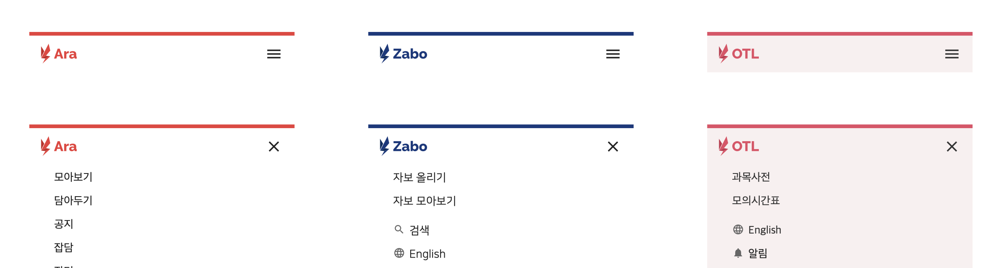

# SPARCS의 디자인 시스템

## 저자

2022년 SPARCS에 들어와, 2023년 현재는 묵묵히 디자인팀장 자리에서 해야할 일들을 하고 있는 배세윤(nine)입니다. 언제까지 이 자리에 있을지는 저도 모릅니다. 🧐

---

# 디자인 시스템

SPARCS에는 과거 디자인팀장 분께서 고생하며 만들어주신 디자인 가이드라인과 브랜딩 가이드라인이 있다. 

## 브랜드 가이드라인

SPARCS라는 브랜드의 일관성을 유지하고 우리 단체에 정체성을 부여하는 중요한 기준이 바로 브랜드 가이드라인이다.

SPARCS를 비롯해 SPARCS에서 운영하고 있는 OTL, Ara와 같은 각 서비스들의 로고는 무엇인지, 색상 팔레트는 어떻게 되는지, 해당 로고를 활용할 때 지켜져야 하는 규칙은 무엇인지와 더불어 공식적으로 사용해야 하는 서체에 대해서 기술하고 있다.

SPARCS는 번개 모양의 심볼과 함께, Raleway Extrabold 서체로 단체와 서비스의 이름을 적어 로고로 활용하고 있다.

단체의 경우 SPARCS Orange(#EBA12A, #EC8F26) 색상을, 산하 서비스들은 각각의 Identity Color를 베이스로 한 패밀리룩을 채용했다.

현행 브랜드 가이드라인 - Identity Color

## 디자인 가이드라인

디자인 가이드라인은 위의 브랜드 가이드라인에서 더 나아가, 실제로 서비스의 UI/UX를 디자인하는 데 있어 필요한 정보와 Component들을 제공하고 있다.

브랜드 가이드라인이 브랜드 단에서의 정체성과 일관성을 부여한다면, 디자인 가이드라인은 실제로 사용자가 느끼는 UI/UX에서의 정체성을 부여한다.

Ara와 OTL, Zabo와 같은 산하 서비스를 사용해 본 사용자들은 알겠지만, SPARCS의 서비스들은 모두 비슷한 디자인을 하고 있다. 

흔히 Header하고 불리는 상단 영역은 각 서비스의 Identity Color를 사용한 5px의 Identity Bar와 함께, 아래와 같이 규정된 가이드라인에 따라 동일한 여백과 색상을 가지도록 규정되어 있다.

Header 뿐만 아니라 SPARCS의 로고와 만든 사람들, 약관 및 문의 이메일 주소 등이 적혀 있는 Footer도 마찬가지다.

현행 디자인 가이드라인 - Header

---

# SPARCS 가이드라인의 과도기

이미 정립되어 있는 가이드라인이 있다는 사실은 최소한 지금까지 SPARCS의 디자인이 해당 가이드라인에 따라 제작되어 있다는 것을 의미하므로, Ara와 OTL과 같은 서비스에서 확인할 수 있다시피 현재까지의 일관성은 담보되어 있다.

전 디자이너 분들과 개발자 분들이 노력해주신 덕분에 SPARCS는 우리만의 정체성을 가질 수 있었다. 그렇다면 현 SPARCS 디자이너가 해야할 일은 해당 디자인 가이드라인에 맞추어 Figma를 통해 새로운 디자인을 만들고 재해석하는 일뿐이다.

실제로 SPARCS의 브랜드 가이드라인은 지금까지 브랜드의 정체성에 있어 긍정적인 기여를 해왔고, 앞으로도 그럴 것이다. 허나 디자인 가이드라인은 그렇지 못하다. 여러 균열의 조짐들이 보이고 있다.

디자인은 시대에 따라 빠르게 바뀐다. SPARCS와 산하 서비스들의 디자인은 현재의 디자인 트렌드에 비해 한 두 세대 정도 뒤쳐져 있는 것이 사실이다. 

현행 가이드라인에 규정된 Header와 Footer는 특히 모바일에서 사용하기에 그다지 적합하지 않으며, 트렌드와도 상당한 거리를 두고 있다. 심지어 App에서 주로 사용하는 Navigation bar의 경우 가이드라인에서 다루고 있지도 않다.

특히 최근에 SPARCS의 여러 산하 서비스에서 앱을 개발 및 출시하면서 이러한 문제가 대두되고 있다. 상기한 여러 문제들로 인해 본인를 포함한 디자이너분들은 디자인 가이드라인이 사실상 사문화되었다고 자의적으로 판단하고, 보기 좋고 사용성도 기존보다 낫지만 가이드라인과 대치되는 디자인을 하고 있다. 사실 좋은 징조라고 보기는 힘들다.

현재 개발 중인 Ara의 앱 디자인 프로토타입

그렇다고 디자인 가이드라인을 개정하는 것도 쉽지 않다.

디자인은 시대에 따라 빠르게 변화하지만, 이러한 디자인을 실제로 적용하기는 어려워 빠르게 바뀔 수 없다는 것이 모순적이다.

상기한 문제들을 해결하고자 디자인 가이드라인을 개정한다면 다음과 같은 작업이 이루어져야 할 것이다.

1. 디자인팀에서 디자인 가이드라인을 개정한다. Figma를 통해 해당 가이드라인에서 규정하고 있는 Component들의 UI를 제작하고 배포한다.
2. 해당 가이드라인을 기반으로 각 팀의 디자이너는 팀에서 운영 중인 서비스를 다시 디자인한다.
3. 각 팀의 프론트 개발자들은 해당 리디자인 프로토타입을 서비스에 적용한다.

상기한 작업의 각 단계는 모두 어머어마한 로드를 자랑한다. 😭

게다가 SPARCS는 다수의 서비스를 개발 및 운영하고 있으므로, 이러한 서비스들의 디자인 언어를 통일하는 일에 필요한 로드는 서비스 개수의 배수만큼 늘어난다. 

물론 디자이너 자원이 충분하다면 병렬적으로 진행할 수 있겠지만, SPARCS에게 있어 디자이너 인력은 초희귀 자원이다. 이러한 작업에 관심이 있는 학우분들께서는 한시 빨리 SPARCS 리크루팅에 지원해 주길 바란다..

---

# 그래서 어떻게 할 것인가?

요약하자면 SPARCS의 디자인은 현재 딜레마에 빠져 있다.

디자인 가이드라인을 개정하고, 그에 맞춰 서비스들이 리디자인을 진행하는 것은 현실적으로 어려운 선택지이다. 그러나 디자인 가이드라인을 개정하지 않는다면, 가이드라인의 존재 의의는 점차 희미해질 것이다.

그런 와중에도 SPARCS 디자인팀 내부적으로 디자인 시스템을 개선하기 위한 노력은 계속되고 있다.

## SPARCS만의 아이콘 셋 만들기

현재 SPARCS 산하 서비스 대부분은 Google의 Material Icons를 기본적으로 사용하고 있지만, Taxi나 Zabo 팀 등 일부는 디자인 언어에 더 잘 맞는 새로운 아이콘 셋을 도입하여 사용하고 있다.

개인적으로는 사용자들에게 서비스들 간의 통일감을 주는 방법 중 하나가 아이콘 셋의 통일이라 생각하여, 시범적으로 SPARCS 아이콘 셋을 제작하고 있다. 해당 아이콘 셋은 Ara의 새로운 앱 디자인에도 적용되어 있다.

## 가이드라인 개정 (To-do)

현재 2023년도 여름학기에는 활동 중인 디자이너들이 별로 없지만, 여름방학 때는 정회원으로 승급된 디자이너분들이 다수 디자인팀으로 유입될 것으로 보인다. 개인적으로는 여름방학 중에 기존 및 신입 디자이너 분들과의 소통을 통해 현재의 디자인 시스템을 전면적으로 개혁해 보고 싶다는 마음이다. 물론 제대로 실행될 지는 미지수지만…

---

# 글을 마치며

올해 디자인팀장 자리에서 SPARCS의 디자인을 총괄하면서 느끼는 점이 많다. 그 중 하나는 디자이너 수십 명을 고용하는 기업들은 이러한 디자인 시스템을 어떻게 체계적으로 관리하는지, 디자이너 각각의 디자인 언어를 어떻게 통일하는지 의문이라는 점이다. 거의 경이롭게 느껴지는 수준이다.

아직 배울 것들이 많다.