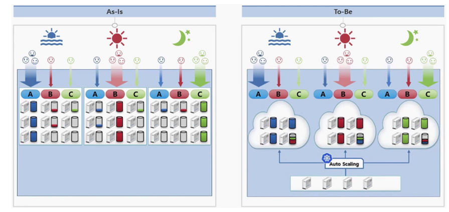

# Kubernetes 란 무엇일까

## 서론

  백엔드 개발자, 혹은 DevOps에 관심이 있는 개발자들이라면 한번쯤 Kubernetes에 대해서 들어본 적이 있을 것이다. 이름만 들어본 사람도 있을 것이고, 그냥 Docker랑 비슷한 컨테이너 관리 툴이라고 아는 분들도 있을 것이다. 이 기술이 뭐길래 이렇게 인기가 많은 걸까? 그리고 SPARCS 에서 Kubernetes를 사용해도 좋을까?

## “이중화”

  Kubernetes를 적용하기 가장 좋은 예시가 바로 작년에 있었었다. 바로 데이터센터 화재로 인한 카카오 서비스 먹통 사태이다.

 해당 사건은 전 국민이 간접적인 피해를 느꼈을 정도로 대한민국 전반에 큰 혼란을 가져다 준 사고였다. 이때 일반인들도 쉽게 접했을 법한 키워드가 있는데, 바로 이중화다. 카카오톡 측에서는 데이터는 이중화되어 있었으나, 막대한 트래픽으로 이러한 백업 장치가 잘 작동이 되지 않았다고 해명한다. 카카오 측이 어떻게 이중화 조치를 했는진 모르겠지만, 하나의 데이터 리전이 다운됨에 따라서 모든 서비스가 먹통된 것으로 보아, 이런 비상상황을 대응한 제대로된 이중화 대응책이 마련이 되지 않았었다고 보여진다. 

  카카오 서비스만큼 거대한 규모가 아니더라도 **SPARCS 서비스들이 위치해있는 서버**가 비슷한 상황에 대응하고 싶으면 어떨까? 물론 이런 경우를 대비해서 대부분의 프로젝트들이 AWS 인프라를 사용하고 있지 않지만, 한번 클라우드 서비스를 사용하지 않는다고 가정해보자. 우선, 다중 서버를 사용해야 할 것이다. 서버 한대가 예기치 않게 고장이 나더라도 다른 서버가 대응할 수 있어야 하기 때문이다. 그리고 SPARCS 서버실 전체에 정전 등 문제가 생기더라도 대응할 수 있는 독립된 또다른 서버실이 필요하다. 교분 SPARCS실 외에 사용할 수 있는  또 다른 공간이 없으니… 법적인 SPARCS 단체 위치라고 할 수 있는 회장님 집에 서버실이 있다고 가정해 보자.

  여분의 서버와 서버실이 있다고 하면 이들을 어떻게 네트워크로 연결해야 할까? Docker (w/o swarm) 나 nginx로만 이를 구축하기에는 많이 복잡하고 어려워 보인다. 뭔가 LXC 컨테이너들을 다중 노드 환경에서 띄울 수 있는 기술이 없을까? Kubernetes가 이런 상황에서 사용될 수 있다.

## Kubernetes 소개

 쿠버네티스는 ‘컨테이너 오케스트레이션 툴’ 이다. 이런 오케스트레이션 엔진을 통해 컨테이너의 생성과 소멸, 시작 / 중단 시점 제어, 스케줄링, 로드 밸런싱, 클러스터링들을 수행할 수 있게 된다.

 쿠버네티스는 다음과 같은 특징을 가지고 있다.

- 자동화된 복구 (self-healing)
    - 컨테이너 중 하나라도 죽으면 바로 재시작
- 로드 밸런싱 (load-balancing)
    - 한 노드나 엔드포인트로 들어온 요청을 여러 서버에 위치해 있는 노드로 고르게 분산해줌
- 오토 스케일링 (auto-scaling)
    - 사이트에 요청이 급격하게 늘어나는 경우, 자동으로 새로운 컨테이너들을 생성하거나, 자원의 크기를 증가시킨다.
- 무중단 서비스 (Fault tolerance-FT)
    - 서비스를 업그레이드할 때, 일시중지할 필요 없이 업데이트를 할 수 있다.
- 호환성 (Vendor lock in 문제 해결)
    - 컨테이너를 기반으로 하는 오픈소스
    - A 사의 클라우드 서비스에서 N 사의 클라우드 서비스로 이전 간단히 해결

Kubernetes가 필요한 좀 더 쉬운 예시를 생각해보자

위 그림은 A 서비스, 점심에는 B 서비스, 저녁에는 C 서비스로 트래픽이 몰리는 상황이 있다고 가정했다. 음.. SPARCS 서비스에 맞게 위와 거의 비슷한 상황(하지만 실제로 같은 문제를 겪고 있는)를 만들어보자.

 수강 신청 기간에는 OTL 서비스, 목요일~일요일에는 Taxi 서비스, SPARCS 지원 기간에는 Apply 서비스, 신입생 심사 기간에는 Biseo 서비스에 트래픽이 몰린다. **이는 실제로 우리가 겪는 문제이다!** 현재는 각 서비스별로 ec2 (혹은 물리서버) 를 부여해 그 위의 도커에서 서비스를 띄우고 있다. 하지만 해당 트래픽이 몰리지 않는 상황에서는 해당 자원들이 사용되지 않고 낭비되게 되고 실제로도 그렇다. 이는 불필요한 비용 지출 및 가용 물리 서버의 부족으로 이어지게 된다. 하지만 To-Be 이미지를 보면 오직 4대의 서버 만으로 기존의 9대의 서버가 필요로 했던 자원을 감당하고 있는 것을 확인할 수 있다. 그리고 Autoscaler가 동적으로 서비스의 자원 사용량을 감지해 필요할 때마다 스스로 새로운 서버를 부여하고, 필요하지 않으면 제거하게 된다. EKS는 AWS에 만든 완성된 kubernetes 서비스이므로 당장 EC2 대신 EKS로 옮기기만 해도 비용을 절감할 수 있는 것이다. (물론 과정이 순탄치 않겠지만..)

 만약 마이크로 서비스와 같이 여러개의 컨테이너가 아닌 전형적인 프론트 - 백엔드 - DB 정도로 적은 컨테이너만 사용한다면 Kubernetes를 사용할 필요는 없다. 하지만, 단순히 `docker-compose.yaml` 을 작성하는 것보다 쿠버네티스 설정 파일 (이것도 `yaml` 형식을 사용한다.) 에서 지정할 수 있는 옵션들이 많기 때문에 일반적인 서비스들도 쿠버네티스를 사용해도 좋겠다는 생각이 든다.

 Kubernetes는 Docker의 지원이 **중단되었다**. 정확히 말하면 기존 컨테이너 런타임으로 `dockershim` 대신 `cri-containerd` 를 사용하게 된 것이다. 따라서 Kubernetes 를 이용해 컨테이너를 띄우면 더이상 `docker ps -a` 로 컨테이너들을 확인할 수 없고 `crictl ps -a` 로 확인해야 한다. 그렇다고 해서 Docker가 쓸모 없어진 것은 아니다. 도커에서 만든 컨테이너 이미지를 Kubernetes에서 등록하고 실행하는 것은 가능하기 때문이다. 이미지는 표준 기준인 OCI(Open container initiative)를 따르기 때문이다. `Dockerfile` 을 이용해 이미지를 빌드 후 `[docker.io](http://docker.io)` 같은 레지스트리에 올린 뒤, 이를 사용할 수 있는 것이다.

 Docker swarm도 컨테이너 오케스트레이션 툴이다. Kubernetes와 다르게 진입 장벽이 낮고, 중소 규모의 클러스터에서 애플리케이션 구등을 제어하기엔 충분하다. 또한 docker만 설치해도 swarm 모드만 활성화 할수있다는 장점이 있다. 하지만 사실상 2022년 기준 유지보수단계에 들어갔고, 장래성이 그리 밝지 않다는 단점이 있다. 사실상 Kubernetes가 컨테이너 오케스트레이션에 관한 표준 기술로 자리 잡았기 때문에 SPARCS의 대부분의 서비스가 Docker를 통해 띄워졌음에도 불구하고, 개인적으로 Docker swarm 대신 Kubernetes를 사용했으면 한다.

## Bare-metal server간 Kubernetes Cluster 구축

- Kubernetes는 설치하고 서버간의 연결하는 과정까지 docker보단 다소 복잡하다. 이번에 서버실 정리가 어느정도 되어 이용 가능한 자원이 늘어났기 때문에 이 서버들을 이용해 클러스터를 구성해 보려고 한다. 이는 현재 휠 프로젝트에서 진행 중에 있으므로, 관심 있거나 조언을 해 줄 수 있는 분들께서는 언제든지 연락 바란다.
- AWS EKS와 묶는 것이 최종 목표이다. **현재 동방 내 SPARCS 물리 서버들은 1년에 한번 점검을 위한 정전으로 인해 필연적으로 down 될 수 밖에 없다.** 만약 kubernetes를 도입했다면 동방의 모든 컨테이너가 죽게 되면 EKS로 노드가 이전하면서 거의 무중단으로 서비스 제공이 가능해진다.

## 컴포넌트 맛보기

배포를 하기 위해서는 `.yaml` 파일을 작성하면 된다. 이름은 상관 없으며, 실행할 때 `kubectl apply -f config.yml` 식으로 실행하면 된다. `docker-compose.yaml` 과 비슷해 보이지만 훨씬 다양한 설정이 가능하며, 진입 장벽도 높다. 따라서 kubernetes로 서비스를 배포하기 위해서는 충분한 연습이 필요하다.

이 config 파일 내에서는  `Pod` `Replicaset` `Deployment` `Service` `Ingress` `Statefulset` `SecretMap` `ConfigMap` `PersistentVolume(Claim)`  `VPA` `HPA` 등 수많은 요소들이 들어갈 수 있다.

하지만 너무 글이 길어지기 때문에 여기서 설명하지는 않겠다. 다만 개인적으로 잘 설명되어 있던 블로그를 소개하려고 한다. 누구나 쉽게 따라할 수 있게 설명이 되어 있고 간단한 연습 문제도 있으니 한번 확인해 보길 바란다.

[시작하기](https://subicura.com/k8s/guide/#가이드)

## 여러 키워드들

`kubectl` : k8s 제어를 위한 툴. `docker` 명령어와 비슷하고, 90%정도는 이 명령어와 사용하게 될 정도로 자주 사용한다.

`kubeadm` : k8s 클러스터 셋업을 위한 툴. control plane과 worker node를 생성하고 연결하는데 사용한다.

`kubelet` : 각각의 worker node를 관리하기 위한 agent. `kubelet` 이 control plain과 소통을 하게 되며 `journalctl` 로 로그를 확인해 troubleshooting을 할 수 있다.

`k8s` : 그냥 k(ubernete)s → k8s 로 줄인 약자인다.

`k0s`, `microk8s`, `k3s` : lightweight 한 k8s

`k9s` : kubernetes 리소스 관리 툴. `kubectl` 명령어 대신 사용 가능

`helm` : Kubernetes를 위한 패키지 매니저. Chart라는 템필릿화 된 yaml 형의 파일

`kustomize` : kubernetes yaml 설정을 다양한 환경(dev, prod)에서 관리하기 위한 툴

`calico` , `flannel` : 네트워크 인터페이스. 여러 노드 간 HA, load balancing을 하는데 필요한 network meshing을 구현하는데 필요하다.

우선 생각나는 것은 이정도인데, 더 있을 수 있다.

## 마무리

원래 본 기술 블로그은 조금 더 구성 요소 및 디테일한 예시 위주로 서술하려고 했으나, 추후 진행될 Orchestration tool 세미나와의 중복 및 필자의 시간관계상 여기서 마무리하려고 한다. 지금까지 간단히 왜 Kubernetes를 써야 하는지, 그리고 어떤 상황에서 사용될 수 있는 지를 확인해보았는데 장단점들을 고려해 본인의 프로젝트에 Kubernetes를 붙히는 것이 좋은지, 그렇지 않은 지 판단해 보자. 

## 💥찐막 홍보💥

구체적인 Docker swarm, Kubernetes 사용법, 더 나아가 Terraform과 같은 IaC에 대한 설명은 23년도 여름 휠 세미나에서 진행할 예정입니다! 관심 있으신 분들은 꼭 청강하시기 바래요 🧡