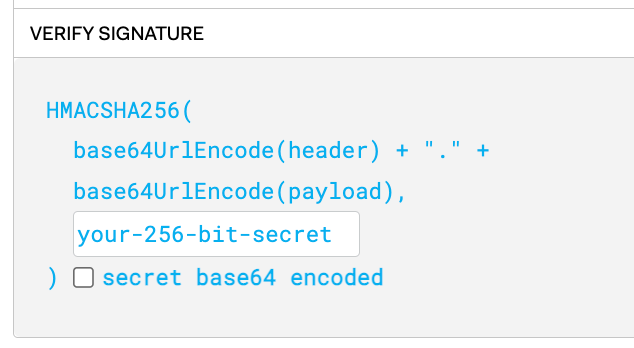

# Sessions vs JWT

## **Sessions vs JWT 입문 (동영상)**

[세션 vs 토큰 vs 쿠키? 기초개념 잡아드림. 10분 순삭!](https://www.youtube.com/watch?v=tosLBcAX1vk)

### Cookies

~~토큰 vs 쿠키? 는 틀린 질문~~

쿠키를 이용해서 서버는 사용자의 브라우저에 데이터를 저장한다.

#### 작동 원리

서버에 request를 보내고 받은 response에 cookies가 있을 수 있다.

그렇게 해서 저장해 놓은 cookies를 서버에 request 보낼 때마다 같이 보낸다.

#### 특징

- 쿠키는 도메인에 따라 제한이 된다.
- 쿠키는 (서버가 정한 기간에 따라) 유통기한이 있다.
- 쿠키는 인증 정보뿐만 아니라, 여러 정보를 저장할 수 있다.
  - e.g., 웹사이트 언어 설정을 바꾸면, 서버는 쿠키를 주어서 사용자의 언어 설정을 저장한다. 이 후에, 쿠키는 request와 함께 서버로 보내지고, 서버는 언어 설정에 해당하는 response를 줄 수 있다.
- 공간 제약이 있다.

### 세션과 토큰이 필요한 이유

HTTP (웹사이트를 이용할 때 쓰는 프로토콜)은 stateless

서버로 가는 모든 request가 이전 request와 독립적으로 다뤄진다. 즉, 요청이 끝나면, 서버는 그 요청에 대한 정보는 기억하지 못한다.

→ 요청을 보낼 때마다, 사용자에 대한 정보를 알려주어야 한다.

### Sessions

#### 작동 과정

1. 유저명과 비밀번호를 서버에 보낸다
2. 비밀번호가 맞다면 Session DB에 user 정보를 저장한다.
3. 각 session마다 별도의 ID가 있고, 이를 쿠키를 통해 브라우저로 돌아와 쿠키에 저장된다.
4. request를 보낼 때 session ID를 쿠키에 담아 보내게 된다.
5. 세션 ID를 세션 DB에서 확인한다.
6. 유저 정보에 해당하는 response를 준다.

#### 특징

- 중요한 유저 정보는 모두 서버가 가지고 있다.
  - 모든 request에 대해서 쿠키를 확인하여, DB를 찾고 저장하는 작업을 서버가 해야한다. 즉, user가 늘어나면 DB 리소스가 더 필요하다.
- 쿠키가 세션 ID를 전달하기 위한 매개체 역할을 한다.
- 세션을 이용하여 안드로이드. iOS를 만들 수 있지만, 쿠키는 사용할 수 없다. → 쿠키 대신 토큰을 사용한다.

#### 장점

- 다양한 기능을 추가할 수 있다.
  - e.g., 특정 유저를 쫓아내고 싶을 때
  - e.g., 원하지 않는 디바이스에서 강제 로그아웃
  - e.g., 로그인한 계정 개수를 알 수 있고, 제한할 수 있다. (넷플릭스)

#### 단점

- DB를 사고, 유지해야 한다.
- 유저가 늘어날 수록 DB도 커진다.
- 주로 redis를 이용한다.
  - 해당 목적을 수행하기 위한, 빠르고, 저렴한 DB

### JWT

토큰 형식

#### 작동과정

1. 유저명과 비밀번호를 서버에 보낸다.
2. 유저명과 비밀번호가 맞다면 서버는 ‘사인된 정보’(JWT)를 string 형태로 클라이언트에 보낸다.
3. request를 보낼 때 ‘사인된 정보’(JWT)를 서버에 보낸다.
4. 서버는 토큰을 받으면, 해당 사인이 유효한지 체크한다.

#### 특징

- 세션 DB가 필요없다.
- 길이에 제약이 없다.
- JWT는 암호화되지 않았다.

#### 장점

- 서버가 많은 정보를 저장하고 있다.

#### 단점

- 다양한 기능을 할 수는 없다.
  - e.g., 강제 로그아웃 X (해당 토큰이 만료되기 전까지 유효)

## **JWT 입문 (동영상)**

[JWT 대충 쓰면 님들 코딩인생 끝남](https://www.youtube.com/watch?v=XXseiON9CV0)

## **JWT token**

[JWT(JSON Web Token)에 대해서... :: Outsider's Dev Story](https://blog.outsider.ne.kr/1160)

### JWT의 구조

#### JOSE 헤더

#### JWT Claim Set

#### Signature

앞에서 보았듯이 JOSE 헤더와 JWT Claim Set은 암호화를 한 것이 아니라 단순히 JSON문자열을 base64로 인코딩한 것뿐이다. 그래서 누구나 이 값을 다시 디코딩하면 JSON에 어떤 내용이 들어있는지 확인할 수 있다. 토큰을 사용하는 경우 이 토큰을 다른 사람이 위변조할 수 없어야 하므로 JOSE 헤더와 JWT Claim Set가 위변조되었는지를 검증하기 위한 부분이 Signature 부분이다. JOSE 헤더와 JWT Claim Set는 JOSE 헤더와 JWT Claim Set를 base64로 인코딩해서 만든 두 값을 마침표(`.`
)로 이어 붙이고 JOSE 헤더에서 `alg`
로 지정한 알고리즘 `HS256`
 즉, HMAC SHA-256으로 인코딩하면 JWT 토큰의 세 번째 부분인 Signature를 만든다.

> 💡 **추가 설명** > [JWT(Json Web Token) 알아가기](https://brunch.co.kr/@jinyoungchoi95/1) > 
> header를 디코딩한 값 + “.” + payload를 디코딩한 값을 위처럼 합치고 이를 your-256-bit-secret, 즉, 서버가 가지고 있는 개인키를 가지고 암호화한 것이 Signature입니다. 따라서 signature는 서버에 있는 개인키로만 암호화를 풀 수 있으므로 다른 클라이언트는 임의로 Signature를 복호화할 수 없습니다.

### J**WT Claim Set**

JWT의 구조를 설명하기 위해서 앞에서는 직접 토큰을 만들었지만 실제로 사용하게 되면 언어별로 있는 JWT 라이브러리를 사용해서 토큰을 만들 것이므로 이 과정을 직접 수행하는 경우는 별로 없다. [JWT 사이트](http://jwt.io/)에 언어별 추천 라이브러리가 있고 현재 지원상황까지 표시되어 있으므로 비교해서 사용하면 된다. 이런 라이브러리는 취약점에 대한 대처가 중요하므로 세부 내용을 자세히 아는 것이 아니라면 그냥 여기 나와 있는 라이브러리를 사용하기를 추천한다. [이전에 작성한 글](http://blog.outsider.ne.kr/1069)에서는 Node.js JWT 라이브러리로 [jwt-simple](https://github.com/hokaccha/node-jwt-simple)을 사용했지만, 개발이 거의 진행되고 있지 않아서 지금은 [jsonwebtoken](https://github.com/auth0/node-jsonwebtoken)으로 갈아탔다.

JWT에서 토큰의 정보를 클레임이라고 부르기 때문에 이 정보를 모두 가지고 있는 바디 부분을 Claim Set이라고 부르고 Claim Set은 키 부분인 Claim Name과 값 부분인 Claim Value의 여러 쌍으로 이루어져 있다. Claim Name으로 사용 가능한 값에는 3가지 분류가 있는데 등록된 클레임 이름(Registered), 공개 클레임 이름(Public), 비밀 클레임 이름(Private)이다. 등록된 클레임 이름은 IANA JSON Web Token Claims에 등록된 이름이고 필수값은 아니지만 공통으로 사용하기 위한 기본값이 정해져 있다. 아래 목록이 등록된 클레임 이름인데 모두 선택사항이다.

- `iss`: 토큰을 발급한 발급자(Issuer)
- `sub`: Claim의 주제(Subject)로 토큰이 갖는 문맥을 의미한다.
- `aud`: 이 토큰을 사용할 수신자(Audience)
- `exp`: 만료시간(Expiration Time)은 만료시간이 지난 토큰은 거절해야 한다.
- `nbf`: Not Before의 의미로 이 시간 이전에는 토큰을 처리하지 않아야 함을 의미한다.
- `iat`: 토큰이 발급된 시간(Issued At)
- `jti`: JWT ID로 토큰에 대한 식별자이다.

공개된 클레임이름은 토큰에서 사용하기 위해서 정의했지만, 충돌을 방지하기 위해서 공개된 이름이고 비밀 클레임이름은 서버와 클라이언트가 협의로 사용하는 이름을 의미한다.

### JWT의 사용

**JWT가 다른 토큰하고 가장 다른 부분은 토큰 자체가 데이터를 가지고 있다는 점이다.** API 서버를 직접 구현한 적이 많지는 않지만, 일반적으로 토큰 기반의 인증을 구현한다면 API 요청 시 헤더나 파라미터에 엑세스토큰을 가져오도록 하고 이 토큰을 보고 인증한다.(서비스에 따라서 앱 ID나 비밀키를 같이 사용하기도 하지만 여기서는 JWT 범주가 아니므로 여기서는 엑세스토큰만 얘기한다.)

일반적인 토큰의 흐름을 생각한다면 API 요청 시에 들어온 토큰을 보고 이 토큰이 유효한지 확인하게 된다. 보통은 데이터베이스에 토큰을 저장해 놓고 만료시간이나 토큰의 사용자 등을 저장해 놓고 유효한 토큰인지 등을 검사하고 유효한 경우 해당 사용자라고 인식하고 이 사용자의 권한으로 사용할 수 있는 정보를 조회하게 된다. 요청마다 데이터베이스를 조회하는 것은 비용이 꽤 크므로 캐시서버 등을 두어 성능을 높이기도 한다.

### **Auth0 - jwt token을 만든 단체**

[Application Session Management](https://auth0.com/blog/application-session-management-best-practices/#Sessions)

## **django에서 session 구현**

[Django Tutorial Part 8: User authentication and permissions - Learn web development | MDN](https://developer.mozilla.org/en-US/docs/Learn/Server-side/Django/Authentication)

## **모바일 앱에서 Sessions vs JWT**

[세션이란? (feat.모바일 앱에서 세션)](https://velog.io/@yhm8622/%EC%84%B8%EC%85%98%EC%9D%B4%EB%9E%80-feat.%EB%AA%A8%EB%B0%94%EC%9D%BC-%EC%95%B1%EC%97%90%EC%84%9C-%EC%84%B8%EC%85%98)

### **모바일 앱에서 세션 관리**

결론부터 말하면, 모바일 환경에서도 세션과 유사한 방식을 사용할 수 있지만, 잘 사용하지는 않는다.HTTP 프로토콜을 사용하면, 결국 논리성의 연속성을 유지하기 위해서 세션과 비슷한 개념이 모바일에도 필요하다. 하지만, 세션이나 쿠키와 같은 방식을 주로 사용하지는 않는 것으로 알고 있다.

모바일과의 네트워킹에서 브라우저에서의 세션과 다른 방식이 사용되는 이유는 다음과 같다.

#### **1. 정보 유지 방식이 다르다**

웹에서는 세션을 발급 받으면, 이를 쿠키에 넣어두고 다시 서버와 소통할 때 사용한다.하지만, 앱은 그 자체로 파일 시스템에 엑세스 할 수 있을 뿐 아니라, 내부 DB도 가질 수 있기 때문에 쿠키를 통해 통신할 필요가 없다.서버에서 받은 유저 식별 데이터를 따로 저장해서 통신할 때 사용하면 된다. 이 값은 보통 앱이 종료되고 재실행 돼도, 로그아웃하지 않는 이상 지워지거나 갱신되지 않는다.즉, 동작 방식은 동일하지만, 세션처럼 관리될 필요는 없는 것이다.TTL을 따로 설정할 필요가 없고, 세션같이 종료시에 expire 될 필요도 없다.또한 앱에서는 모든 정보를 서버에게 요청하는 것이 아니라, 많은 양 클라에서 가지고 있고 서버에서 받은 내용도 캐싱 되는 경우가 대부분이기 때문에, 논리적 연결성 또한 기본적으로 성립되어 있다.

#### **2. 보안 수준**

브라우저에서는 기본적으로 경로가 주소에 공개되어 있고, 환경 자체가 쿠키 값을 파악하거나 중간 탈취할 가능성이 크기 때문에, 세션을 사용하는 것이 필요하다.하지만 앱은 기본적으로 사용자와 1대1 매칭되며, 정보 탈취 가능성이 낮기 때문에 해당 방식과 유사한 방법을 사용한다.

※ 단, 웹뷰등으로 구현하는 하이브리드 앱에서는 세션 관리가 필요하다.
