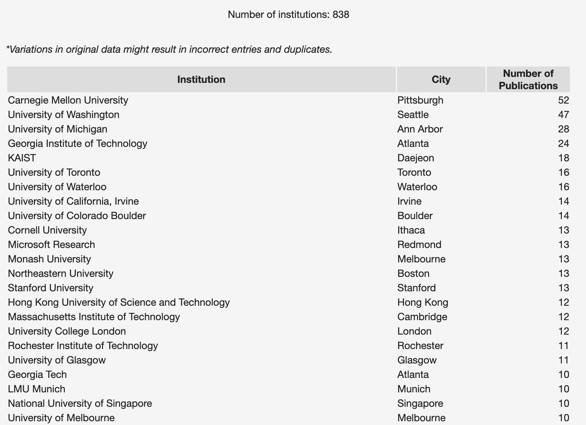
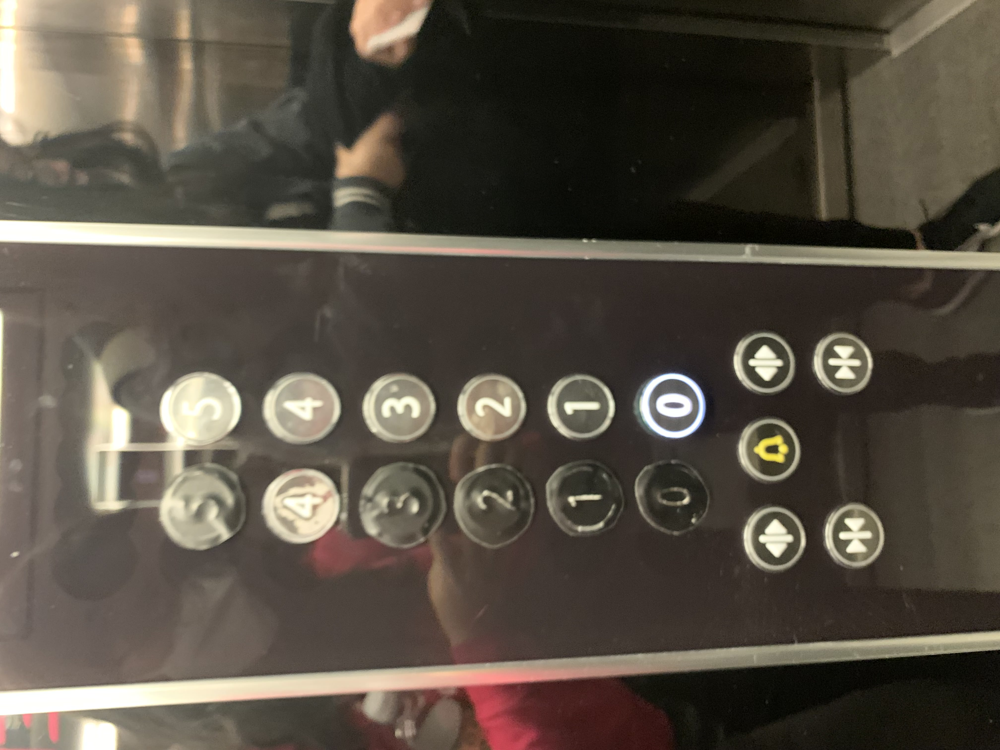
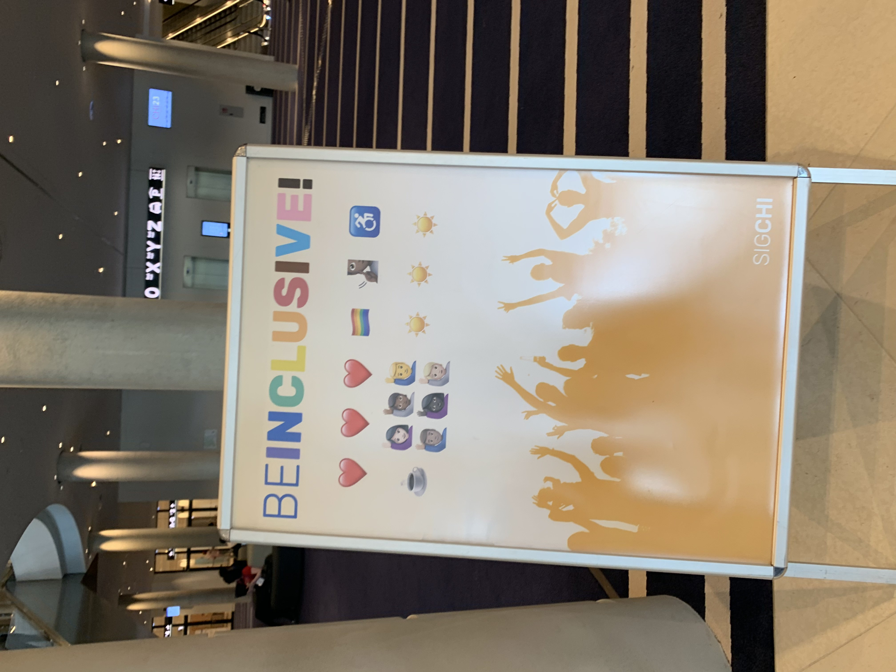
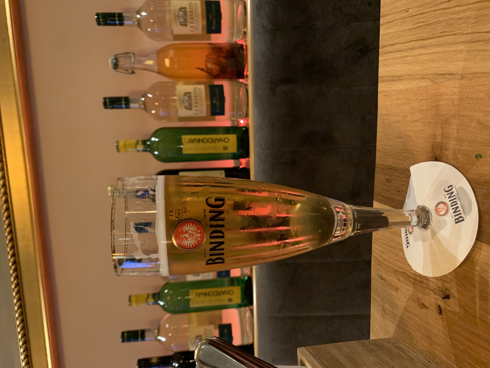
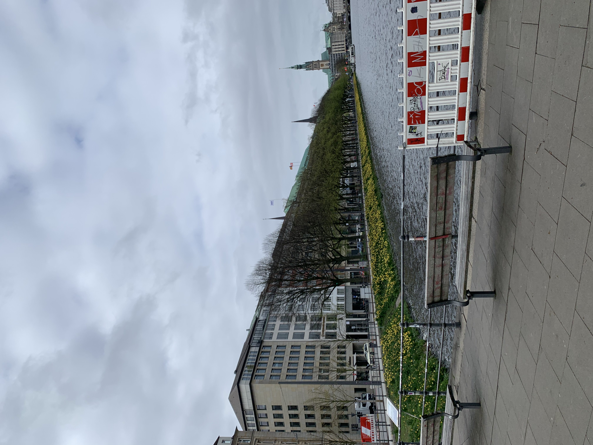
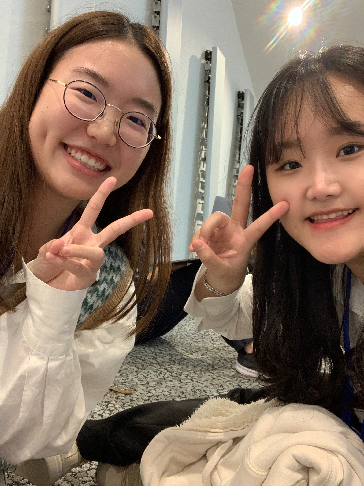
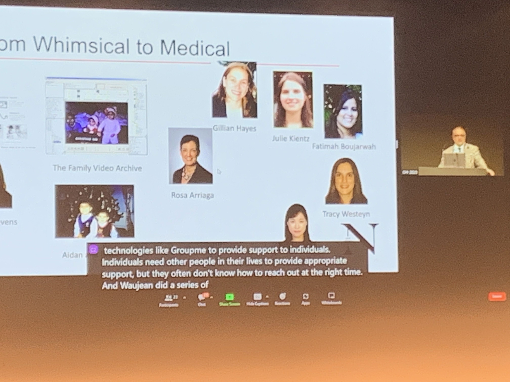
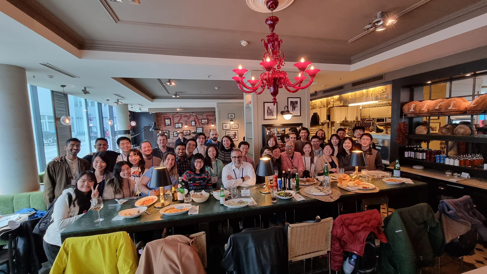
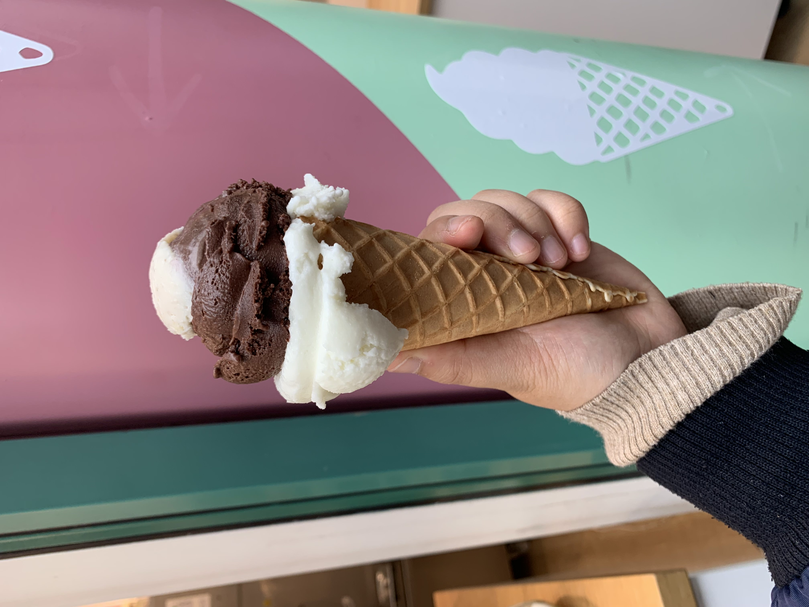

# ACM CHI 를 다녀오다

### **들어가기 전에**

*본 글은 새내기 연구자의 개인적인 견해와 짧은 지식을 바탕으로 작성한 글이며, 어떤 집단도 대변하지 않음을 밝힙니다. 가볍게 읽어주세요 ^^ 잘못된 내용을 발견하신다면 위 프로필을 통해 연락 주시면 감사하겠습니다.* 

### **ACM CHI 학회에 대한 소개**

[ACM CHI](https://dl.acm.org/conference/chi)는 [ACM](https://www.acm.org/)(Association for Computing Machinery의 약자, 세계 최초의 컴퓨터과학 분야의 학술과 교육을 목적으로 하는 각 분야 학회들의 연합체[[ref](https://ko.wikipedia.org/wiki/ACM)])의 [SIGCHI](https://sigchi.org/) 분과에서 주최하는 컴퓨터공학 분야의 탑 컨퍼런스로 HCI(Human-Computer Interaction, 인간 컴퓨터 상호작용) 분야에서 가장 권위있다고 간주되는 학회입니다[[ref](https://ko.wikipedia.org/wiki/ACM_%EC%9D%B8%EA%B0%84-%EC%BB%B4%ED%93%A8%ED%84%B0_%EC%83%81%ED%98%B8%EC%9E%91%EC%9A%A9_%ED%95%99%ED%9A%8C)]. 참고로 “*치”* 라고 발음하기 쉽지만 “*카이(kai)”* 라고 발음합니다. ~~구체적인 이유는 저도 잘 모르겠네요(머쓱). 이유를 아신다면 공유해주세요!~~ 

학회의 개최 지역은 매년 상이한데, ACM CHI 2023는 독일 함부르크에서 열렸습니다. [2015년](https://chi2015.acm.org/)에는 서울에서 열렸다고 합니다! 

### **학회란?**

논문을 낸다! 라고 하면 일반적으로 학회 또는 저널에 제출을 한 것을 의미해요. 분야별로 학회와 저널이 가지는 무게가 조금씩 다른데요, 자연과학 분야에서는 학회는보다는  저널이 비교적 저명하고 무거운 것이 일반적인 반면 컴퓨터 공학 분야에서는 학회에 제출하는 것이 큰 의미를 가집니다. 

CHI(Conference on Human Factors in Computing Systems) 이외에도 컴퓨터 공학 분야의 유명한 학회에는 NeurIPS, CSCW, 등이 있으며, HCI 분야의 학회에는CSCW, UIST, 등 여럿 있으며 아무래도 interdisciplinary한 분야이다 보니, 다른 domain의 학회에도 제출하는 경우가 흔히 있습니다. 학회와 저널의 차이라고 하면 여러 가지가 있는데 대표적인 것으로는 학회는 데드라인이 있고 저널은 대체로 없습니다. 저도 이 부분에 대해서는 더 자세하게 알지 못하는데, Why are conference papers so important in computer science? 라고 검색하면 다양한 답변을 얻을 수 있는 것 같아요. 

연구를 수행하고 논문을 작성하여 학회에 제출을 하면 리뷰어들에게 리뷰와 점수를 받습니다. 연구자는 리뷰에 대한 답변을 하며 그것을 반영한 최종 점수가 나오죠. 그 점수를 바탕으로 논문의 accept와 reject가 결정되지요. 구체적인 R&R(Reject and Resubmit) 방식은 학회별로 상이하기도, 같은 학회 내에서도 꾸준히 변화 합니다. CHI 2023의 R&R 방식은 [이곳](https://chi2023.acm.org/2022/11/09/chi-2023-quick-look-at-how-to-interpret-your-reviews/)에 상세히 나와있는데 기회가 된다면 제가 아는 범위에서 조금 더 자세히 글로 다루어보도록 하겠습니다. 

논문이 accept 되면 해당 학회의 proceeding에 출판 되며 학회에서 연구에 대한 발표를 할 기회를 얻게 됩니다. 피와 땀이 섞인 자신의 연구를 같은 분야를 치열하게 연구하고 있는 다른 연구자 분들에게 소개하고 질문 받고 소통할 수 있는 소중한 기회라고 볼 수 있죠. 연구 협업 및 job offer의 기회로 연결되는 경우도 종종 있는 것 같아요. 

### 나는 어떻게 왜 CHI에 가게 되었는가?

비하인드 스토리가 참 많지만, 결과적으로는 학회 대면 참가비 $590와 왕복 항공 비용을 지원받을 수 있게 되어, 그 당시에 발표할 논문이 없었음에도 불구하고 존경하는 연구실 슨배림들과 함께 가게 되었어요. 저와 친한 같은 학부생 친구 Nicole도 함께 가게 되어 넘 좋았답니당! (Shout out to Nicole 😝)

### 인상 깊었던 논문 소개

이번 출장의 본분, 학회 열심히 참여 하기. 여러 연구들을 살펴보며 제 현재와 미래 연구의 밑거름으로 충전시키는 것이 학회를 열심히 참여하는 것의 큰 축이기 때문에 이 섹션은 빠질 수 없죠! 

소개된 연구들은 정말 재미있고, 감명 깊었으며, 어느 하나 빠짐없이 중요한 문제들을 정의하고 풀어나가는데 들어간 크고 작은 수많은 노력을 어림짐작으로나마 가늠해보며 연구자분들에 대한 존경스러움을 가득 느끼는 시간이었답니다. 

제가 제일 기대했던 session은 Large Language Model 세션이었는데 그 중 가장 재미있게 들었던 발표 논문을 아래 간단하게 소개해보아요. 

> **Synthetic Lies: Understanding AI-Generated Misinformation and Evaluating Algorithmic and Human Solutions**
> 
> 
> *Authors : Ziawei Zhou, Yixuan Zhang, Qianni Luo, Andrea G Parker, Munmun De Choudhury*
> 
> 📄 [doi](https://dl.acm.org/doi/10.1145/3544548.3581318)  🖥 [presentation](https://www.youtube.com/watch?v=J9bUpz0RrwI) 
> 

LLM의 발달으로 설득력 있는 허위 정보를 정말 쉽게 생성할 수 있게 됨에 따라 온라인에서 허위 정보와 잘못된 정보의 확산 문제는 그 어느 때보다도 심각하죠. 본 연구는 이 문제를 해결하기 위해 AI Generated Misinformation의 특성을 더 잘 이해하고, 허위 정보를 탐지하는 다양한 기술들이 AI Generated Misinformation들을 얼마나 효과적으로 탐지하는지 평가합니다. 더 나아가 AI가 생성한 허위 정보를 수집/정리하고, 인간이 만든 허위 정보와 비교하였을 때 나타나는 언어 특성과 표현 패턴을 분석하며, 기존 허위 정보 탐지 모델이 AI가 생성한 허위 정보를 분류하는 데 얼마나 효과적인지 평가하고, 이러한 콘텐츠들에 대한 정보 평가 지침을 검토했어요. 연구 결과로는, 기존 허위 정보 탐지 모델은 AI Generated Misinformation을 정확하게 분류하는 데 어려움을 겪기 때문에 탐지 방법의 개선이 필요함을 시사하며, 추후 탐지 방법 개선에 직접적인 도움이 될 수 있는 AI Generated Misinformation이 가지는 독특한 특성에 대한 insight를 제공합니다.

제가 이해한 것을 바탕으로 최대한 간략하게 소개해보았는데요, 위에 링크로 걸어둔 발표 영상이나 논문을 직접 확인해보시길 추천합니다👍

1저자 연구자분께서 학회에 갑작스럽게 대면으로 참석하지 못하게 되어 온라인으로 발표를 들을 수 밖에 없어 정말 아쉬웠어요🥲 조만간 함께 연구를 하게 될 분이라 이것 저것 여쭙고 싶었는데 말이죠.. 하지만 교신 저자인 Munmun 교수님은 현장에 계셔서 인사 드리고 스몰 토크 시전 할 수 있었답니다! ~~(히히 나는야 성덕)~~

### HCI@KAIST

HCI 분야 학계에서 KAIST의 위상은 대단해요. 아래 사진은 2022년도 CHI에서 전 세계 기관(학교, 기업, 등)별 출판 논문 개수 기준 정렬인데요, KAIST는 어디에 있게요~😝 Microsoft, Stanford, MIT의 위치까지 함께 찾아 보면..👀 숫자와 줄세우기가 모든 것을 얘기해주지는 않지만, 아무튼 HCI@KAIST가 자랑스러운 것은 분명해보이네요!

이것은 모두 HCI@KAIST 커뮤니티 멤버들의 활약과 활약할 수 있는 환경 교수님들, 과거와 현재의 HCI@KAIST 운영진 교수님 및 학생분들을 비롯한 수많은 사람들의 노력 덕분입니다. 

KAIST라는 소속이 매우 자랑스럽습니다. 저를 둘러싼 울타리에 걸맞는 구성원이 되고자, HCI@KAIST의 위상에 콩알만큼이나마 기여하는 연구자가 되어야겠다고 다짐해 봅니다 :) 

### 느낀 점, 전반적인 생각

제가 다음에 참석할 학회는 Minneapolis, MN, USA🇺🇸에서 열리는 CSCW인데요, 제가 마침 미국에 있을 때 학회가 미국에서 열려서 SV(Student Volunteer)로 지원해 참가 해보려고 해요. 다음에는 일반 학회 참가자가 아닌 SV로서의 경험을 공유할 기회가 되면 좋겠습니다! 

많은 이야기를 담으려고 하다 보니 두서 없는 글이 된 것 같기도 하네요. 두서 없는 글 읽어주셔서 대단히 감사합니다! (하지만 담고 싶던 내용의 3할도 못 담은 것 같네요ㅠ)

포스트는 함부르크 사진들로 마무리 해보겠습니다 🇩🇪

### 마무리 하며, 독일 이야기

HCI@KAIST people in #CHI2023 📸 |한국에서의 1층이 독일에서는 0층이랍니다. ~~전산과스러운 사고에 감동(?)으로 치이고 갑니다.~~ |다양성을 수용하는 문화를 지닌 집단을 애정하는데, Inclusive한 문화를 가지고 있답니다. 문구로서 주장하는 문화가 아닌, 살갗으로 느낄 수 있는 “진짜” 깃들여진 문화임을 알 수 있었어요. 
--- | --- | --- | 

독일 왔는데 맥주 안마셔줄 수 없쟈나요… 1일1+ 맥주 했지요 호호🍺 |러닝광인 저는 독일런 하기위해 러닝화까지 따로 챙겨갔지만 절묘하게 꽉 채워 아팠던 바람에(라는 핑계로) 러닝은 포기해야했다는 비하인드가..🥲 타지에서 아프면 괜히 서럽더라구요. 해외에 가기 전에, 가서 건강에 더욱 유의해야겠다는 생각을 하게 됐답니다~! |학회장 땅바닥에서 과제하는 니콜을 발견하여 불쌍한 학부생끼리 찰칵📸
--- | --- | --- | 

Life Time Research Award를 수상하신 Gregory Abowd 교수님의 talk 정말 울림이 컸다.  |그레고리 교수님 academia family 식사 자리  |독일의 젤라또는……….너무 달다
--- | --- | --- |