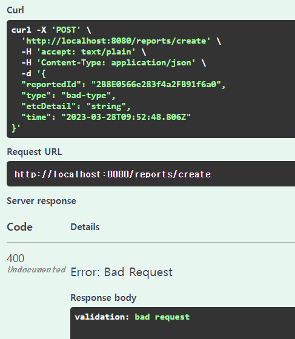
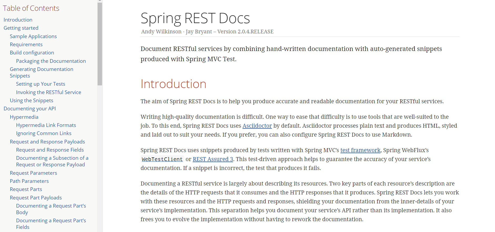

# Swagger와 함께하는 🤘Swag🤘 넘치는 문서화
안녕하세요! SPARCS Taxi팀에서 백엔드 개발자로 활동중인 won입니다.

이번 글에서는 REST 웹 서비스 문서화를 위한 오픈 소스 소프트웨어 프레임워크인 Swagger에 대해 알아보고, Taxi 팀에서 Swagger를 어떻게 사용하는지에 대해 간단히 소개해보려 합니다.

## 서론
평소와 다름없이 열심히 개발을 하던 중 어떤 함수나 type에 대한 정보가 얻고 싶을 때, 블로그와 구글링 다음 최후의 수단으로 공식 문서를 읽어보곤 합니다. 처음에는 영어로 적힌데다가 불편함이 이만저만이 아니지만, 익숙해진다면 확실한 정보를 얻기에 이만한 방법이 없다는 걸 항상 깨닫곤 하지요.

이처럼 코드 문서화는 코드가 어떻게 작동하고, 어떻게 활용되는지 파악할 때 매우 유용하게 작용합니다. 하지만 개발을 하는 개발자의 입장에서 문서화는 새로운 코드를 짜거나 혹은 기존 코드를 변경할 때마다 매번 업데이트 해줘야 하는 귀찮은 존재인데요. 어떻게 하면 문서화를 더 편하고, 더 멋지게! 할 수 있을까요?

## 🤘 Swagger - API 문서 자동화


[Swagger](https://swagger.io/)는 개발자가 REST API를 설계, 빌드, 문서화 및 사용하는데 있어 도움이 되는 OpenAPI 사양을 중심으로 구축 된 오픈 소스 도구 세트입니다. Swagger를 사용하는 가장 큰 특징은 빠르고 쉽게 알록달록한 문서를 만들 수 있으며, 문서 화면에서 사용자가 바로 API를 테스트 해볼 수 있다는 점입니다. 원래 API가 제대로 작동하는지 사용자가 확인하기 위해서는 코드를 받아와 테스트 코드를 작성하거나 별도의 작업이 필요했지만, Swagger에서는 유저가 직접 값을 넣어보며 다양한 테스트를 진행할 수 있다는 점에서 매우 유용합니다. 

개인적으로 생각하는 Swagger의 장단점을 정리하면 다음과 같습니다.
* 장점
    * 적용하기 쉽다.
    * API 테스트를 위한 UI를 제공한다.
    * 다양한 색을 사용하여 API들을 한 눈에 파악하기 좋다
* 단점
    * 코드에 어노테이션을 달거나, 별도의 코드를 작성해야 한다.
    * 문서만으로 유연하게 동기화 시키기는 힘들다.

## ❓ Swagger 어떻게 사용하나요?
지금부터는 간단하게 Swagger를 어떻게 적용하는지 살펴보고, Swagger로 작성된 예시를 Taxi팀에서 사용했던 실제 코드로 살펴보도록 하겠습니다.
### 개발 환경
이 글은 Node.js(express) + Javascript를 기반으로 작성되었습니다.

먼저, Swagger을 사용하기 위한 npm 모듈을 설치해줍니다.
`npm install swagger-ui-express swagger-jsdoc`

그 후, 다음과 같이 router 설정을 수정합니다. 이러면 /docs에 들어가면 Swagger로 작성된 문서를 확인할 수 있습니다.
```
// app.js
app.use("/docs", require("./src/route/docs"));
```

아래 코드는 swaggerUi를 사용해서 기초 Ui를 만들고, swaggerSpec에서 정의한 관련 세팅을 설정해주는 코드입니다.
* `definition`에서는 버전이나 제목, 태그 같은 기본적인 정보들을 설정해 줄 수 있습니다.
* `apis`에서는 Swagger annotation들이 담긴 파일들의 경로를 지정해줍니다.
```
// /src/route/docs.js
const swaggerSpec = swaggereJsdoc({
  definition: {
    openapi: "3.0.3",
    info: {
      title: "Taxi API Document",
      version: "1.0.0",
    },
    basePath: "/",
    tags: [
      {
        name: "logininfo",
        description: "로그인 정보 제공",
      },
    ],
    consumes: ["application/json"],
    produces: ["application/json"],
  },
  apis: ["src/route/*.js"],
});

router.use(swaggerUi.serve);
router.use(swaggerUi.setup(swaggerSpec, { explorer: true }));
```

이렇게 설정이 완료되었다면 각 api들에 대한 정보를 @swagger annotation을 통해 작성해주면 됩니다.
아래 코드는 로그인된 사용자의 정보를 반환하는 API를 Swagger로 문서화한 예시입니다.
```
// /src/route/logininfo.js
/**
 * @swagger
 * /logininfo:
 *   get:
 *     tags: [logininfo]
 *     summary: 사용자 정보 반환
 *     description: 로그인되어 있는 사용자의 정보를 반환
 *     responses:
 *       200:
 *         description: 사용자의 로그인 세션이 유효한 경우, 현재 로그인된 사용자의 정보를 반환, <br/>
 *           세션이 유효하지 않은 경우, 빈 오브젝트를 반환
 *         content:
 *           application/json:
 *             schema:
 *               type: object
 *               properties:
 *                 id:
 *                   type: string
 *                   description: 사용자 id
 *                 sid:
 *                   type: string
 *                   description: 사용자 sid
 *                 name:
 *                   type: string
 *                   description: 사용자 이름
 */
router.route("/").get(logininfoHandlers.logininfoHandler);

```


이렇게 annotation을 잘 작성해주고, 아까 설정한 주소를 접속하면 멋지게 정리된 저희의 문서들을 볼 수 있습니다!

</img>

또한, 각 API들을 직접 테스트한 결과를 다음과 같이 웹 화면에서 직접 확인할 수 있습니다.

</img>

Swagger에 대해 더 자세하게 알고 싶다면 [Swagger 공식문서](https://swagger.io/docs)를 읽어보는 것을 추천드립니다.

## 🚕 Swagger in Taxi
최근 이벤트로 뜨거운 관심을 받고 있는 [Taxi](https://taxi.sparcs.org/home) 서비스는 이전까지 [github Readme](https://github.com/sparcs-kaist/taxi-back/blob/dev/src/routes/docs/README.md)를 사용해서 문서화를 진행해왔는데요, 이번 23년도 봄학기부터 PM(@suwon)님의 제안으로 문서 최신화 작업과 더불어 Swagger를 통한 문서 자동화 작업을 진행 중에 있습니다. 지금부터는 Taxi 팀에서 Swagger을 어떻게 사용하고 있는지 간단하게 알아보겠습니다.

### Swagger 문서들만 파일로 따로 관리하자!
위의 예시처럼 annotation을 통해 Swagger을 작성할 수도 있지만, 이 방법의 경우 복잡한 API에서 annotation이 너무 길어지게 되어 코드가 자칫 더러워질 수 있다는 위험이 있습니다. 또한 문서에서 비슷한 부분이 계속 반복되는 경우 나중에 변경점이 있을 경우 다 수정해야하는 번거로움이 생기겠죠. 

그렇기 때문에 저희는 각 문서들을 json 형식의 object로 관리하여 이 문제를 해결하였습니다. 아래 코드와 같이 각 파일에서 작성된 Swagger 문서들을 가져와 각 문서들을 마치 변수처럼 활용하는 것을 볼 수 있습니다. 이렇게 하면 깔끔하고 좀 더 편하게 문서를 작성할 수 있습니다.

참고로 Swagger는 `.yaml` 형식과 `.json` 형태 모두 작성 가능하기 때문에 편한 양식에 맞춰 작성하면 되겠습니다. 
```
// /src/routes/docs/swaggerDocs.js
const reportsSchema = require("./reportsSchema");
const reportsDocs = require("./reports");
const logininfoDocs = require("./logininfo");
const locationsDocs = require("./locations");

const swaggerDocs = {
  openapi: "3.0.3",
  info: {
    title: "Taxi API Document",
    version: "1.0.0",
  },
  basePath: "/",
  tags: [
    {
      name: "locations",
      description: "출발지/도착지 정보 제공",
    },
    {
      name: "logininfo",
      description: "로그인 정보 제공",
    },
    {
      name: "reports",
      description: "사용자 신고 및 신고 기록 조회",
    },
  ],
  consumes: ["application/json"],
  produces: ["application/json"],
  paths: {
    ...reportsDocs,
    ...logininfoDocs,
    ...locationsDocs,
  },
  components: {
    schemas: {
      ...reportsSchema,
    },
  },
};

module.exports = swaggerDocs;
```


### 문서화와 Validation을 한번에! 
Back-End에서 유효하지 않은 요청을 처리하고 싶지 않은 경우 Validator을 통해서 이를 처리해줍니다. 만약 Validator에서 설정해준 형식이 아니라면 중간에 error을 보내서 예상하지 못한 코드 동작이 일어나지 못하도록 방지해 줄 수 있겠죠.

Taxi팀 또한 `express-validator`라는 모듈을 통해 유효성 검사를 진행해왔는데요. 여기서 문제는 `express-validator` 에서도 각 parameter들의 type을 정의하고, Swagger 문서에서도 `schemas`를 통해 2중으로 API parameter들의 type을 정의해줘야 했다는 점입니다. 문서화도 가뜩이나 귀찮은데 API가 변할 때 마다 validator 설정도 다시 해줘야 한다면 매우 번거로울 것입니다. 

이 문제를 저희는 `AJV(another json validator)`을 사용하여 해결하였습니다! `AJV`는 Node.js / 브라우저를 위한 JSON Validator를 생성해주는 라이브러리로, JSON 형식으로 작성된 Schema를 함수로 컴파일하여 유효성 검사를 진행하는 라이브러리입니다. 

아까 언급하였듯, Taxi에서는 Swagger 문서를 `JSON` 형식으로 작성하기 때문에 Swagger의 `schemas`에 정의된 스키마들을 자연스럽게 `AJV`에서 사용할 수 있습니다. 즉, `express-validator`을 사용하지 않고도 `JSON` 형식으로 정의된 문서를 사용하여 유효성을 검사할 수 있는 것이지요.

이를 적용한 결과, 아래와 같이 type이 유효하지 않은 `bad-type` 요청에 대하여 error을 내는 것을 확인할 수 있습니다.




## 🍃 Spring REST Docs - Swagger말고 다른건 없나요?

[Spring REST Docs](https://docs.spring.io/spring-restdocs/docs/3.0.0/reference/htmlsingle/)는 Swagger와 더불어 API 문서 자동화에 자주 사용되는 Tool입니다. Swagger와 달리 별도의 타이핑이 필요 없으며, Test를 통과해야만 문서가 생성된다는 특징이 있습니다. 이러한 특징 때문에 Spring REST Docs는 다음과 같은 장단점을 갖고 있습니다. 
* 장점
    * 실제 코드에 추가되는 코드가 없다.
    * 테스트가 성공해야 문서가 작성되어 API의 신뢰도를 높여준다.
    * 버전 변화에 유연하고 정확성이 높다.
* 단점
    * 테스트 코드를 따로 작성해야 하며 별도로 준비할 것이 많다
    * 적용하기 어렵다...!

이 글에서 더 자세하게 다루지는 않겠지만, 관심 있는 분들은 이에 관해 자세하게 작성된 아래의 글들을 참고하면 좋을 것 같습니다. 

* [Spring Rest Docs 적용](https://techblog.woowahan.com/2597/)

* [내가 만든 API를 널리 알리기 - Spring REST Docs 가이드편](https://helloworld.kurly.com/blog/spring-rest-docs-guide/#spring-rest-docs-%EB%8A%94-%ED%85%8C%EC%8A%A4%ED%8A%B8%EB%A5%BC-%EB%B0%98%EB%93%9C%EC%8B%9C-%EC%9E%91%EC%84%B1%ED%95%B4%EC%95%BC-%ED%95%9C%EB%8B%A4)

## 글을 마치며
23년 5월 현재에도 Swagger 문서화 작업은 계속 진행 중이며, https://taxi.sparcs.org/docs/ 에서 저희가 지금까지 작업한 Swagger 문서를 확인할 수 있습니다. 아직 완벽하지 않지만 점점 추가될 저희 API 문서들을 기대해 주세요! 

또한 위에서 언급한 코드들은 저희 [taxi-back](https://github.com/sparcs-kaist/taxi-back/tree/dev/src/routes/docs) 레포에 잘 정리되어 있으니 관심 있는 분들은 코드를 살펴보시는 것을 추천합니다. 

지금까지 README를 통해서만 Document를 관리해왔다면 한 번 Swagger을 통해 Documentation을 더 Swag 넘치게 만들어 보는 것은 어떨까요? Swagger을 사용함에 있어 이 글이 도움이 되길 바라며 마무리 하겠습니다.

긴 글 읽어주셔서 감사합니다 :)
