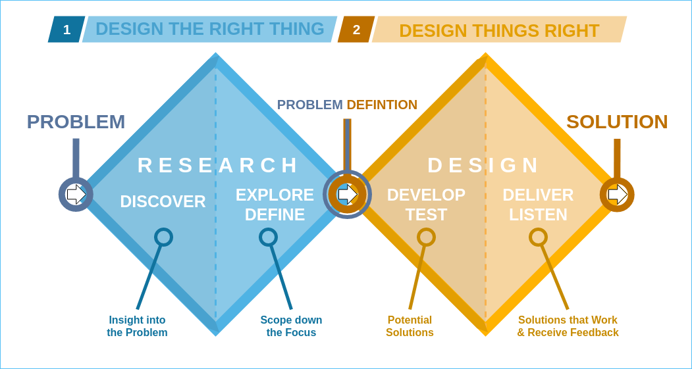
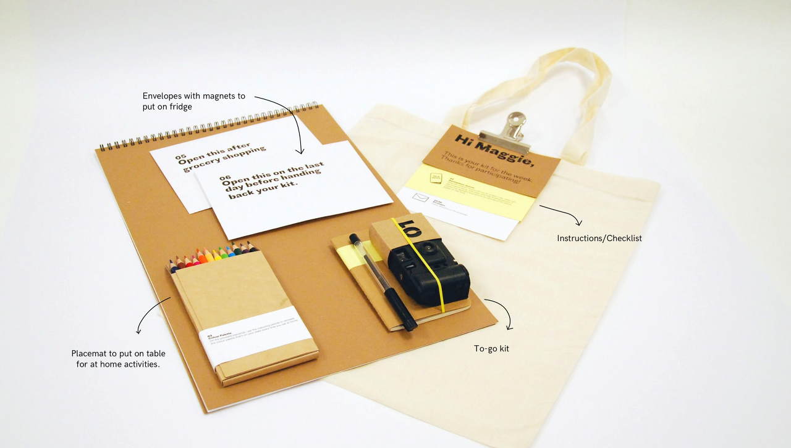

# 사용자 니즈 알아가기

안녕하세요, 22년도 봄부터 디자이너로 활동해온 조유민(yumyum)입니다. 지금까지 업로드 된 글들을 모두 읽고, 어떤 글을 써야 할지 오래 고민했습니다. 그리고 그냥 제가 제일 재밌게 느끼는 걸 쓰기로 했어요. 오늘 다룰 주제는 ***사용자 니즈user needs***입니다.

## 디자인 과정에서의 사용자 니즈

다음 그림은 디자인 프로세스 모델을 설명할 때 자주 쓰이는 ***Double Diamond***입니다. 디자이너들은 흔히 (1) Discover, (2) Define, (3) Develop, 그리고 (4) Deliver의 네 단계를 반복하게 됩니다. (말하고 보니 전부 D로 시작하는군요.)

가장 첫 단계인 Discover 단계에서 목표로 하는 서비스(target service)를 선택하고, 데이터를 모으고, insight들을 찾습니다. 다음 단계인 Define에서는 문제 상황에 대한 아이디어를 brainstorming하고, 그렇게 발산한 아이디어를 정리해 solution scope를 좁혀 나갑니다. 세번째 단계인 Develop은 mid-to-high 프로토타이핑을 목표로 합니다. 그러기 위해서는 먼저 목적과 계획을 수립하고, 프로토타이핑을 반복하며 다듬어 나가는 과정이 필요합니다. 마지막인 Deliver는 그렇게 구축해온 모든 것들을 전달해 피드백을 받는 단계입니다.

사용자 니즈를 찾는 단계는 이 중 가장 앞 순서인 Discover입니다. 사용자를 *잘* 아는 것은 모든 디자인의 근간이 되기에 우리는 사용자의 시각으로 문제 상황을 바라보고 여러 방면에서 사용자를 이해하기 위해 노력합니다.

하지만 동시에 많은 디자이너들이 실패하는 지점 또한 바로 여기입니다. 

‘**Pain Point**’는 말 그대로 사용자가 불편함이나 문제를 느끼는 지점을 뜻합니다. 사용자가 경험하는 그 어떤 문제라도 이에 포함됩니다. ‘**Goal**’은 사용자가 바라는 궁극적인 목표입니다. 사용자의 goal이 pain point로 인해 제대로 성취되지 않는 상황이라고 이해할 수 있습니다. 이렇듯 pain point로 인해 goal이 성취되지 않는 상황 속에서 사용자가 바라는 것을 우리는 ‘**사용자 니즈**’라고 정의합니다.

## 니즈 찾기(Needs Finding)와 디자인 방법(Design Methods)

디자인을 하는 과정은 사용자로부터 끊임없이 배우는 과정과 같습니다. 우리는 사용자의 경험으로부터 insight를 얻고, 사용자의 행동으로부터 피드백을 얻습니다. 좋은 디자인은 사용자를 이해하고 있는 디자인이라고 말할 수 있습니다. 그래서 지금부터는 ‘사용자를 이해하기 위한’ 여러 방법을 간략히 소개해 드리려고 합니다.

제가 아래에 기술한 모든 내용은 산업디자인학과의 <ID303 디자인 방법>, <ID304 사용자 경험 디자인>, <ID403 시스템 디자인>, <CS374 HCI개론> 등의 강의에서 공부한 내용과, 그 외에 개인적으로 얻은 경험 및 지식에 기반하고 있습니다. 제안, 정정, 추가 의견은 언제나 환영입니다 :)

### 설문 조사 Survey

설문 조사는 가장 쉬운 연구 방법 중 하나입니다. 대면으로 진행될 필요도, 실시간으로 이루어질 이유도 없기 때문이죠. 디자이너가 할 일은 몇 가지 질문과 선택지를 떠올리고, [Google Forms](https://www.google.com/intl/ko_kr/forms/about/)에 옮기고, 사용자에게 제공한 후 답변을 기다리는 게 전부입니다. 물론 이것도 품이 아예 안 드는 일은 아니지만 이 뒤에 이어질 여러 방법들을 보다 보면 이게 가장 쉬운(!) 방법이라는 것을 깨닫게 될 것입니다.

다만 설문 조사를 준비하고 진행할 때 주의해야 할 점은 객관성입니다. 간혹 설문 조사는 우리를 유혹에 빠뜨립니다. 디자인을 하는 관점에서 특정 답을 도출하기 위한 질문을 쓰는 것은-결과와 별개로-매우 쉬운 일이기 때문입니다. 하지만 이렇게 얻은 결과는 본질적으로 유의미하다고 말하기 어려우며 보여주기식의 데이터로 끝나기 십상입니다.

더하여 충분한 양과 질의 조사 대상이 보장되지 않는다면 설문 조사는 그 힘을 잃기도 합니다. 여러분은 주로 설문 조사를 어디에 공유하나요? 저의 경우에는 저와 비슷한, 특히 또래의 사람들이 모여 있는 메신저, 게시판, 소셜 미디어를 많이 사용하곤 했는데요, 이는 사실 조사 대상 인원이 매우 편향된 잘못된 사례입니다. 학생 입장에서 설문 조사를 진행할 때 느끼는 가장 큰 어려움은 한정된 주변 사람 풀인 것 같습니다.

### 사용자 인터뷰 User Interview

사용자 인터뷰도 설문 조사와 더불어 많은 분들께 익숙할 것 같습니다. In-depth interview라고도 부르는 사용자 인터뷰는 대상자와 일대일로 충분한 시간에 걸쳐 진행됩니다. 연구자는 자유롭게 질문을 던지고 답변을 구하며 대상자의 태도, 경험, 배경 등에 대한 깊은 이해를 얻게 됩니다. 인터뷰는 실시간으로 진행되기 때문에 사용자의 언어적 표현뿐만 아니라 비언어적 표현을 캐치하기에도 적합하며, 즉흥으로 follow-up 질문들을 던지기 좋습니다.

### Focus Group Interview (FGI)

FGI는 사용자 인터뷰와 매우 다른 성격을 띱니다. 사용자 인터뷰는 질문에 대한 개인의 답변에 가치를 두고 있는 반면 FGI는 그룹 토의(group discussion)에 초점을 맞추고 있습니다. “Focus Group”이란 디자인 목적에 부합하는, 특정한 경험을 공유한 사람들의 집합을 의미합니다. FGI를 진행할 때 우리는 그룹 내의 인터뷰이들이 주고 받는 대화와 상호 작용 속에서 insight를 찾기 때문에 설문 조사나 사용자 인터뷰에서보다 심층적인 정보를 얻을 가능성이 높습니다.

이렇게 깊은 이야기를 이끌어내기 위해서는 인터뷰 전반을 관리할 사회자(moderator)가 필요합니다. 사회자는 준비한 질문을 던질 뿐만 아니라, 참여자들 간의 의사소통이 원활하고 활발히 이루어지도록 유도합니다. 발언 내용을 잘 듣고 이를 의도에 맞게 정리해 말로 표현하거나, 특정 논의가 이어지는 시간을 조절하는 일 등이 이에 포함됩니다. 사회자가 유의해야 할 점은 중립을 유지하며 모든 의견을 존중하는 태도를 취해야 한다는 것입니다. 사회자가 판단을 내리는 듯한 모습을 보인다면 사용자는 자신의 이야기를 꺼내기 어려워지기 때문입니다.

### Cultural Probe

Cultural Probe는 꽤나 생소히 들리는 단어입니다. 사실 한국어로 뭐라고 부르는지도 모르겠습니다. 저도 이번 학기(23년도 봄학기) 들어 이 방법을 처음 제대로 접해봤는데요, 꽤 흥미로워서 꼭 전해드리고 싶었습니다.

Cultural Probe는 생각과 감정을 기록하기 위한 여러 도구(artifact)들을 활용하는 디자인 방법입니다. 여기서 말하는 도구에는 대표적으로 다이어리가 포함되며, 즉석 카메라, 스티커, 엽서, 지도, 워크북 등 그 외에도 여러 형식이 존재합니다. 디자이너는 타겟 그룹으로부터 자신이 찾고자 하는 정보를 끌어내고자 특수한 형태의 Cultural Probe를 디자인하게 됩니다. 목적이 담긴 패키지를 받은 참여자는 여러 도구들을 자유롭게 활용하며 전달 받은 지시 사항을 수행합니다.

Cultural Probe는 타겟 그룹의 실제 생활이나 행동에 대한 깊은 공감을 목적으로 합니다. Cultural Probe가 진행되는 동안에는 디자이너가 참여자에게 간섭하는 행위가 최소화되므로 참여자는 보다 마음 편하게 자신의 생각과 삶을 표현할 수 있습니다. 또한 구두나 텍스트로 한정되는 앞선 세 가지 방법과는 다르게 시각적 요소가 가미되어 있으므로 표현의 범주가 확장됩니다.

하지만 참여자의 자유도가 보장된다는 것은 패키지가 ‘아주 잘’ 만들어져야 한다는 말과 같습니다. Cultural Probe가 진행되는 동안 참여자의 방향을 바로 잡을 기회가 없기에 디자이너는 패키지 안에 자신의 의도를 명확히 담아야 합니다. Cultural Probe를 진행할 때에는 pilot을 먼저 여러 차례 진행해보는 것을 추천합니다.

### Affinity Diagramming

여기서부터는 사용자 연구를 통해 얻은 insight들을 정리하기 위한 디자인 방법들입니다.

Affinity Diagramming은 방대한 양의 정보들 가운데에서 규칙과 의미를 찾기 위해 흔히 쓰이는 방법입니다. 일반적으로는 포스트잇을 많이 이용하는데요, [Miro](https://miro.com/ko/)나 Figma의 [FigJam](https://www.figma.com/figjam/)에서도 포스트잇 형태의 도구를 찾아볼 수 있는 이유이기도 합니다.

Affinity Diagramming을 수행하는 방식은 아주 간단합니다. 수집한 여러 데이터들을 포스트잇에 적어 마구 나열해 보세요. 그리고는 관련 있는 포스트잇들을 그룹핑하는 겁니다. 모아진 포스트잇들에게는 공통된 제목을 부여해 주세요. 중복되었거나 크게 가치 없는 포스트잇은 미련 없이 버리시면 됩니다. 필요하다면 그룹핑을 여러 번 반복하세요. 그러다 보면 포스트잇 하나하나에서는 얻을 수 없었던 high-level insight가 등장할 겁니다!

### 페르소나 Persona

페르소나(Persona)는 우리가 대상으로 하는 사용자를 대표하도록 만들어진 가상의 인물입니다. 비록 페르소나는 허구지만, 페르소나를 구성하는 모든 것들은 실제 데이터를 기반으로 해야 합니다. 이는 앞서 언급된 여러 디자인 방법들을 통해 사전에 얻은 여러 정보들을 가리킵니다. 사실을 기반으로 정말 이 세상 어딘가에서 살아 숨 쉴 것만 같은 페르소나를 만들어 보세요. 페르소나를 구성할 때 포함하면 좋은 정보들의 예시는 다음과 같습니다.

- 이름과 사진
- 나이, 성별, 가족, 사는 곳, 직업, 성격 등의 배경 정보(background information)
- 니즈(needs), Pain Point, Goal
- 그 외에 디자인 목적과 관련된 모든 정보
  - MBTI
  - 자주 사용하는 어플리케이션
  - 페르소나를 나타내는 한 마디

### 사용자 여정 지도 User Journey Map

사용자 여정 지도(User Journey Map)는 사용자가 문제 상황과 상호 작용하는 경험을 나타내는 디자인 방법입니다. 주로 페르소나를 사용자로 가정하고 여정 지도를 그리곤 합니다. 여정 지도는 단순히 사용자가 겪는 순간들을 모아 기술하는 것을 넘어, 전체 시간축을 기반으로 사용자가 어떤 터치포인트(touchpoint)에서 어떤 생각을 하면서 어떤 행동을 하는지를 체계화해 나타낸 것이라고 말할 수 있습니다.

우리는 사용자 여정 지도를 통해 우리가 놓쳤던 사용자의 모습들을 발견하고 전체적인 숲을 그리게 됩니다. 사용자의 입장에서 여정을 따라가다 보면 자연스레 우리가 너무 디자이너와 시스템의 관점으로 사용자를 바라봤던 것은 아닌지 돌아보게 될 것입니다.

## 맺는말

세상에는 정말 다양한 디자인 방법이 있고 디자이너마다 사용자를 바라보는 시각도 다릅니다. 같은 사용자를 두고도 천차만별의 insight가 나오기도 하고 아주 멀리 떨어진 사용자들로부터 신기할 정도로 같은 insight가 도출되기도 합니다. 사용자를 알아가는 것은 나를 알아가는 과정이 되기도 하고 내가 몰랐던 세상의 일부를 발견해내는 모험이 되기도 합니다. 흥미롭지 않나요? 저는 여러분이 이 과정 속에서 즐거움을 느꼈으면 좋겠습니다.

그럼 저는 여기까지 짧게 글을 마무리하겠습니다. 할 말이 많다고 생각했는데 쓰고 보니 분량이 적어 민망하네요. 관련해서 실제 예시가 궁금하거나 하다면 편하게 연락 주세요.

읽어주셔서 감사합니다!
