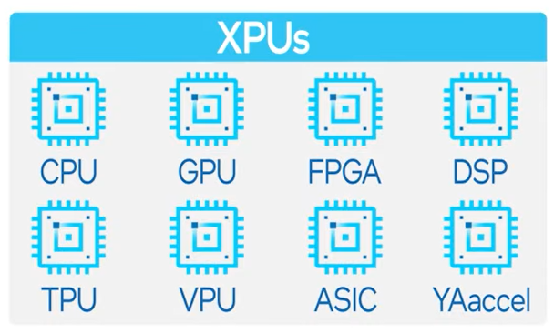
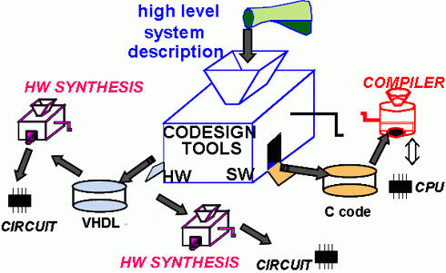
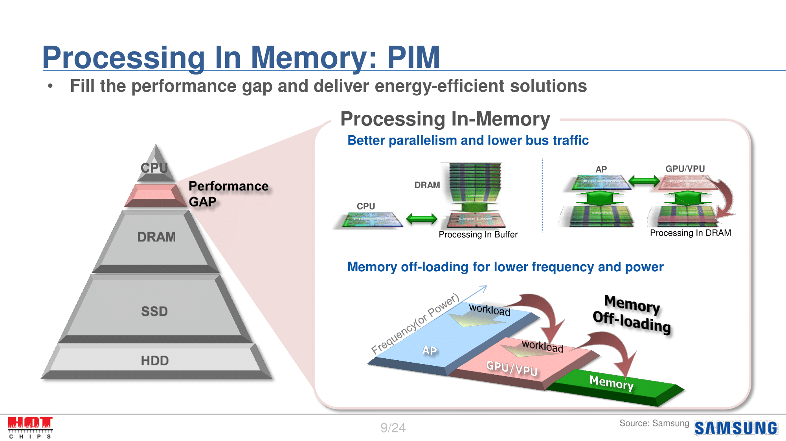

# AI 특화 프로세서
이 글은 4/4에 진행된 박종세 교수님의 반도체 콜로키움(SS496) 강연을 듣고 작성된 감상문입니다.

안녕하세요, 저는 zabo팀에서 활동중인 yongworry 박용원입니다! 얼마 전에 박종세 교수님께서 “Algorithm-Hardware-“Software” Co-Design for Building Specialized Systems”를 주제로 진행하신 강연을 듣게 되었는데, 강연에서 배우게 된 specialized system에 대한 내용을 공유하고자 글을 쓰게 되었습니다.

## **Specialized System**
컴퓨터의 발명 이후 수십년동안 프로세서라는 용어는 CPU와 동일한 의미로 사용되어 왔습니다. 그도 그럴 것이 CPU만으로도 하고자 하는 작업을 수행하기에 무리가 없었거든요. CPU는 turing complete하기 때문에 우리가 원하는 모든 종류의 계산을 해낼 수 있고, 적어도 범용성의 측면에서는 완벽에 가까운 프로세서입니다.
 
하지만 이러한 CPU에도 단점이 있었는데, 바로 특정한 task를 수행하는 데 최적화되어 있지 않다는 것입니다. 높은 그래픽 사양을 요구하는 게임, 어마어마한 계산량을 요구하는 AI 알고리즘이 등장하면서 우리는 하나의 task에 특화된 대신 그 task에서만큼은 CPU를 훨씬 능가하는 프로세서를 구상하게 됩니다. CPU와는 반대로 모든 프로그램을 실행할 필요가 없는, 특별한 task만을 위해 제작되는 프로세서의 경우는 범용성을 잃는 대신 효율과 성능 측면에서 큰 이득을 얻을 수 있을 것입니다. 이렇게 등장하게 된 것이 specialized sytem/processor입니다. 

xPU라고 불리는 이들은 효율과 performace 모두 CPU보다 좋아지지만 설계 용도 이외의 계산을 할 때에 처참한 성능을 보여줍니다. 개중에는 turing complete한 것도, 하지 않을 것도 있습니다. 사람들에게 널리 알려진 것들 중에는 GPU가 있는데, GPU는 turing complete하기 때문에 CPU가 수행할 수 있는 계산은 GPU 또한 할 수 있습니다. 다만 과정이 매우 비효율적일 뿐이죠.

최근 나오는 cs architecture 논문의 50~70퍼센트는 specialization에 대한 내용이라고 합니다. 개척이 거의 이루어지지 않은 분야이다 보니 어떤 논문에서는 성능을 100배 이상 향상시켰다는 결과가 나오기도 합니다. 여전히 cpu에 대한 논문도 적지 않지만, CPU는 이미 개발이 많이 이루어진 분야이기 때문에 효율과 성능의 향상이 미미합니다. Cpu 논문은 효율이 1 퍼센트만 증가해도 의미있는 연구로 취급되지만, specialization 연구는 두세배쯤은 되어야 가치있는 것으로 여겨진다고 합니다.

## **프로세서만 바뀌면 될까?**
최근 들어 Chat GPT를 필두로 전 세계적으로 인공지능이 성행하고 있으며, specialized system은 이들의 성능 향상에 있어 중요한 화두입니다. Specialized system이 발전하기 위해서는 무엇을 연구해야 할까요? 바로 떠올릴 수 있는 것은 뇌를 모사하는 알고리즘인 neural network, 그리고 이를 구동시키는 프로세서(하드웨어)일 것입니다.
물론 AI를 구성하는 알고리즘을 개선하고, 계산이 수행되는 프로세서가 발전한다면 AI의 성능은 좋아질 것이 확실하다. AI based application들에 사용되는 알고리즘들은 deneural network를 사용하기 때문에 이러한 공통점을 이용해 범용성도 챙길 수 있습니다. 하지만 이 두가지가 인공지능의 전부는 아닙니다. 하드웨어와 알고리즘을 이어주는 소프트웨어의 발전이 없이는 알고리즘에 혁신적인 변화가 일어나고 프로세서의 세대가 바뀌더라도 기대한 만큼의 성능 향상이 일어나지 않을 것입니다. 실제 AI application은 system stack을 비롯한 소프트웨어가 있어야 돌아가기 때문이 알고리즘-하드웨어-소프트웨어 co-design이 중요합니다.

## **인공지능 이모저모**
박종세 교수님의 연구실에서도 AI 연구가 활발하게 이루어지고 있다고 합니다. 이 섹션에서는 몇가지 핫한 AI 연구주제들을 소개해보려고 합니다.

- Video analytic system design
초거대 영상 플랫폼인 youtube의 성장과 함께 video data의 양은 어마무시한 속도로 늘어나고 있고, 그에 따라 동영상에 적용시킬 수 있는 인공지능의 설계 또한 활발하게 일어나고 있습니다. 그들 중 하나인 Video qna 알고리즘은 natural language로 질문을 던지면 질문과 영상의 context를 각각 분석하여 벡터로 encoding한 다음 서로 대조하여 유사도가 일정 이상이면 true 아니면 false를 반환하는 알고리즘입니다. 아직은 정확도가 많이 떨어지지만, 십수년 전까지만 해도 기본적인 작업들도 수행하지 못하던 사진 recognition AI의 수준이 지금은 사람보다 정확한 수준이 되었다는 점을 생각하면 video qna 알고리즘 또한 그렇게 될 때까지는 긴 시간이 걸리지 않을 것으로 기대됩니다. 

- Processing-in-memory

컴퓨터에서 메모리의 역할은 데이터를 입출력 및 저장하는 것이고, 연산은 프로세서에서 진행됩니다. 그런데 메모리에서 프로세서로 데이터를 읽어가지 않고, 메모리에서 연산을 바로 처리해버린다면 어떨까요? PIM(Processing In Memory)는 말 그대로 메모리 자체에서 연산이 이루어지는 것을 의미합니다. 정확히 말하면 필요한 연산의 일부를 메모리에서 미리 처리해서 프로세서로 보내야 하는 데이터의 크기를 줄이는 것입니다. AI 연산에 소요되는 시간의 상당 부분이 데이터를 옮기는 데 사용되기 때문에 제대로 구현된다면 성능의 향상이 크게 일어날 것입니다. 

- DNN(Deep neural network) training acceleration
Deep neural network는 사람들에게 가장 유명한 AI 연구주제중 하나입니다. 현재는 알고리즘의 성능을 개선시키는 한편 어떻게 하면 더 적은 비트를 사용한 precision으로, 정확도가 떨어지지 않고 data룰 학습시킬 수 있을지를 연구중이다. 학습에 사용되는 data는 비용과 직결되므로 성능의 개선만큼이나 중요한 사안으로 여겨집니다.

- Acceleration with CXL
지금 세상에 존재하는 코드들, 특히 OS 코드들은 hubistic(이유는 일단 돌아가니까 놔둔, 대충 짠 코드)가 많다. 사람이 거대한 OS 코드를 수정하기 위해서는 엄청난 노력과 시간을 쏟아야 하지만, AI가 이를 대체할 수 있다고 합니다. 실제로 인공지능을 활용해 index를 대체한 사례가 있습니다.

사실 요즘에 유행하는 chat GPT가 마냥 신기하기만 했었는데, 이들이 어디까지 발전할 수 있을지 깊은 생각을 하게 만드는 강의였습니다.
