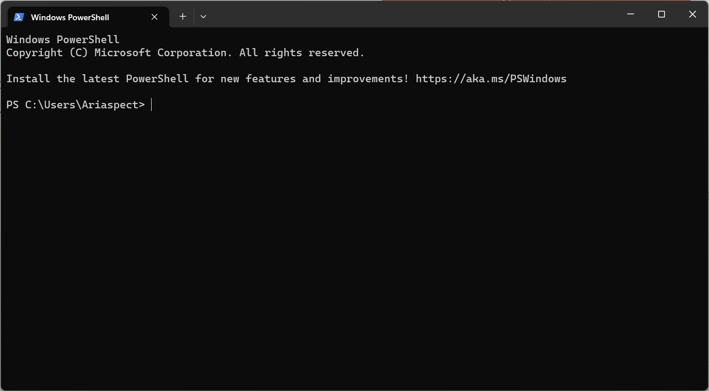

# Windows에서 Linux로 개발하기

### 윈도우즈 사용자의 딜레마
여러분은 어떤 운영체제를 사용하고 계신가요?
프로그래밍, 나아가 개발을 공부하다보면 강력한 터미널을 제공하는 Unix/Linux 계열의 환경을 사용하는 것에 장점이 많다는 것을 느끼실 것입니다. 많은 개발자들이 맥북을 사용하거나 아예 리눅스를 설치한 노트북을 들고다니는 이유도 그 때문이겠죠.

그러나 저처럼 윈도우즈가 익숙하고 편리하게 느껴지는 분들도 많을 거라고 생각합니다. 가장 기본적인 운영체제로 취급되어 다양한 프로그램이나 게임들이 호환되는 것은 물론이고, 대부분의 사람들이 사용한다는 장점이 있겠죠. 이런 편리함을 버리고 새로운 운영체제로 갈아타는건 망설여지기 마련이에요. 아무리 확실한 장점이 존재한다고 하더라도 말이죠.

하지만 그렇다고 리눅스 환경을 포기할 수는 없는 법! VM 보다 적은 오버헤드로 윈도우즈에서도 리눅스 환경을 사용할 수 있는 WSL에 대해서 알아보도록 하겠습니다.

### WSL, Windows Subsystem for Linux

과거의 WSL1 에서는 리눅스 커널을 직접 구현하지 않고 리눅스 system call 을  윈도우즈의 API로 치환하여 사용하는 방식으로 작동했다고 합니다. 저희가 사용할 WSL2 는 실제 리눅스 커널이 구현되어서 훨씬 더 리눅스같은(?) 환경과 기능을 제공할 수 있다고 합니다. Hyper-V 등 WSL2 의 작동원리는 여기서 다루지 않고 넘어가도록 하겠습니다. VM 보다는 리소스 사용량과 속도가 개선되어 있다는 점만 알아두겠습니다.

### Windows Terminal
먼저 윈도우즈의 터미널에 대해 알아보도록 할게요. 원래 윈도우즈에는 아주 칙칙한 디자인의 터미널이 두 종류 존재합니다. 바로 명령 프롬프트(CMD)와 파워쉘(PowerShell)인데요, 각각 검고 파란 배경에 흰 글씨, 답도 없는 폰트까지 완벽합니다. 이에 보다못한 윈도우즈는 말 그대로 윈도우즈의 터미널인, Windows Terminal 이라는 새로운 앱을 출시했습니다.

이게 아까 말한 터미널이랑 뭐가 다르냐구요? 지금부터 하나씩 알아보도록 하겠습니다.

다양한 설정과 모양, 단축키, 색상 테마까지 커스터마이징이 가능합니다. 그 중에서 중요한 설정들을 짚고 넘어가겠습니다.

- Startup: 기본 프로필, 새 탭 관련 행동을 설정할 수 있습니다.
- Interaction: 터미널과의 상호작용에 대한 설정과, 개발에서 가장 중요한 기능인 Copy & Paste 에 대해 다양한 편리성을 지원하고 있습니다.
- Appearance: 터미널의 세부적인 모습을 설정할 수 있습니다.
- Color schemes: 색상 테마를 고르거나, 커스텀 테마를 추가하여 사용할 수 있습니다.
- Rendering: 터미널 렌더링을 설정할 수 있습니다.
- Actions: 다양한 단축키를 설정할 수 있습니다.

- Profiles: 각각의 프로필마다 시작 경로, 명령어, 폰트와 테마를 설정할 수 있습니다.

개인적으로 사용하면서 가장 편리했던 설정은 Interaction 탭의 "Automatically copy selection to clipboard", "Automatically detect URLs and make them clickable" 이였습니다.

예쁜 터미널을 원하시는 분들을 위한 [링크](https://terminalsplash.com/)에서 다른 사용자들이 커스텀한 터미널 테마를 찾아볼 수 있습니다.

기본 단축키 Ctrl+Shift+P 로 커맨드 팔레트를 사용할 수 있습니다. 여러 탭을 사용하거나 창을 나누고 복제하는 등 강력한 기능을 제공하고 있습니다.

### Installing WSL2
터미널에 대한 홍보는 여기까지 하고 이제 WSL2 를 설치해보도록 하겠습니다. 원래는 조금 귀찮은 과정이 있었으나 윈도우즈의 최신 업데이트로 인해 정말 간단한 설치가 가능해졌습니다.

이후의 과정은 Windows Terminal 의 파워쉘에서 진행하도록 하겠습니다.

> wsl --list --online

WSL2 에 사용 가능한 리눅스 배포판들을 확인할 수 있습니다.

> wsl --install \<dist\>

원하는 배포판을 설치 후 실행합니다. 비워두는 경우 기본 Ubuntu 로 설치가 진행됩니다.

> wsl --list --verbose

설치된 리눅스 배포판의 이름과 현재 상태 및 WSL 버전을 확인할 수 있습니다. Running, 2 라면 준비가 끝났습니다. 정말 간단하게 설치가 끝나버렸네요. 이외에 다양한 명령어나 막히는 부분이 있다면 `wsl --help` 또는 이 [링크](https://learn.microsoft.com/ko-kr/windows/wsl/basic-commands)를 이용하세요.

자 이제 WSL 을 사용할 준비가 모두 끝났습니다. Windows Terminal 의 새로운 탭을 열어 WSL 을 켜볼까요? 상단바의 드롭다운 메뉴에서 설치하신 리눅스 배포판을 클릭해주세요. 드디어 윈도우즈에서 리눅스 터미널을 사용할 수 있게 되었네요!

### Tips for using WSL
1. WSL 은 보다 리눅스같은(?) 환경을 제공하기 위에 리눅스 파일 시스템을 사용합니다. 그럼 파일을 옮길 땐 어떻게 해야하나요? 정답은 윈도우즈 파일 탐색기입니다!
> explorer.exe .

이 명령어를 실행하면 현재 경로에서 파일 탐색기를 실행할 수 있습니다. 실제 경로는 대충 이런 느낌입니다. `\\wsl.localhost\Ubuntu-20.04\home\ariaspect`

윈도우즈 파일 시스템에서도 WSL 을 이용할 수 있습니다. 예시로 C 드라이브는 WSL 에서 `/mnt/c/` 경로에 있습니다.
> cd /mnt/\<drive\>/...

2. vim, nano, emacs... 정신나갈것같애! 그런 당신을 위해 VS Code 를 준비했습니다. 먼저 VS Code 에서 [WSL Extension](https://marketplace.visualstudio.com/items?itemName=ms-vscode-remote.remote-wsl) 을 설치해줍니다.
> code .

이 명령어를 실행하면 언제 어디서든 VS Code 로 WSL 을 이용할 수 있습니다! VS Code 내부의 터미널로 WSL 을 조작할 수 있는 편리함은 덤이죠.

3. 개발자인데 도커는 어딨나요? [여기](https://docs.docker.com/desktop/install/windows-install/)요. Docker Desktop on Windows 를 이용해줍시다. 링크에도 나와있지만 WSL2 backend 를 활용할 수 있습니다.
`Use WSL 2 instead of Hyper-V` 옵션을 꼭 체크해줍시다.

도커 데스크탑을 킨 후에만 WSL 내부에서 docker 관련 명령어들이 작동하니 주의해주세요!

### Closing remarks
윈도우즈에서 리눅스 개발을 해보기 위해 WSL 에 대해 나름 자세히 알아보았는데요. 사실 WSL 은 말도 많고 탈도 많습니다. 사용하다보면 정말 다양한 오류를 마주칠 수 있죠. 그래도 당황하지 마세요! 구글에 오류 내용과 함께 `on wsl2` 를 붙여 검색해보시면 몇 가지 해결 방법에 도달하실 수 있을 거에요.

이 글이 윈도우즈 사용자 분들에게 어느 정도 도움이 되었으면 좋겠네요! 감사합니다.