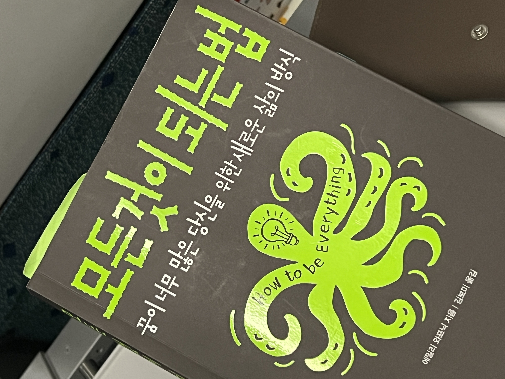
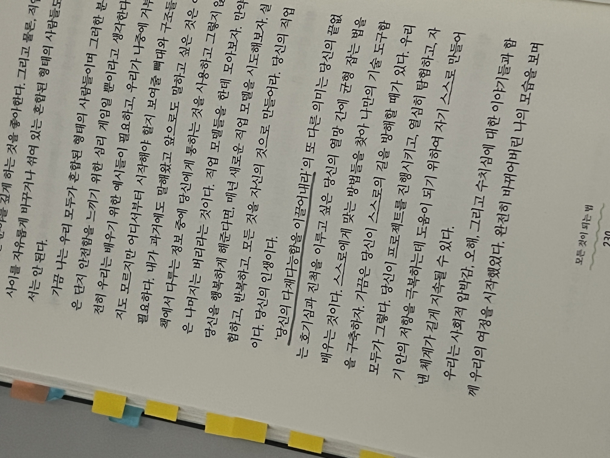

# 개발자가 되지 않을 너에게, 모든 것이 되는 법

어느덧 SPARCS에서 활동한지 3년차가 되었는데, SPARCS 멤버들에게서 발견한 두가지 흥미로운 사실이 있다. 첫번째는 KAIST내 누구보다도 개발에 관심이 많고, 경험이 많다는 것. 두번째는 앞서 언급한 꽤 당연한 특징에 반해 개발자가 되려는 사람이 적다는 것이었다. 다르게 표현하면, 평생 개발만 할 생각인 사람은 보기 힘들었다. 적어도 개발자로서의 경험을 발판 삼아 이루고 싶은 목표가 있거나, 개발을 내가 원하는 다른 경험을 위한 수단으로 생각하는 경우가 많았다. 
>인생 전반에 걸쳐 다양성이 존재하기를 바라는 내 목표를 기억하자. 내가 현재 하는 일이 곧 내가 되지 않는다.

 

개발 말고도 하고싶은게 너무 많은 우리에게, 개발은 내 인생에서 어떤 존재와 역할인지, 나는 왜 개발을 하고 있는지 고민하고 짚고 넘어가는 건 중요하고 꼭 필요한 시간이다. 나이가 들수록 명확하게 깨닫는건 사람에게 시간은 정말 부족하고 소중한 자원이라는 것, 그렇기 때문에 주기적으로 내가 이 자원을 투자하는 일들의 의미를 돌아보고 판단하는 일이 필요하다는 것이다. 
나는 왜 KAIST에 다니는지, 왜 SPARCS 활동을 하는지, ~~왜 매일 잠을 안자고 밤새 SPARCS 동방에 있는지~~

> 나에게 ‘왜’를 파악하자. ‘왜’를 파악하는 것은 이처럼 이질적으로 보였던 관심사들에서 하나의 이야기를 창조할 수 있게 한다. 왜 성취감을 느꼈는지 이해하고, 나 자신과 나를 이끄는 힘에 대해 잘 이해하자. 하지만 그 가치와 수익성을 혼동하지 않도록 주의하고, 여러 개의 ‘왜’를 갖는 것, ‘왜’들이 서로 모순되어 보이는 것을 수용하자.

 

이런 고민을 해야할 필요성을 깨닫고, 시작하는 것은 쉽지 않다. 누군가에게는 오히려 불필요한 시간소모처럼 느껴질 수도 있다. (나도 종종 이런 고민을 한다.) 하지만, 적어도 <u>나는 평생 개발만 하지는 않을거야</u> 라는 생각을 해본 사람이라면 `모든 것이 되는 법`을 통해 나와의 대화를 시작해보기를 바란다. 사실 이 책은 **다능인, multipotentialite**를 위한 책이지만, 다능인 기질이 강하지 않은 사람들에게도 충분히 좋은 시간을 제공할 것이라고 확신한다.

#

 

나는 내가 어렸을 때 부터 유난히 다양한 분야에 관심이 많은 성향이며, 이것이 다른 사람들보다 더 특징적으로 드러나는 점을 잘 알고 있었다. 이 책을 통해 본인이 다능인 기질이라는 것을 확인한 사람도 있겠지만, 대부분의 다능인(기질이 강한)은 본인이 이런 성향이라는 점을 이미 스스로 잘 깨닫고 있었을 것이다. 그리고 내 경험에 비추어 보면 보통 다능인들은 서로를 알아본다. 내가 이 책을 알게 된 계기 또한 나와 비슷한 성격의 회사 동료로부터 <u>나에게 도움이 많이 될 것 같다</u> 라는 말과 함께 선물받으며 알게 되었다. 

 참고로 여기서 다능인은 다재다능과는 다른 개념이다. 여러 분야와 일들에 동시다발적으로 관심을 기울이지 않고는 못배기는 유형을 지칭하는 용어이다. 모든 것을 다 잘하는 것과는 다르다.

>우리는 모든 것을 완벽하게 해낼 수 없음을 잘 알고 있다. 우리의 임무는 나의 중간지점을 찾아내고 인지하는 것이다.

 

`모든 것이 되는 법`은 다능인, multipotentialite이라는 개념을 소개하고, 이들은 어떤 특징을 가지고 있는지 어떤 고민과 시선을 어떻게 극복해나가야 하는지에 대한 이야기를 담고 있다.   누군가에게는 평생 고민해왔던 것들에 해답을 던져주는 책일 수도 있지만, 이미 다능인으로서의 고민에 대한 시행착오를 많이 겪어온 나로서는 명확한 해답을 얻었다기보다는 다능인으로서의 정체성과 다능인으로서 살아가기 위한 팁을 많이 얻을 수 있었다. 이 책이 평범한 여느 자기계발서들과 다르다고 느꼈던 이유는 단순히 저자의 경험과 생각들을 전달하는데 그치지 않고, 각 주제에 대해 충분히 생각하며 흡수할 수 있는 시간을 주기 때문이다. 나는 이 책을 한 텀에 다 읽지 않고 꽤 오랜시간동안 나누어 읽었는데, 책에서 얻은 시선들을 반복적으로 곱씹을 수 있는 시간을 충분히 가질수 있어 더 좋았던 것 같다. 

>나만의 시스템을 만들자. 무엇에 집중할지 결정하고, 그만둘 때를 결정하는. 관심사와 흥미를 옮겨가는 것을 포기하는 것으로 간주하거나 잘못된 선택이었음이라고 판단하지 말자, 그것은 마무리하는 것이다. 흥미를 잃었다는 것은 그 속에서 무언가 경험했거나 성취했을 가능성이 크다. 그것이 무엇인지를 파악하자.

 

비선형적 삶과 진로를 추구하는 사람으로서 이 책을 통해 내가 삶에서 어떤 가치를 추구하고 따라야할지, 내 삶의 원동력은 무엇인지 찾을 수 있었다. 당연히 이 값들은 인생 전반에 걸쳐 꾸준히 변하는 값들이기에, 인생의 답을 주는 책이라는 등 이 책을 통해 인생이 변했다는 등의 찬양은 하지 않겠지만, 적어도 이런 고민을 지금까지 깊게 해보지 않았던 나에게는 책을 읽고 생각하는 시간이 정말 소중했다.

> 또 다시 초보자가 되어 새로운 것을 시작할 때는 평범함을 깨닫는 것이 중요하다. 소질과 관심이 충분하지 않음을 너무 빠르게 판단하지 말자. 나의 기대를 조절하자. 최고가 아니라는 것이 평범하다는 뜻은 아니다. 최고가 되는 것은 사실상 불가능하다. 누구보다 더 잘하는 것을 추구하지 말자.

혹시 책이 땡기지 않는 다면 유튜브에 책의 저자인 에밀리 와프닉이 다능인이라는 개념과 관련하여 강연한 [TED영상](https://www.youtube.com/watch?v=4sZdcB6bjI8)을 보는 것을 추천한다. 나에 대해 알아가는 과정이 얼마나 즐거운 시간인지 알 수 있을 것이다 :)

#
## 맺음말 

안녕하세요, SPARCS에서 디자이너와 개발자로 활동하고 있는 chillo입니다. 저는 작년 초 무렵에 **타이탄의 도구들** 이라는 책을 통해 처음으로 저에 대해 깊게 고민하고 알아가는 시간을 갖기 시작했습니다. 그리고 1년 뒤인 지금 시점에서 그때와 비교해본다면, 지난 어느 1년보다도 정말 빠르고 폭넓게 발전한 것 같아요. 그 배경에는 내적인 성숙과 성장이 자리했기 때문이라고 확신합니다. 그리고 그 과정에서 **모든 것이 되는 법**이 중요한 역할을 해주었고요.

우리가 성공했다고 여기는 사람들만큼 본인의 성장에 뜨겁고 열정적이며, 본인에 대해 잘 알고있는 사람은 어디에도 없습니다. KAIST에서, SPARCS에서 과제에 수업에 프로젝트에 치여살다보면, 정말 쉽게 나를 놓치게 되는 것 같아요. 저도 종종, 아니 자주 그런 상황을 마주하곤 합니다. (~~네떡,,휴,,~~) 그래도, 그떄 나를 다시 붙들 수 있는 경험을 자주하다보면 어렵지 않게 다시 자리로 돌아올 수 있게 되는 것 같아요. 

누군가에게는 이 글과 책이 지금까지 해보지 않았던 나에 대해 알아가는 여정을 시작하는 기회가 되길 바랍니다. ☺️
이상으로 읽어주셔서 감사합니다!

위에 작성된 인용구들은 제가 책을 읽으면서 다시 곱씹고싶은 구절들을 정리한 부분들이에요. ~자.로 끝나는 문장은 제가 저에게 하고 싶은 말들로, 실제 책의 구절들은 조금 더 제안하는 표현들로 구성되어있습니다.

