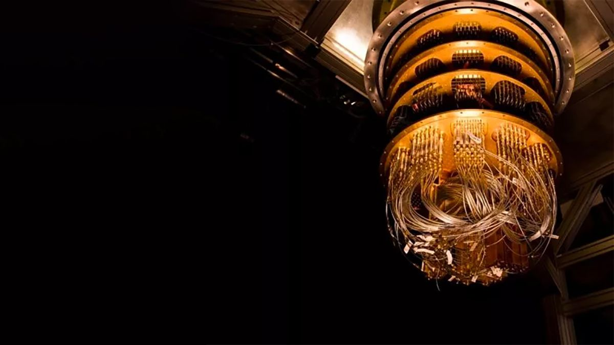
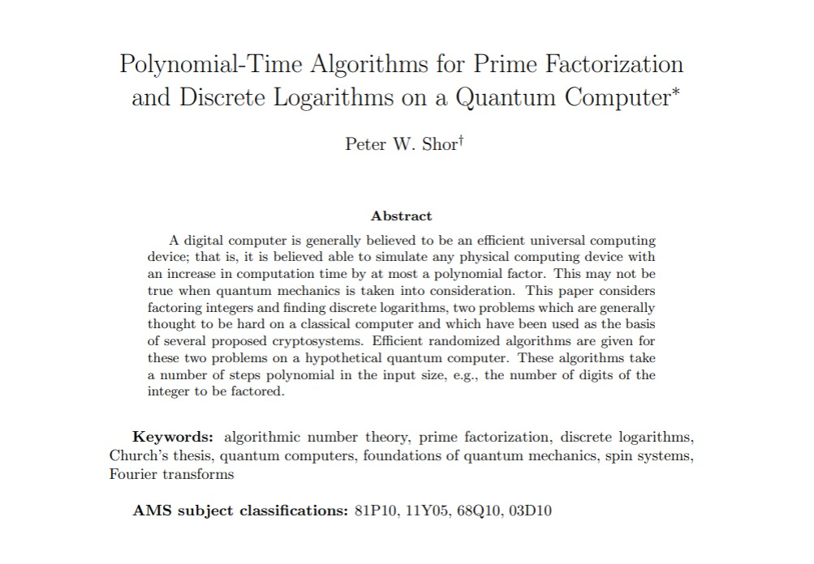
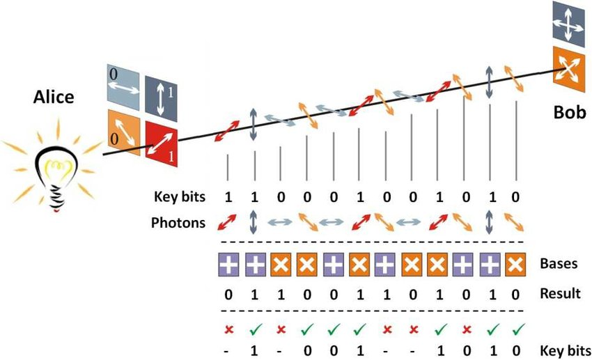

# 양자 키 분배(QKD)로 가는 길

안녕하세요, 이 글에서는 제가 관심있는 암호학의 한 분야인 '양자 암호'에 대해 다루고자 합니다. 
여기서 양자 암호(Quantum Cryptography)란 기존의 암호 체계에 양자역학의 성질을 도입한 분야로, 최근 활발히 연구되고 있습니다.
오늘은 양자 암호가 대두되기 까지의 맥락, 그리고 양자 암호 프로토콜으로 가장 대표적인 양자 키 분배(QKD)에 대해 알아보고자 합니다.

## 양자 컴퓨터의 발전

위 사진은 2019년 발표된 구글의 양자 컴퓨터 Sycamore 입니다.
해당 프로세서는 53 큐비트의 성능을 가지고 있으며, 구글은 이 프로세서가 기존의 슈퍼 컴퓨터로는 제시간 내에 해결할 수 없는 문제를 양자 컴퓨터로 해결할 수 있게 되는 시점인, 양자 우월성(quantum supermacy)에 도달했다고 주장하였습니다.
이후 IBM 사에서는 구글이 해결한 문제가 슈퍼 컴퓨터로 2.5일이면 해결할 수 있는 것이라고 반박하긴 했지만, 여전히 Sycamore는 양자 컴퓨터의 엄청난 발전을 보여준 사례입니다.

### 큐비트 (Qubit)
양자 컴퓨터는 정보의 단위로써 파동과 입자의 성질을 동시에 띠는 큐비트(qubit)를 사용합니다. 
고전적인 컴퓨터가 정보의 단위로써 전류의 유무를 0/1로 나타내는 비트(bit)를 사용하는 것과 대조적으로, 양자 컴퓨터의 각각의 큐비트는 0/1 값이 중첩된 상태를 가집니다.
가장 친근한 예시는 전자(electron)로, 전자의 스핀은 업과 다운이 중첩된 상태를 가지며, 관측 시 해당 상태의 확률 진폭에 따라 한 가지 상태로 붕괴하게 됩니다.
이처럼 큐비트는 0/1 두개의 기반 상태가 중첩(superposition)된 상태를 가지며, 우리는 이러한 큐비트에 각종 논리 연산을 수행할 수 있습니다.
이로부터 고전적인 컴퓨터로는 수행할 수 없는 알고리즘을 양자 컴퓨터는 수행할 수 있게 되는 것입니다.

## 쇼어 알고리즘 (Shor's Algorithm)

위 사진은 1994년 미국의 수학자 피터 쇼어(Peter Shor)가 발표한 논문으로, 양자 컴퓨터에서 소인수 분해와 이산 로그 문제를 다항시간에 해결하는 알고리즘을 제시하였습니다.
이는 엄청난 파급력을 가지는데, 현대에 우리가 사용하는 공개 키 암호 알고리즘의 대부분이 해당 문제에 기반하기 때문입니다.

공개 키 암호는 한 방향을 계산하는 것은 쉽지만 특정 정보 없이는 역방향을 계산하는 것이 어려운 트랩도어 함수를 이용합니다.
가장 대표적인 공개 키 알고리즘인 RSA는 큰 수의 소인수 분해를, Diffie–Hellman 키 교환은 이산 로그 문제를 트랩도어 함수로써 사용하는데, 이 문제들이 양자 컴퓨터를 이용하면 다항 시간내에 해결 가능하다고 제시된 것입니다.

하지만 앞서 보았듯이 양자 컴퓨터는 현재 연구 개발 단계에 있으며, 큐비트의 수나 성능 면에서 현재의 암호체계를 해독할 수준에는 미치지 못하고 있습니다.
2021년 IBM이 쇼어 알고리즘으로 N=21을 소인수 분해하는데 성공했다고 하는데, 우리가 쓰는 RSA가 2048~4096 비트의 암호키를 사용하는 것에 비하면 매우 작은 수입니다.
따라서 대비할 시간이 주어져온 것인데, 암호학은 크게 두가지 방법으로 돌파구를 찾게 됩니다.

### 양자 내성 암호 (PQC)
사실 양자 컴퓨터가 소인수 분해 등 특정 문제들을 빠르게 해결할 수 있는 것이지, 모든 문제를 다항 시간에 해결할 수 있는지는 전혀 미지수입니다.
따라서 공개 키 암호의 알고리즘을 양자 컴퓨터로 효율적인 해법이 제시되지 않은 문제들을 이용하면 되는데, 그 예시로 다변수 기반 암호, 격자 기반 암호 등이 존재합니다.
이는 기존의 공개 키 암호 프로토콜에서 알고리즘을 변경하는 방식이기에, 현재 실현 가능성이 높다고 평가 받으며 활발히 연구되고 있습니다.

### 양자 암호 (QC)
그 외에 굉장히 흥미로운 가능성이 제시되었는데, 바로 암호 통신 자체에 양자역학의 성질을 띠는 입자를 사용하는 것입니다.
그렇게 되면 양자역학에서의 '파동함수의 상태를 관측하면 하나의 기반 상태로 붕괴한다'는 성질을 잘 이용해 통신의 중간에 발생하는 도청을 감지할 수 있습니다.
또한 계산 복잡도가 아닌 물리적 원리에 기반하기 때문에, 무조건적 보안성이 수학적으로 증명 가능합니다.
여기서 무조건적 보안성(unconditional security)란 공격자에게 어떠한 컴퓨팅 자원이나 시간에 대한 제약이 존재하지 않을 때의 보안성을 말합니다.
이러한 양자 암호의 가장 대표적인 프로토콜이 바로 양자 키 분배(QKD)입니다.

## 양자 키 분배 (Quantum Key Distribution, QKD)
QKD는 두 명의 참가자 Alice와 Bob이 양자 통신 채널을 통해 하나의 키를 안전하게 공유하는 것을 목표로 합니다.
그 후 공유한 키를 이용해 OTP(One-time pad) 방식으로 평문을 암호화해 일반 채널으로 통신합니다.

OTP는 비밀 키를 공유하는 경우 무조건적 보안성을 가지는데, 이것이 이때까지 사용되지 못한 이유는 비밀 키를 안전하게 공유할 수 있다면 굳이 암호화 하지 않고 평문을 안전하게 공유하면 되기 때문입니다.
하지만 QKD를 이용하면 양자 채널에서 키를 랜덤하게 생성하고, 이를 안전하게 공유할 수 있게 됩니다.
이러한 QKD의 가능성을 제시해준 것이 바로 1984년 Charles Bennett과 Gilles Brassard가 제시한 BB84 프로토콜인데, 이에 대해 살펴보겠습니다.

## BB84

1. **Alice가 두 개의 편광판에서 가능한 4개의 상태 (수평 |0⟩, 수직 |1⟩, 대각선 |+⟩, 반대각선 |-⟩) 중 하나를 무작위로 골라 편광된 빛을 Bob에게 보낸다.**
2. **Bob은 두 개의 편광판 (직선 기저 |0⟩, |1⟩ 또는 대각선 기저 |+⟩, |-⟩) 중 하나를 무작위로 골라 빛을 관측한다.**
3. **이를 반복한 뒤, Alice와 Bob은 각각의 시행에서 사용한 편광판의 정보를 공개한다.**
4. **Alice와 Bob이 같은 편광판을 선택한 경우의 관측값만을 남겨 이를 암호 키로 사용한다.**

여기서 중요할 점은, Alice와 Bob이 같은 편광판을 이용하는 경우 이 둘의 관측값은 동일하지만 다른 편광판을 이용하는 경우 기반 상태가 바뀌면서 완전히 랜덤한 관측값을 얻게 된다는 것입니다.
따라서 둘이 선택한 편광판을 공개하면 실제 관측값을 공개하지 않고도 Alice와 Bob은 서로의 관측값이 동일한 비트만을 남길 수 있습니다.

### 도청을 감지할 수 있다
Alice와 Bob의 송수신 과정에서 Eve가 도청을 시도하여, 해당 빛을 Bob 보다 먼저 관측한다고 가정해봅시다.
이 경우 양자 상태를 완벽하게 복제할 수 없다는 복제 불가능성 정리(no-cloning theorem)에 의해 Eve는 새로운 상태의 빛을 Bob에게 보내야 합니다.
하지만 Eve는 Alice가 초기에 선택한 상태가 자신의 관측값과 일치하는지 알 수 없기 때문에, Alice와 다른 초기 상태로 빛을 송신하는 경우가 확률적으로 발생합니다.
그러면 Bob이 Alice와 같은 편광판을 선택했음에도 관측 결과가 다른 경우가 생기게 됩니다.
따라서 Alice와 Bob이 적당한 길이의 관측 결과를 비교하여 오차율을 측정함으로써 도청자의 존재 유무를 파악할 수 있습니다.

## 맺음말
우리는 양자 컴퓨터와 양자 알고리즘의 발전에 따른 기존 암호학의 문제를 살펴보았고, 이에 대한 해법으로 양자 내성 암호(PQC)와 양자 암호(QC)가 제시되기 까지의 과정을 살펴보았습니다.
또한 대표적인 양자 암호 프로토콜인 양자 키 분배(QKD)를 BB84라는 간단하고도 강력한 예시를 통해 알 수 있었습니다.
사실, 기술적인 구현의 한계와 실제 상황에서의 보안에 대한 위험 등을 이유로 미국 국가안보국(NSA)와 영국 국립사이버보안센터(NCSC)는 현재 QKD 보다 PQC를 해법으로 사용하기를 권장하고 있습니다.
QKD는 분명 상용화되기 까지 많은 연구와 검증이 필요할 것입니다.
그럼에도 불구하고, 수학적으로 증명 가능한 완전한 보안 체계를 만든다는 것만으로 QKD는 굉장히 매력적이라고 생각합니다.

읽어주셔서 감사드립니다 :)

## 참고 자료
1. 구글 Sycamore
    - Arute, F., Arya, K., Babbush, R. et al. Quantum supremacy using a programmable superconducting processor. Nature 574, 505–510 (2019).
2. 쇼어 알고리즘
    - P. W. Shor, "Algorithms for quantum computation: discrete logarithms and factoring," Proceedings 35th Annual Symposium on Foundations of Computer Science, Santa Fe, NM, USA, 1994, pp. 124-134.
    - IBM N=21 소인수분해:
    Skosana, U., Tame, M. Demonstration of Shor’s factoring algorithm for N = 21 on IBM quantum processors. Sci Rep 11, 16599 (2021).
3. BB84
    - C. H. Bennett, G. Brassard et al., "Quantum cryptography: Public key distribution and coin tossing," in Proceedings of IEEE International Conference on Computers, Systems and Signal Processing, vol. 175, no. 0. New York, 1984.
4. QKD 보고서
    - NSA: https://www.nsa.gov/Cybersecurity/Quantum-Key-Distribution-QKD-and-Quantum-Cryptography-QC/
    - NCSC: https://www.ncsc.gov.uk/whitepaper/quantum-security-technologies
