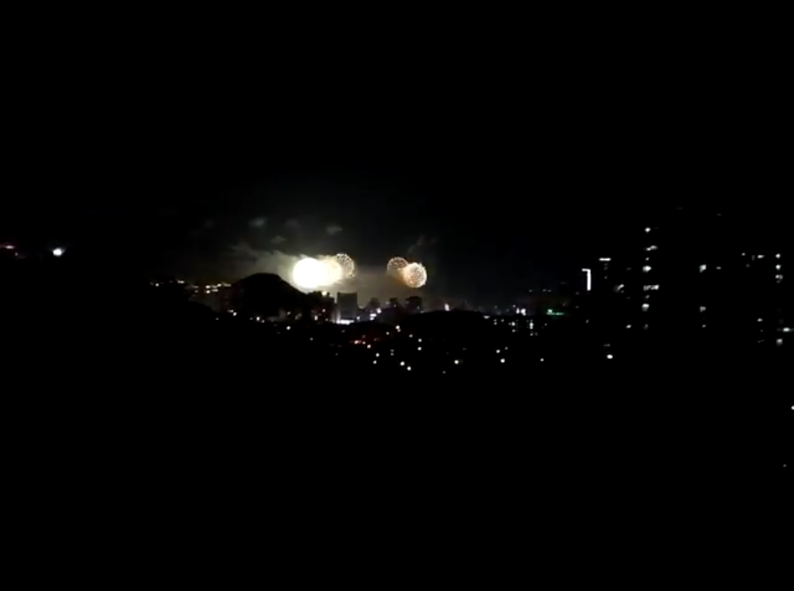

# 기술과 사진의 접점, 계산사진학 속으로

## 당신 곁에 있는 카메라가 최고의 카메라입니다

10년 전 사람들에게 사진이 잘 나오는 카메라를 물어보았다면, 아마 이런 걸 보여줬을 것입니다.

|  |
| :-----------------------------------------------------------------------------------------------------------------------------------------------------------------: |
|                 **[그림 1]** 캐논 EOS 5D Mark III. 사진 출처: [위키미디어 공용](https://commons.wikimedia.org/wiki/File:Canon_EOS_5D_Mark_III.jpg)                  |

2012년에 출시한 캐논 EOS 5D Mark III입니다. 렌즈를 제외한 본체의 무게만 생수 500mL 두 병에 달했으며, 출시 당시 무려 429만원에 판매되었다고 합니다. 크고 무거운 데다 잘 쓰려면 상당한 사진 지식이 필요했겠죠.

이제 여러분 옆에 있는 친구분에게 사진이 잘 나오는 카메라를 물어봅시다. 주머니에서 바로 [아이폰 14 프로](https://www.apple.com/kr/iphone-14-pro/)나 [갤럭시 S23 울트라](https://www.samsung.com/sec/smartphones/galaxy-s23-ultra/)를 꺼내 보여주시는 분들도 계시겠지만, 여전히 많은 경우에는 저렇게 거대한 DSLR이나 미러리스를 말씀하실 겁니다. 솔직히 그렇잖아요? 아무리 폰카가 잘 나온다 잘 나온다 하지만, 우리는 여전히 사진을 찍을 때 저런 카메라가 있는 스튜디오를 가고 싶어합니다. 콘서트에서 직캠을 찍고 싶을 때에도 망원렌즈가 달린 저런 카메라를 대여하려고 하고요.

그런데요, 그런 DSLR이나 미러리스를 만드는 곳에서는 다른 생각을 하고 있습니다. 여기 테루시 시미즈라는 분이 계십니다. 소니와 니콘 DSLR에 들어가는 이미지 센서와, 전세계 스마트폰 센서의 44% ([출처](https://finance.yahoo.com/news/strategy-analytics-sony-leads-image-075800726.html?guccounter=1&guce_referrer=aHR0cHM6Ly93d3cuZ29vZ2xlLmNvbS8&guce_referrer_sig=AQAAADAQxwJGaGQQUXplzzpuyxn5BE7Hi10pURD4PI1yzQlH5sRrnsNB1J5qsDURLxqzhq-lfn7ZOsWuZTpJwvvWaal9jWM01eTZzn01uH9S4JYZg8MobJq1l4up4Tuk1niTpYtNY-KvF7kf4Dd13i6P2_ZQKHhYDpJRZcEPszI9xeFM))를 제조하는 소니 반도체 사업부의 CEO이신데요. 2022년 사업 설명회에서 이런 발언을 남겼습니다.

|                                                   |
| :-------------------------------------------------------------------------------------------------------------------------: |
| **[그림 2]** 연설 중이신 테루시 시미즈 씨. 사진 출처: [닛케이 기사(원문)](https://xtech.nikkei.com/atcl/nxt/news/18/12937/) |

> "앞으로 몇 년 안에 (스마트폰으로 찍은) 정지 사진이 SLR 카메라의 화질을 능가할 것이라 예상합니다." (출처: [닛케이 기사(원문)](https://xtech.nikkei.com/atcl/nxt/news/18/12937/))

시미즈 씨는 구체적인 시기로 2024년을 언급하면서, "더 큰 센서"와 "더 넓은 구경의 렌즈", 그리고 "계산사진학 기술(Computational Photography)"을 결합해 스마트폰 카메라의 화질이 DSLR을 능가할 것이라고 말했습니다.

내년이면 스마트폰이 DSLR을 추월한다니. 놀랍습니다. 시미즈 씨의 발언을 조금 더 자세히 살펴볼까요? 저 세 가지 중 더 큰 센서와 더 넓은 구경의 렌즈는 그럭저럭 이해가 갑니다. 당장 우리의 폰의 "카툭튀"가 그걸 보여주고 있으니까요.

그럼에도, 여전히 스마트폰의 카메라 센서는 기존 카메라에 비하면 터무니없게 작습니다. 센서가 크다는 갤럭시 S23 울트라도 겨우 1/1.3"입니다. 기존 DSLR에 비하면 1/12배에 불과한 면적입니다. 도대체 마지막 세 번째, "계산사진학 기술"은 어떻게 센서 크기에 의한 사진의 질 차이를 메꾸는 것일까요?

오늘은 계산사진학이 어떻게 등장했는지, 그리고 어떤 예시가 있는지 가볍게 살펴보도록 하겠습니다. 아, OpenCV를 이용해 직접 체험해보실 수 있는 간단한 코딩 예제도 포함되어 있어요.

## 계산사진학의 시초, 스티브 만(Steve Mann)

계산사진학(Computational Photography). 처음 들었을 때 용어가 다소 낯설게 느껴지시는 분도 계실 텐데요.
계산사진학의 영역은 지금도 확대되고 있기 때문에, 이 학문에 대한 하나의 정의를 내릴 수는 없습니다(Raskar, 2007).
계산사진학은 "사진이 잘 나오는 카메라"가 아니라 "사진이 잘 나오는 카메라를 만드는 방법"입니다.
어떤 환경에서 어떤 사람이 찍든, 잘 나온 것 같은 사진을 만들기 위한 알고리즘을 개발하고 이를 실제 제품에 적용하는 학문입니다.

계산사진학을 처음 만든 분이 바로 아래에 있습니다.

MIT에서 웨어러블 컴퓨터의 시초를 만든 스티브 만(Steve Mann)입니다.

|                                                                                                     |
| :-------------------------------------------------------------------------------------------------------------------------------------------------------------------------: |
| **[그림 3]** 1980년, 웨어러블 컴퓨터를 착용하고 계신 스티브 만씨. 사진 출처: [http://www.wearcam.org/ieeecomputer/r2025.htm](http://www.wearcam.org/ieeecomputer/r2025.htm) |

네, 지금 보기에는 조금 불편해 보이죠. 그래도 당시 PC에 쓰이던 최신 MOS 6502 프로세서와 화면 표시를 위한 1.5인치 CRT 디스플레이를 장착하고도 머리에 착용할 수 있었던 크기로 만들어낸 기술이 놀라워 보입니다.

이 프로토타입은 세계 최초의 웨어러블 컴퓨터이기도 합니다. 이 컴퓨터 만으로도 할 수 있는 이야기가 너무나도 많지만, 오늘 집중하고 싶은 것은 이 컴퓨터가 어떤 용도로 쓰였는지입니다.

바로 아래 사진을 찍기 위해서였습니다.

|                                                                                            |
| :-----------------------------------------------------------------------------------------------------------------------------------------: |
| **[그림 4]** Steve Mann씨의 작품. 사진 출처: [http://www.wearcam.org/ieeecomputer/r2025.htm](http://www.wearcam.org/ieeecomputer/r2025.htm) |

어떻게 이런 사진을 찍을 수 있었을까요? 이 사진을 찍을 당시에는 디지털 카메라가 없었습니다. 포토샵도요. 스티브 만씨는 "Light-Painting"이라는 기법을 사용하였습니다.

정적인 풍경을 사진으로 담을 때, 한 색의 조명을 한 건물에 비추어두고, 조명의 색상과 위치를 바꾸어가며 여러 장의 사진을 합성하면 위와 같은 사진을 얻을 수 있습니다. 스티브 만씨의 컴퓨터는 조명의 위치를 기억하여 현재의 시야 위에 합성해줌으로써 이를 가능하게 했습니다. 컴퓨터가 수행한 연산의 도움을 받아 독창적인 사진을 만들어낸 것이지요. 이것이 바로 계산사진학의 시초입니다.

놀랍게도 오늘날 스마트폰에 적용되고 있는 계산사진학의 원리도 위 사진의 것과 크게 다르지 않습니다. 핵심은 "여러 장의 사진을 쌓아 하나의 사진을 만들어내는 것"입니다. 우리가 생각해볼 수 있는 것은, "여러 장의 사진"을 만들어내는 과정과, 그 사진을 "쌓아" 하나의 사진으로 만들어내는 과정 두 가지이겠지요. 이제 스마트폰에서 이 두 과정이 어떻게 이루어지는지 살펴보도록 하겠습니다.

## 스마트폰의 계산사진학

스마트폰의 계산사진학의 핵심은 작지만 그 덕분에 읽기 속도가 빠른 카메라 센서와 기존 카메라보다 높은 성능의 처리 장치입니다. 빠른 센서는 여러 장의 사진을 서로 다른 조건으로 빠르게 촬영할 수 있게 하고, 고성능의 CPU, GPU, NPU는 그 사진들을 하나의 사진으로 합성하는 것을 가능케 합니다 (이 과정을 "쌓음(Stacking)"이라고 표현합니다). 우리가 흔히 쓰는 카메라의 기능들이 어떻게 구현되어 있는지 간단하게 살펴보겠습니다.

### 1. 파노라마 - 방향을 바꾸어가며 쌓아나가기

경치 좋은 휴양지를 가게 되면 항상 써볼까 말까 고민하게 되는 기능이죠! 파노라마는 오늘 소개해드릴 예시 중 가장 고전적인 예시입니다.
2011년 애플은 아이폰 5를 발표하면서 스마트폰에 처음으로 파노라마 기능을 도입했습니다.

|                                         |
| :--------------------------------------------------------------------------------------------------------------------------------------------------------: |
| **[그림 5]** 아이폰 5의 파노라마 기능 광고 스크린샷. 사진 출처: [https://www.youtube.com/watch?v=fqrI0EUxYUg](https://www.youtube.com/watch?v=fqrI0EUxYUg) |

아이폰에서 파노라마를 촬영할 때에는 가속도계 센서를 사용하여 사용자가 아이폰을 움직이는 속력을 측정하고, 위 그림처럼 사각형 형태의 가이드라인을 화면 상에 그려 사용자가 일정한 방향과 속력으로 풍경을 촬영하도록 유도합니다.
그렇지만 파노라마 기술 자체는 이러한 가속도계 센서 없이 사진 여러 장만 있어도 구현할 수 있습니다. 바로 호모그래피(Homography) 기술 덕분입니다. 호모그래피는 한 사진을 이루는 평면과 평면과 다른 사진을 이루는 평면 사이의 대응 관계를 나타내는 행렬입니다.

|           |
| :---------------------------------------------: |
| **[그림 6]** 두 장의 사진을 찍을 때 호모그래피. |

<b>[그림 6]</b>에서 카메라가 서로 다른 위치에서 서로 다른 방향을 보며 두 장의 사진을 찍습니다. 카메라에 담기는 영역을 빨간색 삼각형으로 표시해보았습니다(카메라가 얼마 만큼의 풍경을 담을 수 있는지는 카메라 렌즈의 화각에 의해 결정됩니다). 이 때 두 사진은 분명 같은 평면 위에 있지 않습니다만, 두 사진이 공통적으로 포함하고 있는 대상들을 찾아내고, 그 대상들이 각각의 사진에서 어느 좌표에 그려지는지를 알면 두 평면 사이의 대응 관계를 구할 수 있습니다. 이렇게 구한 대응 관계를 이용하여 두 사진을 합성하면 <b>[그림 7]</b>과 같이 됩니다.

|            |
| :------------------------------------------: |
| **[그림 7]** 두 장의 사진을 합성한 파노라마. |

정리하면 파노라마 사진을 합성하는 과정은 아래와 같습니다.

1. 두 사진에서 사진이 회전되거나 선형변환되어도 변하지 않는 대상들을 찾아냅니다. 이 대상들을 keypoint라고 부르는데, SIFT, SURF 등의 알고리즘을 사용하여 찾아낼 수 있습니다.
2. 두 사진의 keypoint들이 서로 각각 어떻게 대응되는지를 찾아냅니다. 이 과정을 feature matching이라고 합니다. 각 사진의 keypoint의 개수가 많지 않다면, 각각의 keypoint들을 일일이 비교하는 brute-force 방식을 사용해도 됩니다.
3. feature matching의 결과를 바탕으로 homography matrix를 구합니다. homography matrix의 각 원소를 구하기 위해서는 4개의 대응 관계만 있으면 됩니다.
4. 구한 homography matrix를 이용하여 한 사진을 다른 사진의 평면으로 변환시킵니다. 이제 두 사진은 같은 평면에 있기 때문에, 두 사진을 붙일 수 있습니다.

[Towards Data Science의 예시 코드](https://towardsdatascience.com/image-panorama-stitching-with-opencv-2402bde6b46c)를 참조해보셔도 좋습니다.

이처럼 파노라마는 기계학습 없이도 구현할 수 있는 기술입니다. 이어 소개할 HDR도 그렇습니다!

### 2. HDR - 노출을 바꾸어가며 쌓아나가기

여러분이 스마트폰 카메라에서 셔터 한 번을 누를 때, 실제로 찍히는 사진이 한 장이 아니라는 것을 알고 계시나요? 제가 사용하는 갤럭시의 기본 카메라 앱 설정에 들어가면 아래와 같이 HDR 설정이 항상 켜져있는 것을 볼 수 있습니다.

|  |
| :--------------------------: |
|    **[그림 8]** "HDR ON".    |

아래는 제 카메라로 찍은 일출입니다. 저희 눈으로 보는 하늘과 건물의 모습과는 너무 다르죠. 카메라 센서가 받아들일 수 있는 빛 신호의 최대 세기와 최소 세기 사이의 간격은 그렇게 크지 않습니다. 저희가 일반적으로 쓰는 카메라는, 센서가 한 번에 담을 수 있는 가장 밝은 부분과 가장 어두운 부분의 밝기 차이가 1,000배 정도에 불과합니다(이를 다이나믹 레인지(DR, Dynamic Range)가 좁다라고 합니다). 하늘을 기준으로 노출을 맞추니 건물이 검게 나오고, 건물을 기준으로 노출을 맞추니 하늘이 하얗게 나옵니다.

|                                      |
| :-------------------------------------------------------------------: |
| **[그림 9]** 역광 상황에서의 카메라 사진 (하늘 기준으로 노출을 맞춤). |

|                                      |
| :--------------------------------------------------------------------: |
| **[그림 10]** 역광 상황에서의 카메라 사진 (건물 기준으로 노출을 맞춤). |

그런데, 우리는 이미 파노라마 사진을 만드는 원리로부터 여러 장의 사진들에서 겹치는 부분들을 찾아낼 수 있다는 것을 알고 있습니다. 마찬가지로 하늘이 잘 나온 사진에서 하늘에 대한 색 정보를 가져오고, 건물이 잘 나온 사진에서 건물에 대한 색 정보를 가져와서 합성하면 어떨까요? 이렇게 하면 하늘과 건물이 모두 잘 나온 사진을 얻을 수 있을 것입니다. 이것이 바로 High Dynamic Range(HDR) 사진입니다.

직접 HDR 사진을 만들어 보겠습니다. [Debevec et al.](https://www.pauldebevec.com/Research/HDR/)의 방법을 사용하겠습니다. 이 방법에서는, 노출 시간이 짧은 사진은 밝은 부분을 잘 담아내고, 노출 시간이 긴 사진은 어두운 부분을 잘 담아낼 것이라고 가정합니다. 즉 사진의 노출 시간을 가중치로 하여 여러 장의 사진들을 하나로 합성합니다.

|                                                                                                                                                                                       |
| :---------------------------------------------------------------------------------------------------------------------------------------------------------------------------------------------------------------------------------------------: |
| **[그림 11]** 다양한 셔터스피드로 촬영한 사진. 왼쪽 위부터 시계 방향으로 15, 2.5, 1/4, 1/30초 동안 노출한 사진. 사진 출처: [https://en.wikipedia.org/wiki/Multi-exposure_HDR_capture](https://en.wikipedia.org/wiki/Multi-exposure_HDR_capture) |

아래의 코드([출처: OpenCV 공식 문서](https://docs.opencv.org/3.4/d2/df0/tutorial_py_hdr.html))를 통해 HDR 사진을 생성할 수 있습니다. 해당 코드를 실행시키려면 파이썬과 OpenCV, Numpy가 설치된 환경이 필요합니다.

```python
# Debevec et al.의 방법을 사용해 HDR 이미지를 생성하는 코드
# 코드 출처: https://docs.opencv.org/3.4/d2/df0/tutorial_py_hdr.html
import cv2 as cv
import numpy as np

# 여러 노출로 찍은 사진들을 리스트로 불러옵니다.
img_fn = ["0.jpg", "1.jpg", "2.jpg", "3.jpg"]
img_list = [cv.imread(fn) for fn in img_fn]
exposure_times = np.array([15.0, 2.5, 0.25, 0.0333], dtype=np.float32)

# 여러 장의 노출을 합쳐 하나의 이미지를 만듭니다.
merge_debevec = cv.createMergeDebevec()
hdr_debevec = merge_debevec.process(img_list, times=exposure_times.copy())

# 만들어진 이미지에 gamma correction을 적용합니다.
# 우리의 눈이 인식하는 밝기와 실제 이미지의 픽셀 값의 크기는 선형적으로 비례하지 않습니다.
# 따라서 비선형 함수를 사용하여 우리 눈이 실제로 인식하는 밝기에 따라 이미지를 변형시킵니다.
tonemap1 = cv.createTonemap(gamma=2.2)
res_debevec = tonemap1.process(hdr_debevec.copy())

# 현재 데이터타입이 0.0~1.0 범위의 4바이트의 float이기 때문에, 0~255 범위의 1바이트 정수로 변환시킨 후 사진을 저장합니다.
# 0 이하의 값과, 1 이상의 값은 각각 0과 255로 처리됩니다.
res_debevec_8bit = np.clip(res_debevec * 255, 0, 255).astype("uint8")
cv.imwrite("ldr_debevec.jpg", res_debevec_8bit)

```

그 결과는 아래와 같습니다. 결과 사진이 조금 어둡게 나와서 밝기를 임의로 높이긴 했습니다만, 위 네 사진과 비교하면 하늘의 색 정보와 건물의 색 정보가 모두 그럭저럭 살아있는 것을 확인할 수 있습니다. 우리 눈으로 보는 것과 더욱 비슷해졌죠.

|                              |
| :-----------------------------------------------------------: |
| **[그림 12]** Debevec et al.의 방법을 사용해 합성한 HDR 사진. |

HDR 사진을 만들 때 한 가지 고려할 점은, 여러 장의 사진이 정확히 같은 각도로 찍혀야 이미지 합성 과정에서 결과물이 흐릿해지지 않는다는 것입니다. 이를 해결하는 접근법은 두 가지가 있는데, 하나는 파노라마에서 소개한 "호모그래피"를 사용하여 모든 사진들의 각도를 하나로 맞추는 것이고, 다른 하나는 CNN과 같은 신경망을 사용하여 하나의 사진 만으로 HDR 사진을 생성하는 것입니다(!). 두 번째 접근법이 더욱 궁금하시다면 2020년 CVPR 학회에 올라온 논문([Yu-Lun Liu et al.](https://github.com/alex04072000/SingleHDR))을 참조해보세요.

### 3. Night Mode - 어두운 사진들을 빠르게 쌓아나가기

누구나 어릴 때에는 불꽃놀이를 좋아합니다. 저는 불꽃축제를 직접 눈으로 본 게 중학교 1학년 때가 처음이었는데요, 아파트 난간에 기대어 팬텍 베가 아이언 스마트폰으로 찍었던 사진이 아직도 남아 있더라고요.

|  |
| :-------------------------------------------: |
|    **[그림 13]** 2015년에 촬영한 불꽃축제.    |

대충 하얀 건 불꽃이고 나머지 빛들은 아파트들의 조명들인 것을 알 수 있지만, 나머지 요소들은 거의 알아볼 수 없었습니다. 스마트폰의 이런 한계는 2018년에 구글이 전례 없는 카메라 중심 스마트폰을 세상에 내놓기 전까지 계속됐어요.

|                                                                                                                                                                     |
| :---------------------------------------------------------------------------------------------------------------------------------------------------------------------------------------------------------------------------------------: |
| **[그림 14]** 아이폰 XS에서 HDR로 촬영한 야간 사진(왼쪽)과 Pixel 3의 Night Sight를 이용한 사진(오른쪽). 사진 출처: [https://blog.google/products/pixel/see-light-night-sight/](https://blog.google/products/pixel/see-light-night-sight/) |

2018년 11월, 구글은 Pixel 3 스마트폰을 세상에 내놓으면서 "Night Sight" 모드를 처음으로 소개했습니다. 당시의 아이폰과 비교해서 훨씬 밝고 적은 노이즈를 가진 야간 사진을 찍는 것이 가능해졌습니다.

Night Sight의 핵심이 되는 연산은 두 가지입니다.

1. 환경에 따라 셔터 스피드 결정하기
   - 셔터 스피드는 사진을 찍을 때, 카메라의 센서가 빛을 받는 시간을 의미합니다. 셔터 스피드가 길어지면 더 밝은 사진을 찍을 수 있지만, 센서가 빛을 받는 시간이 길어지면서 사진이 흔들릴 가능성 또한 증가합니다. 우리가 밤에 찍는 사진이 항상 흔들렸던 이유입니다.
   - Night Sight는 스마트폰이 흔들리는 정도를 측정해, 사진이 흔들리지 않을 셔터 스피드를 계산합니다. 흔들림이 없는 환경이라면 긴 셔터스피드의 밝은 사진을 적게 찍고, 흔들림이 큰 환경이라면 짧은 셔터스피드의 어두운 사진을 여러 장 찍어 합성합니다. Pixel 3는 흔들림이 많을 때에는 1/15초의 사진을 15장 합성하여 1초의 노출을 가진 한 장의 사진을 만들어낼 수 있었고, 흔들림이 적을 때에는 1초의 사진을 6장 합성하여 6초의 노출을 가진 더 밝은 한 장의 사진을 만들어낼 수 있었습니다.
2. 화이트밸런스 보정하기
   - Night Sight 기술은 기본적으로 주변 광원의 세기를 극대화하는 기술이기 때문에, 사진의 피사체가 주변 광원의 색의 영향을 크게 받습니다. 따뜻한 색의 조명 아래에서 찍은 아래의 Night Sight 사진에서도 피부의 색이 전반적으로 황색을 띠며 왜곡된 것을 볼 수 있습니다. 머신러닝 기술을 이용하여 피사체의 종류를 감지하면, 해당 피사체의 원래 색을 추론하여 광원에 의해 왜곡된 피부색을 보정할 수 있습니다. 사진에서 얼굴을 감지하여, 원래 얼굴의 자연스러운 색상에 맞춰 사진을 보정하는 것이죠. 아래 그림 처럼요.

|                                                                                                                  |
| :---------------------------------------------------------------------------------------------------------------------------------------------------------------------------------------------: |
| **[그림 15]** Night Sight에서 결과물의 얼굴 색을 보정한 결과. 사진 출처: [https://blog.google/products/pixel/see-light-night-sight/](https://blog.google/products/pixel/see-light-night-sight/) |

여러 장을 촬영해야 하기 때문에 촬영 시간이 1~6초로 길어진다는 한계는 있지만, 가방에 있는 DSLR(만약에 있다면)을 꺼내 사진을 찍고, 그걸 또 휴대전화에 옮기는 시간보다는 훨씬 빠를 것 같습니다. :)

## 계산사진학의 미래

이외에도 스마트폰에 적용되는 계산사진학 기술은 정말 다양합니다. 이 글에서 소개하지 않은 멀티 카메라를 이용한 줌과 배경흐림 ([DxOMark의 설명(영문)](https://www.dxomark.com/multi-camera-smartphones-benefits-and-challenges/)), 머신러닝을 이용해 하나의 카메라로부터 깊이 정보를 추론하는 것 등이 있습니다. 매년 삼성, 애플, 구글, 샤오미에서는 새로운 플래그십 스마트폰을 선보이며 계산사진학의 역사를 다시 쓰고 있습니다.
앞으로 계산사진학은 어떻게 발전해나갈까요? 계산사진학은 이제 사진을 잘 찍는 것을 넘어, 잘 찍은 것 같아 보이는 사진을 만들어내는 경지에 접어들었습니다. 아래 사진은 Sony a1 카메라와 50mm F1.2 GM 렌즈를 사용하여 촬영한 인물사진...이 아니라, 그렇게 프롬프트를 넣었을 때 나온 인물 사진입니다. 불쾌함의 골짜기를 이미 넘어선 것 같습니다.

|                                                                                                                                                                                                                                                                                                                |
| :-----------------------------------------------------------------------------------------------------------------------------------------------------------------------------------------------------------------------------------------------------------------------------------------------------------------------------------------------------------------------------------------: |
| **[그림 16]** Midjourney AI가 생성한 인물 사진. 사진 출처: [https://www.sonyalpharumors.com/ai-trickery-how-to-take-a-realistic-portrait-with-a-sony-a1-and-50mm-f-1-2-gm-lens-without-to-actually-usually-using-the-gear/](https://www.sonyalpharumors.com/ai-trickery-how-to-take-a-realistic-portrait-with-a-sony-a1-and-50mm-f-1-2-gm-lens-without-to-actually-usually-using-the-gear/) |

또다른 화두는 요즘 화제가 되고 있는 대규모 언어 모델(LLM, Large Language Model)이 어떻게 사진을 찍고 처리하는 과정을 발전시킬 수 있을지입니다. [Bing AI](https://www.microsoft.com/ko-kr/bing?form=MA13FJ)와 같은 언어 모델은 아래 그림과 같이 특정한 상황이 주어졌을 때 사진을 찍을 수 있는 최적의 카메라 설정값을 비교적 정확하게 추천해줍니다. 카메라의 모델명을 인식해 해당 카메라에만 존재하는 "연속 촬영: Hi" 기능을 추천해주기도 하고, 제가 사용하는 렌즈의 초점거리가 선수를 찍기에는 너무 짧다고 지적해주기도 하죠. 최신 언어 모델이 스마트폰에서도 오프라인으로 잘 실행될 수 있는 2023년[^1], 이런 언어 모델이 스마트폰의 카메라 앱에 통합되는 것은 시간문제일 것입니다.

[^1]: 구글의 최신 대용량 언어모델 PaLM 2의 가장 작은 모델 Gecko는 스마트폰에서 오프라인으로 실행할 수 있을 정도로 적은 파라미터를 가지고 있습니다. [출처: Google 블로그](https://blog.google/technology/ai/google-palm-2-ai-large-language-model/)

|  |
| :--------------------------------------------------------------------------------: |
|           **[그림 17]** 축구 경기 촬영 상황에 대한 조언을 주는 Bing AI.            |

스마트폰으로 좋은 사진을 찍을 수 있는 것에 모자라 세상에 존재한 적 없는 사진을 AI가 만들어낼 수 있는 오늘날의 계산사진학 기술은 필연적으로 "기술은 사진을 어디까지 조작해도 되는가?"에 대한 논쟁을 낳을 것입니다. 포토샵이 처음 출시되어 사진에서 물체를 지우고 추가할 수 있게 되었을 때, 사진가들 사이에서 사진 작품의 조작 여부를 놓고 여러 논란들이 일어났던 것처럼 말입니다([참고 기사](http://photovil.hani.co.kr/?document_srl=529461)). "사진은 세상의 본모습을 담아야 한다"는 주장과 "사진가의 의도를 강조하기 위해 사진을 편집할 수 있다"는 주장은 그때나 지금이나 앞으로나 첨예하게 맞설 것입니다.

한가지 중요한 점은, 위와 같은 논쟁에도 불구하고 계산사진학 기술은 계속 발전해나갈 예정이라는 것입니다. 그것이 우리 각자가 사진을 찍는 목적과 동기를 도울 수 있는 방향이라면, 기술에 대한 거부감은 조금 내려놓고 기술의 발전을 지켜보는 것도 나쁘지 않을 것 같습니다. 이참에 우리가 사진을 찍는 목적과 동기에 대해 다시 한 번 생각해보자구요.

읽어주셔서 감사합니다 :)

## 참고자료

- http://www.wearcam.org/ieeecomputer/r2025.htm
- https://www.dpreview.com/articles/9828658229/computational-photography-part-i-what-is-computational-photography/1
- https://vas3k.com/blog/computational_photography/index.html
- https://web.media.mit.edu/~raskar/Adm/Book06Feb08/Stuff/forMorganRaskarTumblinNov2007.pdf
- https://blog.google/products/pixel/see-light-night-sight/
