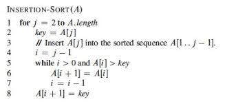

# 버그 없는 코드를 향하여

*본 글은 KAIST 강의 중 김문주 교수님의 <소프트웨어 소스 코드 동적 분석>, 유신 교수님의 <소프트웨어 테스팅 자동화 기법>, 허기홍 교수님의 <[프로그래밍 논증](https://github.com/prosyslab-classroom/cs492-program-reasoning/tree/main/slides)>을 참고하였음을 밝힙니다*

돌아가기**만** 하는 코드를 작성하는 것은 어느 때보다도 쉬워진 세상이다. 

적당한 Prompt를 LLM에 입력하기만 하면 몇백줄의 코드가 뚝딱 나오고, 조금만 바꾸면 원하는 결과를 얻을 수 있는 Working Example도 수두룩하다.

그런데 그렇게 작성한 코드가 **정말** 바르게 작동하는 코드인지는 어떻게 알 수 있을까?

Software Verification 및 Testing과 관련된 학부 수업을 3개 수강하고 개요를 정리해보았다.

# Program Verification

 프로그램의 정합성을 수학적으로 증명할 수는 없을까? 프로그램의 일부 지점에서 항상 성립하는 성질(Invariant)을 찾거나 프로그램 자체를 논리식(First-order theory)으로 해석하고 Automated Theorem Prover을 이용하는 방법으로 가능하다.

## Invariant 이용하기

 Insertion Sort를 증명하는 방법을 되새겨보자. 루프 진입 전과 루프 내부에서 성립하는 성질을 찾은 후, 루프 종결 직후 입력 배열이 정렬되어있다는 성질을 유도하면 된다.



Insertion Sort 수도코드 (출처: CLRS)

 위 코드에서 Invariant는 다음 두 가지이다.

1. 바깥쪽 루프 내부인 2번 줄에서는 이미 1번째부터 (j-1)번째 에 해당하는 원소들이 정렬되어 있다.
2. 8번째 줄에서는 i번째부터 j번째에 해당하는 원소들이 key와 같거나 큰 값을 가지고 있다. 

j=1 일때 1번 Invariant를 만족시키므로, 수학적 귀납법에 의해 모든 j에 대해 위 Invariant가 성립한다. 따라서 이 알고리즘이 종료될 때 A는 정렬된 상태가 된다.

## 논리식의 Satisfiability 증명하기

 다음과 같은 프로그램이 crash를 호출할 가능성이 있을까?

```python
def foo(x, y):
	z = 2 * x
	if y > 0:
		w = 2 * y
		if w + x == 0:
			crash()
```

 위 프로그램은 다음 논리식으로 표현할 수 있으므로, 이 식을 만족시키는 x, y 의 값이 존재한다면 crash를 호출하게 될 것이다.

$$
(z = 2*x) \land (y > 0) \land (w=2*y) \land (w+x=0)
$$

 Z3와 같은 SMT Solver 구현체에 아래 논리식을 입력하면 식을 만족하는 변수의 값들이 존재하는지, 혹은 만족될 수 없는 식인지 알려준다. (참고로 간단한 Boolean 변수로 이루어진 논리식의 Satisfiability를 증명하는 문제조차 NP Complete으로 알려져 있어, 효율적인 SMT Solver을 구현하는 것 자체가 또다른 연구분야이다.)

 이와 같은 접근은 프로그램의 특정 지점까지 접근할 수 있는지 알아내거나, 두 프로그램의 출력을 다르게 만드는 입력의 유무 등 다양한 문제에 활용할 수 있다.

## Verification의 한계

 내 프로그램이 수학적으로 옳다고 증명하는 것은 매력적으로 보인다. 그러나 현실 세계의 프로그램은 너무 복잡하고 개발자들은 게으르다. 논리식으로 쉽게 분석 가능하거나 Invariant를 명시한 실용적인 소스 코드는 찾을 수가 없다. 모든 경우의 수를 고려하기 위해 Theorm Prover에 엄청난 컴퓨팅 파워가 필요한 것은 말할 필요도 없다.

# Software Testing

 버그 없는 소프트웨어를 향한 보다 인기있는 기법에는 **테스팅**이 있다. 다익스트라는 “[테스팅은 버그가 있다는 것만 보여줄 뿐이지 버그가 없다는 것을 보여줄 수는 없다](https://www.goodreads.com/quotes/506689-program-testing-can-be-used-to-show-the-presence-of)”고 말했지만, 엔지니어로서는 약간의 정확성을 포기하고라도 소프트웨어의 품질을 높일 수 있는 방법을 찾아야한다. 테스트를 더 잘 할 수 있는 방법을 알아보자.

## CI / Automated Testing

 가장 보편적고 실용적인 테크닉은 테스트를 코드베이스에 기록하고, 전체 테스트 셋의 실행을 자동화하는 것이다. CI를 달아 커밋을 할 때마다 테스트가 돌도록 하고, 모든 테스트가 통과해야 코드 리뷰를 시작할 수도 있다. 프레임워크별로 테스트 작성과 실행 자동화를 돕는 도구도 이미 여럿 존재한다.

에 따르면 58% 이상의 개발자가 Automated Testing을 회사에서 도입하고 있다고 응답했다.](survey.png)

 [2022년 스택오버플로우 개발자 설문](https://survey.stackoverflow.co/2022/#professional-developers-developer-experience)에 따르면 58% 이상의 개발자가 Automated Testing을 회사에서 도입하고 있다고 응답했다.

## Metrics for Testing

좀 더 기술적으로 테스트를 개선하려면, 테스트를 얼마나 “잘” 하고 있는지에 대한 척도가 필요할 것이다. 

### Coverage

 흔히 사용하는 척도는 Coverage로, 프로그램이 실행 가능한 모든 경우의 수를 얼마나 실행했는지 수치화한다. 전체 statement 혹은 branch를 한 번은 실행했는지 확인하는 것이 가장 쉽고, 이외에 프로그램을 그래프로 해석하여 Edge-Pair나 Prime Path Coverage를 계산할 수도 있다.

 이렇게 계산한 Coverage를 높여나가는 방향으로 테스트 개선의 목표를 설정할 수도 있다. 단, 수치가 높아진다고 반드시 버그를 발견할 확률이 높아지는 것은 아니니 의도적으로 좋은 테스트를 작성하기 위한 노력을 기울여야한다.

### Mutation Testing

 다른 재미있는 방법은 Mutation Testing이다. 기존 코드를 약간씩 변경한 Mutant를 만들어서, 지금의 테스트들이 이 변경사항을 얼마나 잘 잡아낼 수 있는지(=얼마나 실패하는지) 평가한다. 기존 코드는 대체로 맞고, Mutant는 완전히 틀린 코드일 가능성이 높다. Mutant에 대해서 테스트가 실패한다면? 해당 테스트는 비슷한 버그를 발견 가능한 제대로 된 테스트라고 할 수 있을 것이다. 

## Test Case Generation

테스트 케이스를, 보다 정확히는 입력을 자동으로 생성할 수도 있다. 그러나 생성된 입력에 대해 프로그램이 어떤 행동을 보여야 하는지는 일반적으로는 알 수 없다. 개발자가 수동으로 작성해주거나, 프로그램이 정상적으로 종료되었다는 것을 확인하는 것만으로 만족해야할 수도 있다.

### **Random Testing**

가장 간단하게는 아무 값이나 넣어보고 잘 작동하는지 확인할 수 있겠다. 이때 중요한 것은 “아무 값”을 잘 선택하는 것이다. 비슷한 입력만 잔뜩 넣어서는 리소스 대비 효과가 덜하니, 입력 간의 “거리”를 계산하여 최대한 멀리 떨어진 입력을 선택해야 버그를 발견할 확률이 높아질 것이다.

### **Model Checking**

 리소스가 무한하다면 가능한 입력을 모두 넣어볼 수도 있다. int 범위의 변수에 대해 정말 -2,147,483,648 부터 2,147,483,647 까지 넣어보는 것이다! 물론 루프나 객체가 존재하는 일반적인 프로그램의 경우 정말 모든 경우를 세는 것은 불가능하니, 루프를 몇 번만 돌고 빠져나올 것인지, 배열의 최대 길이는 얼마로 할 것인지 등을 설정하여 해당 경우만 체크한다.

### Concolic Testing (Dynamic Symbolic Execution)

 좀 더 똑똑한 입력 생성 방법도 있다. 일단 아무 값이나 넣어서 프로그램을 실행한 후, 실행 과정 중 계산한 Bool Expression의 결과를 뒤집는 방향으로 입력 파라미터를 조정한다. 앞서 언급한 SMT Solver을 이용하면 주어진 식을 만족시키는 입력 파라미터들을 얻을 수 있다. 모든 경우의 수를 실행했다면 더 이상의 입력 생성을 중단한다.

```python
def foo(x, y):
	if x == 1 and x < y:
		return 0
	elif x == 2 and x > y:
		return 1
	else:
		return 2
```

| Constraints | Data | Next Constraints |
| --- | --- | --- |
|  | x = 0, y = 0 | not (x == 1 and x < y) and not (x == 2 and x > y) |
| not (x == 1 and x < y) and (x == 2 and x > y) | x = 2, y = 1 | x == 1 and x < y |
| x == 1 and x < y | x = 1, y = 2 |  |

## Conclusion

 엔지니어는 인간의 요구사항을 컴퓨터가 이해할 수 있도록 명확히 하는 것에만 집중하고, 귀찮은 코딩, 검증, 테스팅, 그리고 디버깅을 자동화할 수 있다면 얼마나 좋을까? 이 글에서는 이러한 “최종 목표”를 달성하기 위한 검증과 테스팅의 극히 일부 개념을 소개했다.

 LLM을 활용한 코딩이 보편화되는 요즘, 보다 정확하고 안전한 프로그램을 만드는 것이 보다 주목 받고 상용화되었으면 한다.