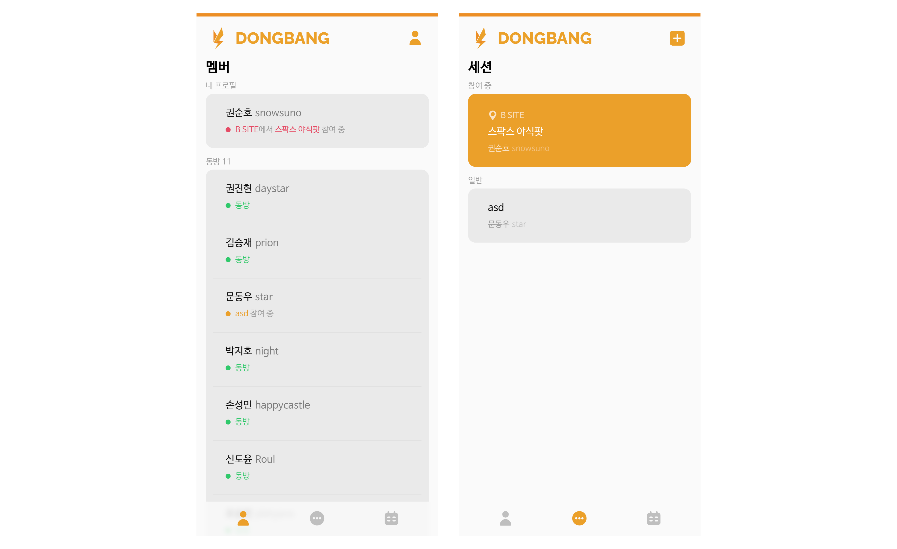

# 동방에 누구 있나요? Wi-Fi 신호로 특정 공간에 있는 사람 확인하기

안녕하세요, SPARCS에서 개발자로 활동 중인 snowsuno 권순호입니다. 

SPARCS에는 동아리 방을 이용하는 회원들의 편의를 위한 `DONGBANG`이라는 내부 서비스가 있습니다. 여러 가지 기능이 있지만, 그 중에서도 가장 핵심 기능은 바로 동아리 방(이하 동방)에 누가 있는지 실시간으로 알려 주는 기능입니다. 

위 그림처럼 `DONGBANG` 서비스는 사용자의 어떠한 액션 없이도 자동으로 SPARCS 동방에 있는 사람들이 누구인지 표시해 줍니다. 
어떻게 동방에 누가 있는지를 알고, 이를 표시해 주는 걸까요? 

이 포스트에서는 `DONGBANG` 서비스, 
그 중에서 특히 동방에 누가 있는지 알려주는 이 기능의 원리와 이를 구현한 과정, 그리고 그 과정에서 부딛히게 된 여러 문제들을 모두 하나하나 따라가면서 
이 서비스가 어떻게 동작하는지에 대해 적어보려 합니다. 

## 간단한 원리부터

그렇다면 그래서 `DONGBANG`은 어떤 원리로 사람이 동방에 있는지 알 수 있는 것일까요?

그 답은 바로 Wi-Fi에 있습니다. 동방 Wi-Fi에 연결되어 있는 디바이스를 기반으로 어떤 회원이 동방에 있는지 판단하는 것입니다. 
얼핏 보면 간단해 보이지만, 이 기능을 실제 구현하여 동방에 누가 있는지를 알기 위해서는 훨씬 더 복잡한 과정이 필요합니다. 

## Wi-Fi에 연결된 기기 받아오기

먼저 와이파이에 연결된 기기들을 받아올 수 있는 방법이 필요하겠죠? 공유기의 종류나 제조사에 따라서 조금씩은 다르겠지만, SPARCS 동방에 있는 Wi-Fi의 경우, 관리자 API를 통해 접속 중인 기기 정보를 가져올 수 있습니다. 

이를 위해 동아리 방에 raspberry pi를 설치하여 연결된 기기의 목록을 받아와 `DONGBANG` 서비스의 서버로 전송하도록 하였습니다. 관리자 API를 포워딩하여 외부의 서비스 서버가 직접 요청하도록 하는 방식도 가능하나, 보안적 측면과 후술할 추가적인 절차의 필요성으로 인해 동아리 방의 로컬 네트워크 망에 실제 기기를 설치하는 방법을 선택하게 되었습니다. 

여기까지 오면 거의 다 왔다고 생각하시겠지만, 사실 이제부터가 시작입니다. 왜냐하면 여기에서 받아올 수 있는 정보는 기기의 (보통은 랜덤화된) **MAC 주소**와, 그 기기에 현재 할당되어 있는 **로컬 IP** 뿐이기 때문이죠. 즉, 관리자 API만으로는 연결되어 있는 기기들은 알 수 있지만, 그 기기가 누구의 것인지는 알 수 있는 방법이 없습니다. 

## 기기 등록하기: 이 기기는 누구의 것?

`DONGBANG`에서는 이 문제를 '기기 등록하기'라는 절차를 넣음으로써 해결하려고 했습니다. 유저들이 자신의 기기가 무엇인지 서비스에 등록한다면 어떤 기기가 누구의 것인지 알 수 있기 때문이죠. 

가장 간단하고 직관적인 방법으로는 유저가 직접 자신의 기기의 MAC 주소를 서비스에 등록하는 방법이 있습니다. 하지만 이 방법은 User Experience 측면에서도 번거롭고 MAC 주소를 직접 등록한다는 점에서 개인 정보 보호의 측면에서도 문제가 있으며, 또한 요즘 사용되는 대부분의 모바일 기기의 경우 AP마다 다른 *randomized MAC*을 사용하여 연결하기 때문에 유저가 이 MAC 주소를 올바르게 등록한다는 보장도 없었죠.

그래서 다음으로 생각하게 된 방법은 **로컬 IP**를 이용하는 방법이었습니다. Raspberry pi에 HTTP 서버를 띄워 두고, `DONGBANG` 클라이언트에서 기기 등록 버튼을 눌렀을 때 이 HTTP 서버의 로컬 IP로 요청을 보내도록 하는 것입니다. 이 요청에서는 서버와 클라이언트가 모두 동방 Wi-Fi의 로컬 네트워크 상에 있게 되기 때문에 서버에서 수신하게 되는 HTTP 요청의 IP 주소는 public IP가 아닌, 그 Wi-Fi의 로컬 네트워크 상에서 할당받은 local IP가 됩니다. 이러한 과정을 통해 서버에서는 사용자의 기기의 SPARCS Wi-Fi 상에서의 local IP를 알 수 있게 됩니다. 

이제 필요한 정보는 모두 모였습니다. Wi-Fi의 관리자 API를 통해서 특정 기기의 **MAC 주소**와 **Local IP**를 알 수 있고, '기기 등록하기' 절차를 통해 **사용자**의 **Local IP**를 알 수 있게 되었습니다. 이 정보를 통해 `DONGBANG` 서비스에서는 어떠한 기기가 어떠한 사용자의 것인지를 알 수 있게 되고, 이를 바탕으로 누가 동방에 있는지 정보를 제공할 수 있게 되었습니다. 

[//]: # (#### 기기 등록 방식)

[//]: # (&#40;전체 작동 방식&#41;)

[//]: # ()
[//]: # (#### 동방에 기기 있는지)

[//]: # (&#40;전체 작동 방식&#41;)

## 예상치 못한 문제: Local IP, HTTPS와 Mixed content policy

로컬 IP로의 요청을 활용하여 사용자의 기기 정보를 받아 오는 계획은 완벽해 보였습니다. 그러나 이를 구현하는 과정해서 사소해 보였지만 사실은 그렇지 않았던 문제와 마주치게 되었습니다. 바로 브라우저의 'Mixed content policy' 였습니다. 

`DONGBANG` 서비스는 SSL/TLS를 사용하여, 즉 HTTPS로 서빙되는 웹 서비스입니다. 그러나, 기기 등록을 위해 사용되는 동방 로컬 네트워크의 raspberry pi HTTP 서버에 접속하기 위해서 우리는 raspberry pi의 로컬 주소를 사용하기 때문에 이는 당연히 HTTP 접속을 사용하게 됩니다. 

문제는 대부분의 브라우저는 보안 상의 이유로 HTTPS 사이트에서 HTTP 주소로의 요청을 허용하지 않는다는 점입니다(Mixed content policy). 

처음에는 단순히 SSL 인증서를 발급받아 Raspberry pi 서버로의 연결에도 HTTPS를 적용하면 쉽게 해결될 문제라고 생각했습니다. `192.168.0.xxx`와 같은 Local IP 주소로는 SSL 인증서를 발급받을 수 없기 때문에, Raspberry pi 서버를 포트 포워딩 해준 뒤 포워딩된 외부 주소를 통해서만 SSL 인증서를 발급받을 수 있었습니다. 

문제는 이렇게 되면 사용자의 기기에서 Raspberry pi 서버로 가는 요청이 Raspberry pi의 Local IP로의 요청이 아닌, 포워딩 된 외부 주소를 통한 요청이 된다는 점이었습니다. 

**기기 등록하기** 절차의 포인트는 **로컬 네트워크 상에서** 사용자의 기기가 Raspberry pi 서버에 요청을 보내면, **서버가 이 요청의 IP를 알 수 있다는 점을 이용**해 **기기가 그 네트워크 상에서 할당받은 Local IP**를 알아내는 것이었습니다..

SSL 인증서를 발급 받아 raspberry pi 서버에도 HTTPS를 적용하면 되지 않느냐, 라고 생각하실 수도 있겠지만, `192.168.`로 시작되는 로컬 IP에는 인증서를 발급받을 수 없습니다.
Raspberry pi 서버에 SSL 인증서를 발급받기 위해서는 그 서버가 listen 중인 IP/port를 forwarding하고, forwarding 한 public IP에 SSL 인증서를 발급받는 방법밖에 없는데, 이렇게 되면 raspberry pi 서버로의 요청이 local IP가 아닌 public IP로의 요청이 되는 것이기 때문에 '로컬 네트워크 상에서의 접속을 통해 기기의 local IP를 알아낸다'는 기기 등록하기 절차 자체가 불가능해지게 됩니다. 

문제가 되는 부분을 정리해 보자면 다음과 같습니다: 
1. Raspberry pi로 접속할 수 있는 Public IP가 존재하지 않으면 SSL 인증서를 발급받을 수 없습니다.
2. 포트 포워딩을 통해 Public IP를 할당하고 SSL 인증서를 발급받을 수 있지만, 이 경우 Local IP를 통한 접속이 아닌, 포워딩 된 IP를 통한 접속이 되기 때문에 Raspberry PI에서는 요청자의 Local IP가 아닌 Public IP를 알게 됩니다. 
3. Raspberry pi 서버를 통한 **기기 등록하기** 절차에서는 Local network 상에서의 접속을 통해 Local IP를 얻어와야 하기 때문에, 포트 포워딩을 하게 되면 기존에 계획한 메커니즘대로 동작하지 못하게 됩니다. 
4. 그러나 포트 포워딩을 하지 않게 되면 SSL 인증서를 발급받지 못하기 때문에 Mixed content policy에 부딛히게 됩니다.

이를 해결하기 위한 오랜 고민 끝에 결국 크게 두 가지의 해결 방안을 구상하게 되었습니다. 

#### 1. Super DMZ(Twin IP)
첫 번째 해결 방안은 바로 Super DMZ(Twin IP)를 이용하는 방법입니다. Super DMZ는 랜이 할당받은 Public IP를 특정 기기의 Local IP로 직접 할당해 줄 수 있는 공유기의 기능입니다. 기존의 일반적인 상황이라면 기기의 Local IP는 DHCP 서버가 할당해준 `192.168.0.xxx`와 같은 망 내에서만 사용 가능한 IP였겠지만, Super DMZ 기능을 활성화 하게 되면 Public IP가 바로 Local IP로 할당되기 때문에 두 주소가 같아지게 됩니다. 

이 주소로 접속하는 상황에서 접속자가 서버와 다른 네트워크 상에 있다면 포트 포워딩과 거의 동일하게 동작하게 되지만, 같은 네트워크 상에서 접속하는 경우 로컬 네트워크의 DHCP 서버에서 바로 서버의 로컬 주소로 라우팅 해 주기 때문에 Local IP로 접속하는 것과 동일하게 동작하게 됩니다. 

이 방법은 기존의 설계를 변경하지 않고 그대로 적용할 수 있는 솔루션이지만, 모든 포트가 expose된다는 점에서 보안 측면의 문제가 까다로워지게 됩니다. 그래서 기존의 설계를 약간 변경하지만, 이와 같은 인프라 상의 보안 정책은 변경하지 않는 두 번째 방안을 구상하게 되었습니다. 

#### 2. 별도 페이지와 리디렉트를 이용한 방법
Mixed content policy는 `DONGBANG` 서비스는 HTTPS 상에서 동작하나, raspberry pi에 접속하기 위한 주소는 HTTP이었기 때문에 발생하는 문제였습니다. 기존에는 raspberry pi에 접속하기 위한 주소를 HTTPS로 바꾸기 위한 방향으로 접근하고 있었지만, 더 간단하게 `DONGBANG` 서비스를 HTTP로만 서빙하는 방법도 있습니다. 하지만 이 기기 등록 절차만을 위해서 HTTPS 프로토콜이 주는 보안적 이점을 모두 포기하고 HTTP 서빙을 할 수는 없는 노릇입니다. 

하지만 기기 등록 절차를 위한 페이지만을 따로 분리해서 이 페이지만 HTTP로 서빙한다면 어떨까요? 유저가 기기 등록 절차 페이지를 사용하는 것은 일회성, 그것도 아주 짧은 시간 동안이기 때문에 이 방법을 택하였을 때 얻게 되는 시스템의 복잡성 감소 등을 생각해 보았을 때 충분히 합리적인 선택입니다. 

게다가, 이 페이지를 raspberry pi 서버를 통해 서빙한다면 HTTP로 서빙되는 기기 등록 페이지는 동방 Wi-Fi의 로컬 망에서만 접속 가능해지기 때문에 보안적인 약점 또한 어느 정도 커버 가능해집니다. 기기 등록 절차가 동아리 Wi-Fi에 연결되어 있을 때에만 이루어진다는 점을 생각해 보았을 때, 기기 등록 페이지는 동방 Wi-Fi의 로컬 망에서만 접속 가능해도 충분하기 때문이죠. 

정리해보자면 다음과 같습니다. `DONGBANG` 서비스는 여전히 기존 서버에서 HTTPS로 작동하지만, 기기 등록 페이지는 별도의 페이지로 분리되어 동아리의 raspberry pi를 통해 동아리 Wi-Fi의 로컬 네트워크에서 HTTP로 서빙됩니다. 기기 등록 과정에서 발생하는 요청들은 모두 HTTP이기 때문에 Mixed content policy 문제가 발생하지 않고, 모두 외부로 노출되지 않고 동방 Wi-Fi의 로컬 네트워크 상에서만 일어나기 때문에 보안적인 약점도 어느 정도는 상쇄됩니다. 

## 바뀐 설계, 그리고 사소한 문제들

결국 SPARCS 당시 Wheel장과의 논의 끝에 두 번째 방법을 선택하게 되었습니다. 기기 등록 방식이 초기 기획의, `DONGBANG`의 클라이언트에서 바로 API 요청을 보내는 방식에서 별도의 페이지에서 진행되는 방식으로 변경됨에 따라 사소한 문제들이 발생했습니다. 

#### Page 간 User credentials 전달하기
페이지가 두 개로 분리되게 되면서 기기를 등록할 User credential을 전달할 방법이 필요하게 되었습니다. 기존에 페이지가 분리되지 않았을 때에는 다른 요청과 마찬가지로 유저 토큰과 함께 요청을 보내면 되었지만, 페이지가 분리되면 이 페이지는 그 유저가 누구인지도, 접근 토큰도 알 수 없기 때문에 페이지 간에 이를 전해줄 방법이 필요했습니다. 

바뀐 설계에서는 유저를 기기 등록 페이지로 리디렉트해주는 방식을 사용했기 때문에 이 리디렉션 URL의 쿼리 매개변수(query parameter)에 credential 토큰을 담아 리디렉트 해 주게 되었습니다. 토큰은 scope는 기기 등록만 가능하고, 만료 기간은 1분 정도로 매우 짧게 설정된 jwt 토큰을 사용하였습니다. 

#### 기기 등록 UI를 언제 띄워야 하지?
기존의 설계에서는 1. `DONGBANG` 서비스에 접속 중인 기기가 등록되어 있지 않고 2. 그 기기가 동방 Wi-Fi에 접속 중일 때 기기를 바로 등록할 수 있는 카드 UI를 홈에 띄워 주었습니다. 그러나 기기 등록 방식이 바뀌면서 이가 불가능해지게 되었습니다. 

따라서 새로 바뀐 설계에서는 기기가 동방 Wi-Fi에 연결되었는지 확인하기 위해 기존의 로컬 raspberry pi를 ping 해보는 방식이 아닌, 서버에서 요청의 origin이 동방의 public IP인지 확인하고, 이에 따라 해당 UI를 표시하도록 하였습니다. 

## 긴 여정의 끝

"Wi-Fi를 이용하여 동아리 방에 누가 있는지 알아낸다"는 단순해 보이기도, 마치 마술같아 보이기도 하는 신기한 컨셉을 실제로 구현하면서 많은 문제들을 마주하게 되었습니다. 
그러나 이를 해결해 나가는 과정에서 정말 많은 것을 배울 수 있었습니다. 

긴 글 읽어주셔서 감사합니다. 궁금한 점이 있으시면 언제든 물어봐 주세요 :)
