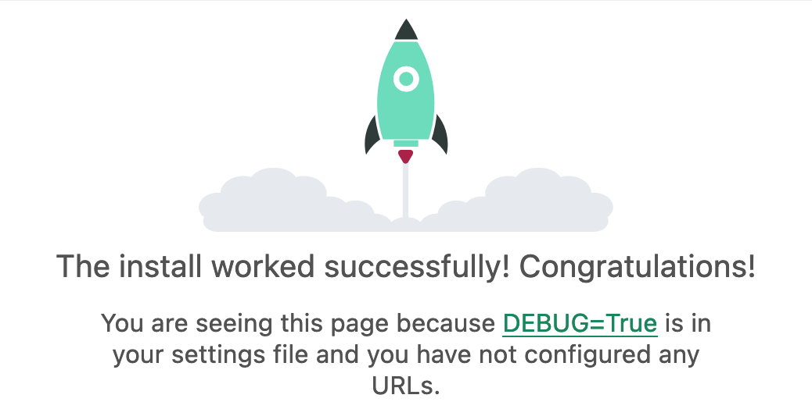
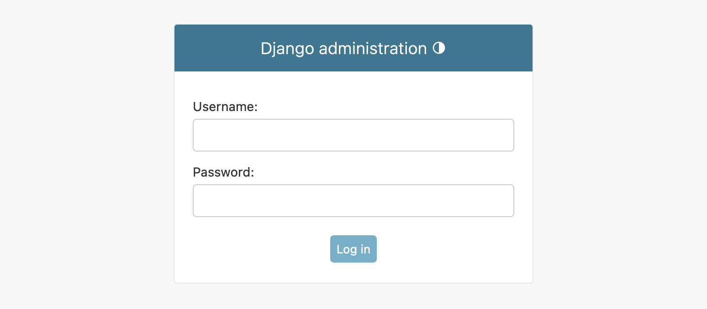
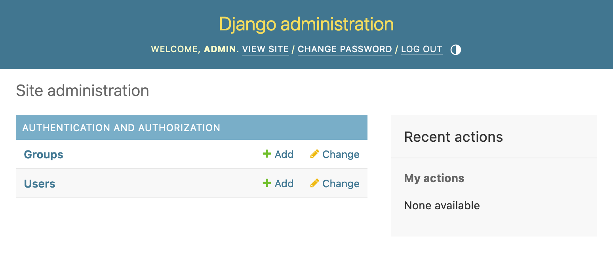
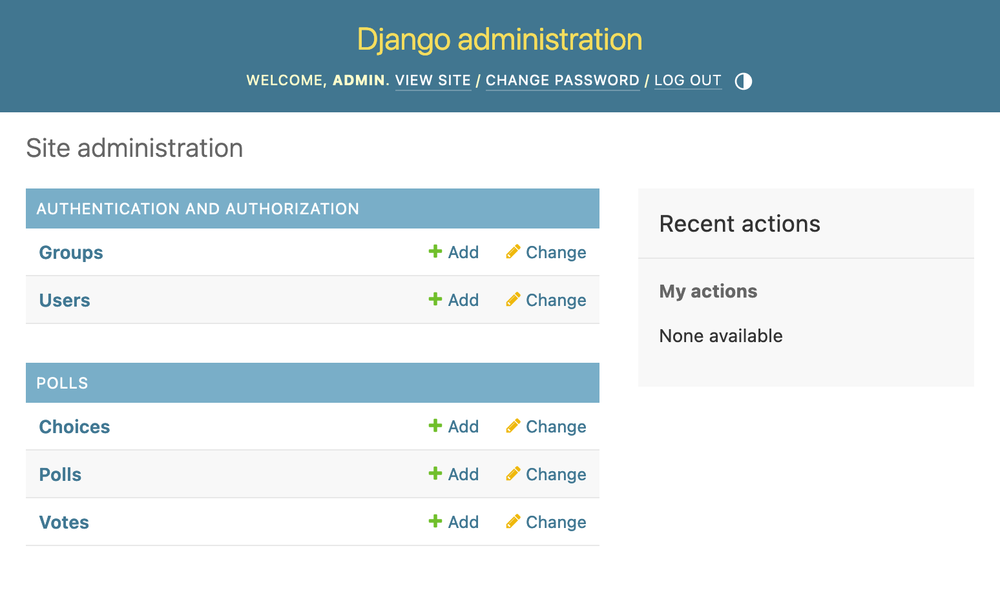

# 시간이 없을 때 백엔드 서버 띄우는 법

인간은 살다 보면 백엔드 개발을 해야 할 때가 찾아 오곤 한다. 그중에는 시간이 부족해 복잡하고 반복되는 작업
없이 원하는 기능을 수행하게 만들고 싶을 때가 있다. 이번 시간에는 정말 간단하게 백엔드 서버를 띄우는 방법을
보도록 하자. 최대한 best practice를 따르며 작성하겠지만 깊은 디테일은 다루지 않고 넘어갈 것이다. 우리는
바쁜 현대인이지 않은가! 글 중간중간에 도움 될 만한 레퍼런스를 적어 놓았으니 참고하도록 하자.

## 개발 환경 설정

개발 환경 설정 과정은 필요한 부분들만 빠르게 설명하고 실제 코드 작성하는 부분을 집중해서 보도록 하자.

작업할 디렉토리로 이동한 후 가상환경을 생성하고 필요한 패키지들을 설치한다.

```bash
$ python3 --version
Python 3.11.3

# 가상환경 생성
$ python3 -m venv .venv
$ source .venv/bin/activate

# 패키지 추가
$ python3 -m pip install \
> Django djangorestframework drf-spectacular \
> black isort \
> python-dotenv
```

패키지 버전 문제가 있을까 싶지만 적고 넘어가겠다. (drf-spectacular 버전을 보면 major 버전이 0인데
[Release management][drf-spectacular-release-management]를 보면 버전을 고정할 것을 권장하고 있다.)

```bash
Package             Version
------------------- -------
black               23.3.0
Django              4.2.1
djangorestframework 3.14.0
drf-spectacular     0.26.2
isort               5.12.0
python-dotenv       1.0.0
```

아래 명령으로 프로젝트를 시작하자. Django 튜토리얼을 따라 `django-admin startproject mysite`처럼
작성하면 `mysite/mysite` 같이 괴상한 구조가 생겨버리므로 프로젝트명을 무엇으로 하든지 간에 아래처럼 `config`로
작성하는 것이 보기에 깔끔하다. 뒤에 .을 적은 까닭은 새로운 디렉토리를 생성하지 않고 현재 경로에서 프로젝트를
진행하기 위함이다.

```bash
django-admin startproject config .
```

위를 실행하고 나면 아래와 같은 보일러플레이트가 생성된다.

```bash
$ tree
.
├── config
│   ├── __init__.py
│   ├── asgi.py
│   ├── settings.py
│   ├── urls.py
│   └── wsgi.py
└── manage.py

2 directories, 6 files
```

아직 아무 것도 없지만 실행은 할 수 있다. 아래를 실행하고 <http://127.0.0.1:8000>에 접속하면 환영
인사와 함께 로켓 이미지를 볼 수 있다.

```bash
python3 manage.py runserver
```



## Settings

`manage.py` 파일을 보면 아래와 같은 줄이 있다. `config/settings.py`에서 설정한 값들을 이용해 프로젝트를
시작하기 위한 것이다. 설정 가능한 값들은 [Django: Settings][django-settings]에서 확인 가능하다.

```python
# manage.py

def main():
    os.environ.setdefault("DJANGO_SETTINGS_MODULE", "config.settings")
    ...
```

위에서 설치한 패키지 중 [DRF][drf]와 [drf-spectacular][drf-spectacular] 를 `config/settings.py`
파일의 `INSTALLED_APPS` list에 추가하자. 각각에 대한 설명은 후술하겠다.

```python
# config/settings.py

INSTALLED_APPS = [
    ...
    "rest_framework",
    "drf_spectacular",
]
```

아래를 실행해서 마이그레이션을 완료한다.

```bash
python3 manage.py makemigrate
python3 manage.py migrate
```

`SECRET_KEY`는 노출되면 안 되니 커밋을 하기 전에 `.env` 파일로 옮기고 불러오는 방식으로 수정하자.

```.env
# .env

SECRET_KEY = "django-insecure-4sg5r0@uh!=&mwm+99*zf4i5^hla1qzj!9au7+_k70@ke23**0"
```

```python
# config/settings.py

import os
from dotenv import find_dotenv, load_dotenv

load_dotenv(find_dotenv())
SECRET_KEY = os.environ["SECRET_KEY"]
```

## Models

[Django 튜토리얼][django-tutorial]에서 간단한 투표 앱을 만드는 것으로 설명을 하니 비슷하게 따라가
보겠다. 이미 있는 튜토리얼 따라가서 뭐 하겠나 싶을 수 있겠지만 DRF를 사용하고 일부 추가적인 기능들을 넣는다는
점에서 의의를 두자. (mini [Biseo][biseo]를 만든다는 생각으로 시작해 본다.)

우선 `polls`라는 앱을 만드는 것으로 시작해 보자. `apps` 디렉토리를 생성하고 그 안에 `polls` 앱을 생성한다.

```bash
mkdir apps
cd apps
python3 ../manage.py startapp polls
```

투표 앱을 만들기 위해 세 개의 테이블이 필요하다: `poll`, `choice`, `vote`. Poll은 여러 개의 choice를
가지고 choice는 여러 개의 vote를 가진다.

하나의 `.py` 파일에는 하나의 모델만 정의하는 것이 좋으므로 `models.py` 파일을 삭제하고 아래처럼 `models`
디렉토리를 생성한다.

```bash
$ mkdir -p polls/models
$ cd polls/models
$ touch __init__.py poll.py choice.py vote.py

$ tree
.
├── __init__.py
├── choice.py
├── poll.py
└── vote.py
```

생성한 세 개의 `.py` 파일에 모델을 작성한다. 각 attribute가 하나의 DB entry가 된다. Field의 종류는
[Django: Fields][django-fields]에서 확인 가능하다.

```python
# apps/polls/models/poll.py

from django.db import models


class Poll(models.Model):
    title = models.CharField("title", max_length=255)
    text = models.TextField("text")
    start_date = models.DateTimeField(
        "date started",
        blank=True,
        null=True,
    )  # Created != Started
    end_date = models.DateTimeField(
        "date ended",
        blank=True,
        null=True,
    )

    def __str__(self) -> str:
        return self.title
```

```python
# apps/polls/models/choice.py

from django.db import models


class Choice(models.Model):
    poll = models.ForeignKey("Poll", on_delete=models.CASCADE)
    text = models.TextField("text")

    def __str__(self) -> str:
        return self.text
```

```python
# apps/polls/models/vote.py

from django.conf import settings
from django.db import models


class Vote(models.Model):
    choice = models.ForeignKey("Choice", on_delete=models.CASCADE)
    user = models.ForeignKey(settings.AUTH_USER_MODEL, on_delete=models.CASCADE)

    def __str__(self) -> str:
        return f"({self.user}) -> ({self.choice})"
```

```python
# apps/polls/models/__init__.py

from .choice import Choice
from .poll import Poll
from .vote import Vote
```

`apps.py` 파일에서 `PollsConfig.name = "apps.polls"`로 수정하고 `settings.py` 파일의 `INSTALLED_APPS`
list에 `"apps.polls.apps.PollsConfig"`를 추가한다.

```python
# config/settings.py

INSTALLED_APPS = [
    "apps.polls.apps.PollsConfig",
    ...
]
```

마이그레이션은 다음처럼 실행한다.

```bash
python3 manage.py makemigrations polls
python3 manage.py sqlmigrate polls 0001
python3 manage.py migrate
```

## Admin

Django의 장점은 어드민 페이지를 제공한다는 것이다. 이를 보기 위해 우선 어드민을 생성한다.

```bash
$ python3 manage.py createsuperuser
Username (leave blank to use 'yuwol'): admin
Email address: admin@example.com
Password: ********
Password (again): ********
Superuser created successfully.
```

서버를 시작하고 <http://127.0.0.1:8000/admin/>으로 접속하면 아래와 같은 로그인 화면을 볼 수 있다.
위에서 설정한 값들을 입력하고 들어가자.



들어가면 기본적인 페이지만 보이고 아직 아무 것도 없는 것을 확인할 수 있다.



`admin.py` 파일을 수정해 위에서 생성한 세 개의 모델을 어드민 페이지에 추가할 수 있다.

```python
# apps/polls/admin.py

from django.contrib import admin

from .models import Choice, Poll, Vote

admin.site.register(Choice)
admin.site.register(Poll)
admin.site.register(Vote)
```



일단은 어드민 페이지를 가지고 놀아보자. Poll을 만들고 Choice와 Vote를 연결해 추가할 수 있다. 아직 엔드포인트를
작성하지 않았지만 간단하게 추가할 수 있다. 이는 추후 본 글을 수정하거나 새 글을 적는 방식으로 추가하겠다.

[biseo]: https://docs.djangoproject.com/en/4.2/intro/
[django-fields]: https://docs.djangoproject.com/en/4.2/ref/models/fields/
[django-settings]: https://docs.djangoproject.com/en/4.2/ref/settings/
[django-tutorial]: https://docs.djangoproject.com/en/4.2/intro/
[drf]: https://www.django-rest-framework.org/
[drf-spectacular]: https://github.com/tfranzel/drf-spectacular
[drf-spectacular-release-management]: https://github.com/tfranzel/drf-spectacular#release-management
