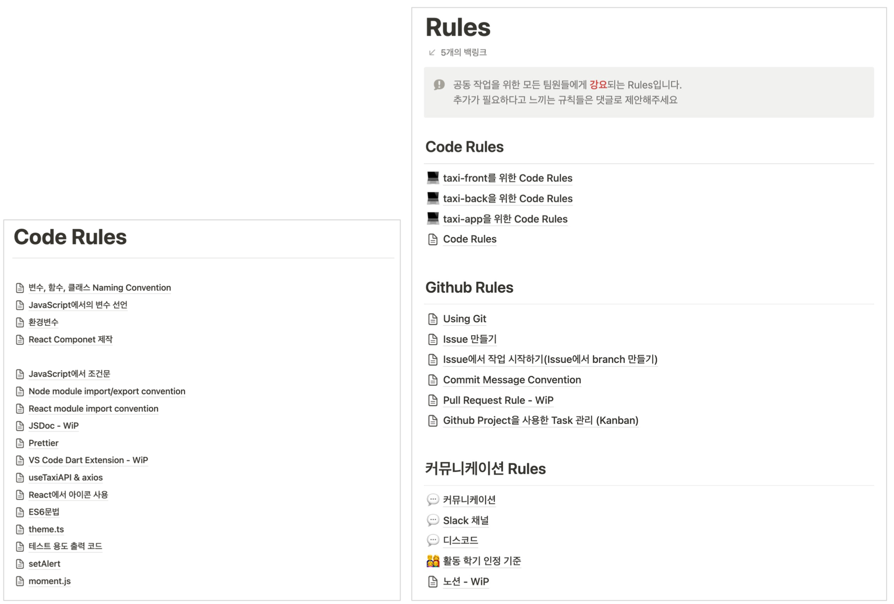
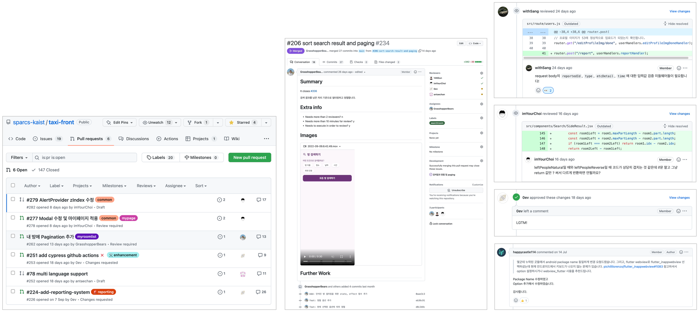

# 코드 리뷰와 리팩토링: 좋은 코드를 작성하는 방법

안녕하세요. Taxi팀의 PM으로 활동하고 있는 김건(suwon)입니다.

소프트웨어 개발은 복잡한 과정입니다. 프로젝트의 성공은 코드의 품질에 크게 의존하며, 이를 달성하는 방법 중 하나는 코드 리뷰와 리팩토링입니다. 좋은 코드를 작성하는 방법, 코드 리뷰의 중요성, 그리고 리팩토링 기법에 대해 다루겠습니다.

## 좋은 코드란?

좋은 코드를 작성하는 것은 간단해 보이지만, 많은 연습과 지식이 필요합니다. 좋은 코드는 효율적이고, 이해하기 쉬워야 합니다. 이를 위한 몇 가지 방법은 다음과 같습니다:

- **명확한 명명법**: 변수, 함수, 클래스의 이름은 그것이 무엇을 하는지 명확하게 나타내야 합니다. 예를 들어, `calculateAverage()`는 그 함수가 평균을 계산한다는 것을 명확하게 보여줍니다.

- **단순함**: 코드는 간결하고 단순해야 합니다. 복잡한 코드는 이해하기 어렵고, 오류를 유발할 가능성이 높습니다.

- **주석**: 주석은 코드의 작동 방식을 설명하고, 복잡한 로직을 이해하는 데 도움을 줍니다. 하지만 너무 많은 주석은 코드를 복잡하게 만들 수 있으므로 적절한 균형이 필요합니다.

좋은 코드로 효율성과 통일성을 높이기 위해 Taxi 팀에서는 모든 팀원들이 공통적으로 지켜야 하는 Code Rules와 Convention을 지정하고 Issue & PR 템플릿을 사용하고 있습니다. 규칙을 지키며 코드를 작성하는 것은 개인적으로 개발에 많은 시간을 요구할 수 있지만, 거시적으로 팀 전체의 개발 속도는 감소시킬 것입니다. PM으로서 Code Rules를 팀원 전체에게 강요하는 이유입니다.

## 코드 리뷰의 중요성

코드 리뷰는 개발자가 작성한 코드를 동료가 검토하고 피드백을 제공하는 과정입니다. 이는 여러 가지 이유로 중요합니다:

- **버그 발견**: 코드 리뷰는 코드에서 버그를 찾는 데 도움이 됩니다. 개발자가 작성한 코드에는 그 개발자가 인지하지 못한 버그가 있을 수 있습니다.

- **코드 품질 향상**: 코드 리뷰는 코드의 품질을 향상시키는 데 도움이 됩니다. 리뷰어는 개선할 수 있는 부분을 지적하고, 더 나은 방법을 제안할 수 있습니다.

- **지식 공유**: 코드 리뷰는 개발 팀 내에서 지식을 공유하는 좋은 방법입니다. 다른 사람의 코드를 리뷰하면서 새로운 기법이나 관점을 배울 수 있습니다.

팀원들의 성장과 코드의 품질을 위해 Taxi 팀에서는 코드 리뷰를 권장하고 있습니다. 코드 리뷰를 통해 서비스에서 발생할 수 있는 많은 버그를 발견하였고 저 개인적으로도 팀원들의 코드를 리뷰하면서 많은 지식을 얻을 수 있었습니다.

## 리팩토링 기법

리팩토링은 코드의 구조를 개선하면서 외부적으로 보이는 행동은 그대로 유지하는 것을 말합니다. 이는 코드의 가독성을 향상시키고, 유지 보수를 용이하게 하는데 도움이 됩니다. 주요 리팩토링 기법으로는 다음과 같은 것들이 있습니다:

- **Extract Function(함수 추출)**: 긴 함수나 복잡한 코드 조각을 별도의 함수로 분리하는 기법입니다. 이를 통해 코드의 가독성을 향상시키고, 재사용성을 높일 수 있습니다.

- **Rename Variable(변수 이름 변경)**: 변수의 이름을 더 명확하게 변경하는 것입니다. 이를 통해 코드의 의도를 더 잘 전달하고 이해하는 데 도움이 됩니다.

- **Replace Magic Number with Symbolic Constant(매직 넘버를 상징적 상수로 변경)**: 코드 내에 특정 값을 직접 사용하는 대신 의미 있는 상수로 대체하는 기법입니다. 이를 통해 코드의 가독성을 높이고, 오류를 방지할 수 있습니다.

- **Remove Dead Code(불필요한 코드 제거)**: 더 이상 사용되지 않는 코드를 제거하는 기법입니다. 이를 통해 코드의 복잡성을 줄이고, 유지 관리를 용이하게 할 수 있습니다.

## 결론

좋은 코드를 작성하는 것은 소프트웨어 개발의 핵심적인 부분입니다. 코드 리뷰와 리팩토링은 이를 달성하는 데 중요한 도구입니다. 코드 리뷰를 통해 팀원들과 지식을 공유하고, 서로의 코드를 향상시킬 수 있습니다. 또한, 리팩토링을 통해 코드의 품질을 개선하고, 유지 보수를 용이하게 할 수 있습니다. 이러한 절차를 통해, 우리는 더 나은 소프트웨어와 서비스를 만들어낼 수 있습니다.
